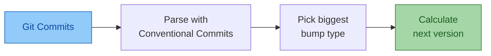
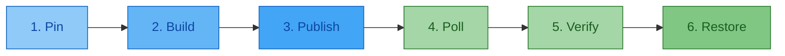
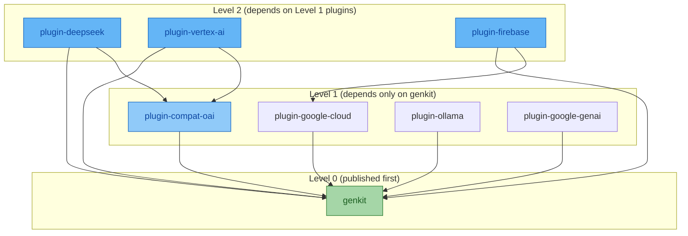
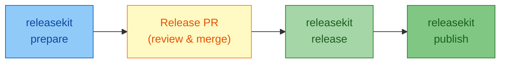
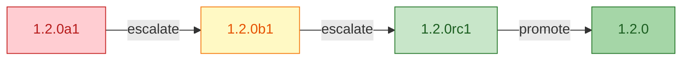

# Beginner's Guide to Release Management

This guide takes you from "I've never released a package" to confidently
shipping production software with automated versioning, release channels,
supply-chain security, and CI/CD pipelines.

---

## Part 1: Why Release Management Matters

### What Is a "Release"?

A **release** is a snapshot of your code that you share with the world.
When a user types `pip install genkit` or `npm install genkit`, they're
downloading a specific release — a packaged, versioned bundle of your
source code.

Without release management, you'd be telling users "just clone the repo
and hope for the best." With it, you give them:

- **A version number** — so they know what they're getting
- **A changelog** — so they know what changed
- **A package** — so they can install it in one command
- **A signature** — so they know it hasn't been tampered with

### The Release Lifecycle

Every release follows this lifecycle, whether you're publishing a Python
library to PyPI or a JavaScript SDK to npm:

| Step | Stage | What Happens |
|------|-------|--------------|
| 1 | **Develop** | Write code, fix bugs, add features |
| 2 | **Version** | Decide what number this release gets |
| 3 | **Changelog** | Document what changed for users |
| 4 | **Build** | Package the code into distributable artifacts |
| 5 | **Publish** | Upload artifacts to a package registry |
| 6 | **Tag** | Mark this point in git history forever |
| 7 | **Announce** | Tell users the release exists |

ReleaseKit automates every step of this lifecycle. Let's learn each one.

### How Does ReleaseKit Compare?

If you've used other release tools, this table shows where ReleaseKit
fits:

| Feature | **ReleaseKit** | [release-please](https://github.com/googleapis/release-please) | [semantic-release](https://github.com/semantic-release/semantic-release) |
|---------|:--------------:|:--------------------------------------------------------------:|:------------------------------------------------------------------------:|
| Multi-ecosystem (Python, JS, Go, Rust, Dart, Java) | ✅ | ❌ JS-centric | ❌ JS-centric |
| Monorepo with topological publish order | ✅ | ⚠️ Limited | ⚠️ Via plugins |
| Ephemeral dependency pinning | ✅ | ❌ | ❌ |
| Release PR workflow | ✅ | ✅ | ❌ |
| SLSA L3 provenance & Sigstore signing | ✅ | ❌ | ❌ |
| SBOM generation (CycloneDX + SPDX) | ✅ | ❌ | ❌ |
| One-click rollback with registry yank | ✅ | ❌ | ❌ |
| Supply-chain health checks (OSV, OSSF) | ✅ | ❌ | ❌ |
| Lifecycle hooks | ✅ | ❌ | ✅ |
| Language | Python | Node.js + Go | Node.js |

---

## Part 2: Understanding Versions

### What Is a Version Number?

A version number is a promise to your users about what changed. The most
widely used format is [**Semantic Versioning (semver)**](https://semver.org/):

```
    1   .   2   .   3
    │       │       │
    │       │       └── PATCH — bug fixes only, no new features
    │       └── MINOR — new features, but nothing breaks
    └── MAJOR — breaking changes (users may need to update their code)
```

!!! tip "The Social Contract of Semver"
    Say your current version is `1.2.4`:

    When you release `2.0.0`, you're telling users: "I changed something
    that might break your code. Read the changelog before upgrading."

    When you release `1.3.0`, you're saying: "I added something new. Your
    existing code still works."

    When you release `1.2.5`, you're saying: "I fixed something. Upgrade
    freely."

### How ReleaseKit Decides the Version

ReleaseKit reads your **git commit messages** to automatically determine
the next version. This is why
[Conventional Commits](https://www.conventionalcommits.org/en/v1.0.0/)
are important:

| Commit Message | Bump | Why |
|----------------|------|-----|
| `fix: resolve null pointer in parser` | **patch** | Bug fix → patch |
| `feat: add streaming support` | **minor** | New feature → minor |
| `feat!: redesign the API` | **major** | `!` = breaking → major |
| `fix(docs): typo in README` | **patch** | Still a fix |
| `chore: update dependencies` | *(none)* | Maintenance — no release |



**Example:** If your current version is `1.2.3` and your recent commits
contain both a `fix:` and a `feat:`, the biggest bump wins → **minor** →
next version is `1.3.0`.

### Python vs Everyone Else

Python has its own version format called
[**PEP 440**](https://peps.python.org/pep-0440/). It's very similar to
semver but with slightly different pre-release syntax:

| Phase | semver | PEP 440 |
|-------|--------|---------|
| alpha | `1.2.0-alpha.1` | `1.2.0a1` |
| beta | `1.2.0-beta.1` | `1.2.0b1` |
| release candidate | `1.2.0-rc.1` | `1.2.0rc1` |
| dev build | `1.2.0-dev.1` | `1.2.0.dev1` |
| stable | `1.2.0` | `1.2.0` |

!!! note
    ReleaseKit handles this automatically. When your ecosystem is
    `python`, it uses PEP 440 format. When it's `js`, `go`, `rust`,
    etc., it uses semver. You don't need to think about this.

For more details, see [Versioning Schemes](versioning-schemes.md).

---

## Part 3: The 10-Minute Tutorial

This part walks you through your first release from start to finish.
At the end you'll have a published package on a registry. The remaining
parts of this guide cover the *concepts* behind each step.

### Prerequisites

Before you begin, you need:

- **Git** with a clean working tree
- **Python 3.10+** with [uv](https://docs.astral.sh/uv/) installed
- A project with a `pyproject.toml` (for Python) or `package.json` (for JS)
- Commits following the [Conventional Commits](https://www.conventionalcommits.org/) format

### Step 1: Install ReleaseKit

=== "uv tool (recommended)"

    ```bash
    uv tool install releasekit
    ```

=== "uvx (no install)"

    ```bash
    uvx releasekit --help
    ```

=== "pip (fallback)"

    ```bash
    pip install releasekit
    ```

    !!! note
        `pip install` works, but the rest of this guide uses `uv`
        for building and publishing. If you don't already have `uv`,
        install it with `pip install uv` or see the
        [uv installation guide](https://docs.astral.sh/uv/getting-started/installation/).

### Step 2: Initialize Your Project

```bash
releasekit init
```

ReleaseKit scans your project and generates a `releasekit.toml`
configuration file:

```toml
# releasekit.toml — auto-generated, edit as needed
forge           = "github"
repo_owner      = "myorg"
repo_name       = "myproject"
tag_format      = "{name}-v{version}"

[workspace.py]
ecosystem       = "python"
root            = "."
```

### Step 3: See What You Have

```bash
releasekit discover
```

| Package | Version | Path |
|---------|---------|------|
| myproject | 0.1.0 | `.` |
| myproject-utils | 0.1.0 | `packages/utils` |

### Step 4: Preview the Plan

Before doing anything, see what ReleaseKit *would* do:

```bash
releasekit plan
```

| Package | Bump | Current | Next |
|---------|------|---------|------|
| myproject | minor | 0.1.0 | 0.2.0 |
| myproject-utils | patch | 0.1.0 | 0.1.1 |

### Step 5: Run Health Checks

```bash
releasekit check
```

This validates your workspace is ready to release:

```
✓ dependency_cycles       No circular dependencies
✓ lockfile_staleness      uv.lock is up to date
✓ version_consistency     All versions in sync
✓ naming_convention       Package names follow convention
✓ type_markers            All packages have py.typed
```

### Step 6: Dry Run

Always dry-run first:

```bash
releasekit publish --dry-run
```

This simulates the entire publish pipeline without uploading anything.

### Step 7: Publish for Real

```bash
releasekit publish
```

```
Publishing myproject@0.2.0...
  ✓ Pin    — Internal deps locked to exact versions
  ✓ Build  — Created dist/myproject-0.2.0.tar.gz
  ✓ Upload — Published to PyPI
  ✓ Poll   — Available on PyPI (8s)
  ✓ Verify — SHA-256 checksums match
  ✓ Restore — pyproject.toml restored

Publishing myproject-utils@0.1.1...
  ✓ Pin → Build → Upload → Poll → Verify → Restore

✅ 2 packages published successfully
```

**Congratulations!** 🎉 You've published your first release.

!!! warning "Common Pitfalls"
    These are the most common issues beginners hit — save yourself a
    debugging session:

    | Pitfall | Symptom | Fix |
    |---------|---------|-----|
    | **Forgetting Conventional Commits** | `releasekit plan` shows "no releasable changes" | Use `feat:`, `fix:`, or `chore:` prefixes. Commits like `"updated stuff"` are invisible to ReleaseKit. |
    | **Shallow clone in CI** | "Could not determine commits since last release" | Add `fetch-depth: 0` to your `actions/checkout` step. |
    | **Expired registry token** | `403 Forbidden` during publish | Rotate your `UV_PUBLISH_TOKEN` / `NPM_TOKEN`. Or switch to [OIDC trusted publishing](https://docs.pypi.org/trusted-publishers/) (no tokens to expire). |
    | **Missing `id-token: write`** | "OIDC token request failed" | Add `id-token: write` under `permissions:` in your workflow. |
    | **Dirty git tree** | `releasekit check` fails with "uncommitted changes" | Commit or stash local changes before releasing. |
    | **Version already exists** | `409 Conflict` on PyPI | The version was already published (possibly from a previous run). ReleaseKit skips it automatically on re-run. |

!!! success "Tutorial complete — concepts ahead"
    You've completed the hands-on tutorial! The remaining parts explain
    the *concepts* behind each step: channels, pipelines, monorepos,
    pre-releases, rollback, security, and CI/CD automation. Read them
    at your own pace.

    Hit a problem? Jump to [Common Pitfalls](#common-pitfalls) above
    or the [FAQ](faq.md).

---

## Part 4: Understanding Channels

### What Are Release Channels?

Channels let you publish different *stability levels* from different
git branches. Think of them like TV channels — each one shows the same
show but at a different stage of completion:

| Branch | Stability | Install Command | Version |
|--------|-----------|-----------------|--------|
| `main` | Stable | `pip install myproject` | `1.2.0` |
| `beta` | Beta | `pip install myproject==1.3.0b1` | `1.3.0b1` |
| `next` | Next major | `pip install myproject==2.0.0rc1` | `2.0.0rc1` |
| `nightly` | Snapshot | `pip install myproject==1.3.0.dev42` | `1.3.0.dev42` |

### Why Channels Matter

Without channels, you have two options — both bad:

1. **Wait until everything is perfect**, then release. Users wait months
   for features that are already done.
2. **Release everything from `main`**. Users get half-finished features
   and breaking changes they weren't ready for.

Channels give you a third option: **let users choose their risk
tolerance**. Power users opt into `beta`. Everyone else gets `stable`.

### Configuring Channels

```toml
# releasekit.toml
[branches]
main           = "latest"     # Stable releases
beta           = "beta"       # Beta pre-releases
next           = "next"       # Next major preview
"release/v1.*" = "v1-maint"  # Maintenance releases for v1.x
```

| Branch | Channel | What Users See |
|--------|---------|----------------|
| `main` | `latest` | `pip install myproject` → `1.2.0` |
| `beta` | `beta` | `pip install myproject==1.3.0b1` → `1.3.0b1` |
| `next` | `next` | `pip install myproject==2.0.0rc1` → `2.0.0rc1` |
| `release/v1.5` | `v1-maint` | `pip install myproject==1.5.3` → patch only |

For JavaScript packages, channels map to **npm dist-tags**:

```bash
npm install genkit         # latest (stable)
npm install genkit@beta    # beta channel
npm install genkit@next    # next major preview
```

For more details, see [Release Channels](channels.md).

---

## Part 5: The Publish Pipeline

When `releasekit publish` runs, each package goes through a 6-stage
pipeline:



### Stage 1: Pin — Lock Internal Dependencies

In a monorepo, internal dependencies (e.g. `genkit`) are resolved to
local source during development but need **exact version pins** in the
published wheel. ReleaseKit temporarily rewrites `pyproject.toml`
before building, then restores it:

```diff
# Before build (ephemeral rewrite):
- dependencies = ["genkit"]
+ dependencies = ["genkit==0.6.0"]
```

The pin is *ephemeral* — it exists only during the build step, and
Stage 6 (Restore) reverts the file even if publishing fails.

For the full explanation of *why* this is needed and how uv workspaces
work, see [Dependency Pinning](dependency-pinning.md).

??? info "Deep dive: Why workspace dependencies break at publish time"
    When you develop with
    [uv workspaces](https://docs.astral.sh/uv/concepts/workspaces/),
    your `pyproject.toml` lists internal dependencies *without* version
    constraints:

    ```toml
    # Plugin's pyproject.toml
    dependencies = ["genkit"]         # No version — bare package name

    # Workspace root pyproject.toml
    [tool.uv.sources]
    genkit = { workspace = true }     # "genkit" → use ../packages/genkit/
    ```

    During `uv sync`, uv sees `"genkit"` and resolves it to the local
    directory. But the `[tool.uv.sources]` section is development-only.
    When you run `uv build`, the built package only contains the bare
    `"genkit"` name with no version constraint. If uploaded to PyPI,
    users running `pip install genkit-plugin-foo` would get *whatever
    version of genkit pip happens to resolve* — potentially an
    incompatible one.

    **Why not commit the pinned version?** If you committed
    `genkit==0.6.0`, uv's workspace resolver would ignore
    `[tool.uv.sources]` and try to fetch `0.6.0` from PyPI during
    `uv sync`. That would break local development. Ephemeral pinning
    gives you the best of both worlds.

### Stage 2: Build — Create Artifacts

| Ecosystem | Command | What It Creates |
|-----------|---------|-----------------|
| Python    | `uv build` | `dist/*.whl` + `dist/*.tar.gz` |
| JavaScript | `pnpm pack` | `.tgz` tarball |
| Rust      | `cargo package` | `.crate` file |
| Go        | *(none)* | Published via git tags |

### Stage 3: Publish — Upload to Registry

ReleaseKit delegates the actual upload to each ecosystem's native
tooling:

| Ecosystem | Command | Registry | Auth |
|-----------|---------|----------|------|
| Python | `uv publish dist/*` | PyPI (`https://upload.pypi.org/legacy/`) | `UV_PUBLISH_TOKEN` or [trusted publisher](https://docs.pypi.org/trusted-publishers/) (OIDC) |
| JavaScript | `pnpm publish --tag latest` | npm (`https://registry.npmjs.org/`) | `NPM_TOKEN` or `npm login` |
| Rust | `cargo publish` | crates.io (`https://crates.io/api/v1/`) | `CARGO_REGISTRY_TOKEN` |
| Go | `git tag v0.6.0 && git push --tags` | Go module proxy (`https://proxy.golang.org/`) | Git push access |
| Dart | `dart pub publish` | pub.dev (`https://pub.dev/api/`) | Google account OIDC |
| Java | `./gradlew publish` | Maven Central (`https://central.sonatype.com/`) | GPG key + Sonatype credentials |

For Python specifically, the underlying command looks like:

```bash
# What ReleaseKit runs under the hood:
uv publish dist/genkit-0.6.0.tar.gz dist/genkit-0.6.0-py3-none-any.whl

# Or with a custom index (e.g. TestPyPI):
uv publish --publish-url https://test.pypi.org/legacy/ dist/*
```

For JavaScript:

```bash
# What ReleaseKit runs under the hood:
pnpm publish --no-git-checks --tag latest

# For a pre-release channel:
pnpm publish --no-git-checks --tag beta
```

!!! tip "Trusted Publishing (recommended)"
    For the most secure setup, use
    [**OIDC trusted publishing**](https://docs.pypi.org/trusted-publishers/)
    instead of long-lived API tokens. Both
    [PyPI](https://docs.pypi.org/trusted-publishers/creating-a-project-through-oidc/)
    and [npm](https://docs.npmjs.com/generating-provenance-statements)
    support this — your CI job proves its identity via
    [OpenID Connect](https://openid.net/developers/how-connect-works/),
    and the registry grants a short-lived upload token. No secrets to
    store or rotate.

    **Setup guides:**

    - [PyPI: Creating a trusted publisher for a project](https://docs.pypi.org/trusted-publishers/creating-a-project-through-oidc/)
    - [npm: Generating provenance statements](https://docs.npmjs.com/generating-provenance-statements)
    - [GitHub: Configuring OIDC in workflows](https://docs.github.com/en/actions/security-for-github-actions/security-hardening-your-deployments/configuring-openid-connect-in-cloud-providers)
    - [uv: Publishing with trusted publishers](https://docs.astral.sh/uv/guides/package/publishing/#publishing-with-a-trusted-publisher)

### Stage 4: Poll — Wait for Availability

After uploading, ReleaseKit polls the registry's API until the new
version appears. This is critical for monorepos — if `plugin-foo`
depends on `genkit`, we need `genkit@0.6.0` to be installable *before*
we publish `plugin-foo@0.6.0`.

| Ecosystem | API Polled | Example URL |
|-----------|-----------|-------------|
| Python | PyPI JSON API | `https://pypi.org/pypi/genkit/0.6.0/json` |
| JavaScript | npm registry | `https://registry.npmjs.org/genkit/0.6.0` |
| Rust | crates.io API | `https://crates.io/api/v1/crates/genkit/0.6.0` |
| Go | Go proxy | `https://proxy.golang.org/github.com/org/genkit/@v/v0.6.0.info` |

```
Polling genkit@0.6.0 on PyPI... ⏳ (5s intervals, 300s timeout)
  attempt 1: 404 — not yet available
  attempt 2: 404 — not yet available
  attempt 3: 200 — ✅ available
```

The poll interval and timeout are configurable:

```toml
# releasekit.toml
poll_interval = 5.0     # seconds between attempts (default: 5)
poll_timeout  = 300.0   # give up after this many seconds (default: 300)
```

### Stage 5: Verify — Checksum Validation

ReleaseKit downloads the published artifact and compares its SHA-256
hash against the local build:

```
Local:    sha256:a1b2c3d4e5f6...
Registry: sha256:a1b2c3d4e5f6...
✅ Match — artifact integrity confirmed
```

This catches registry corruption, man-in-the-middle attacks, or upload
errors.

### Stage 6: Restore — Clean Up

The original `pyproject.toml` (before pinning) is restored. This
happens even if publishing fails — your working tree is never left
in a broken state.

### Crash Recovery

If publishing is interrupted (network failure, CI timeout), ReleaseKit
saves progress to a state file. When you re-run `publish`, already-
published packages are skipped:

```bash
# First run: publishes genkit, fails on plugin-foo
releasekit publish

# Second run: skips genkit (already published), retries plugin-foo
releasekit publish
```

For more details, see [Publish Pipeline](publish-pipeline.md).

---

## Part 6: Monorepos and Dependency Ordering

### What Is a Monorepo?

A **monorepo** is a single git repository that contains multiple packages.
For example, the Genkit project has:

```
genkit/py/
├── packages/genkit/            ← core framework
├── plugins/google-genai/       ← Google AI plugin
├── plugins/ollama/             ← Ollama plugin
└── samples/basic/              ← sample app (not published)
```

### Why Order Matters

Packages depend on each other — and not just on the core framework.
Plugins can depend on other plugins too. Here are real dependencies
from the Genkit Python workspace:

- `genkit-plugin-compat-oai` depends on `genkit` (core)
- `genkit-plugin-google-cloud` depends on `genkit` (core)
- `genkit-plugin-deepseek` depends on `genkit` **and**
  `genkit-plugin-compat-oai` (it reuses the OpenAI-compatible client)
- `genkit-plugin-vertex-ai` depends on `genkit` **and**
  `genkit-plugin-compat-oai` (it reuses the OpenAI-compatible client
  for Model Garden models)
- `genkit-plugin-firebase` depends on `genkit` **and**
  `genkit-plugin-google-cloud` (it reuses Cloud telemetry exporters)

If you tried to publish all of these at once in random order,
`deepseek` might fail because it references `compat-oai@0.6.0`
which hasn't been uploaded yet. ReleaseKit builds a **dependency
graph** and publishes in
[topological order](https://en.wikipedia.org/wiki/Topological_sorting)
— packages with no unmet dependencies first, then their consumers:



Notice that `plugin-deepseek`, `plugin-vertex-ai`, and
`plugin-firebase` are all at Level 2 — they can't be published until
Level 1 completes, because they depend on `plugin-compat-oai` or
`plugin-google-cloud` respectively. ReleaseKit figures this out
automatically from your `pyproject.toml` (or `package.json`,
`Cargo.toml`, etc.) dependency declarations.

Visualize your own dependency graph:

```bash
releasekit graph --format ascii
```

Within each level, packages are published **concurrently** for speed:

```bash
releasekit publish --concurrency 5   # 5 packages in parallel per level
```

### Release Groups

For large monorepos, you can organize packages into **groups** and
release them independently:

```toml
# releasekit.toml
[groups]
core    = ["genkit"]
plugins = ["genkit-plugin-*"]    # glob patterns work!
samples = ["sample-*"]
```

```bash
# Release only plugins
releasekit publish --group plugins

# Release everything except samples
releasekit publish --group core --group plugins
```

For more details, see [Release Groups](groups.md).

---

## Part 7: The Prepare/Release Workflow

For teams that need review gates before publishing, ReleaseKit supports
a two-phase workflow using **Release PRs**:



### Phase 1: Prepare

```bash
releasekit prepare
```

This:

1. Analyzes commits since the last release
2. Bumps version numbers in `pyproject.toml` / `package.json`
3. Generates/updates `CHANGELOG.md`
4. Opens a **Release PR** on GitHub

The PR gives your team a chance to review the version bumps and
changelog before anything is published.

??? example "What a Release PR looks like"
    Here's what ReleaseKit generates:

    ```
    ┌──────────────────────────────────────────────────────────────┐
    │  chore(release): genkit 0.6.0, genkit-plugin-google-genai   │
    │  0.6.0, genkit-plugin-vertex-ai 0.6.0                       │
    │                                                              │
    │  Labels: autorelease: pending                                │
    ├──────────────────────────────────────────────────────────────┤
    │                                                              │
    │  ## 📦 Release Plan                                          │
    │                                                              │
    │  | Package                       | Bump  | Version          │
    │  |-------------------------------|-------|----------         │
    │  | genkit                        | minor | 0.5.1 → 0.6.0    │
    │  | genkit-plugin-google-genai    | minor | 0.5.1 → 0.6.0    │
    │  | genkit-plugin-vertex-ai       | minor | 0.5.1 → 0.6.0    │
    │                                                              │
    │  ## 📝 Changelog Preview                                     │
    │                                                              │
    │  ### genkit 0.6.0                                            │
    │  #### Features                                               │
    │  - Add structured output for GenerateData (#4501)            │
    │  - Support system prompts in Dotprompt (#4489)               │
    │  #### Bug Fixes                                              │
    │  - Fix event loop deadlock in schema resolver (#4478)        │
    │                                                              │
    │  ---                                                         │
    │  🤖 This PR was generated by `releasekit prepare`.           │
    │  Merging it will trigger the release pipeline.               │
    └──────────────────────────────────────────────────────────────┘
    ```

    The PR includes:

    - **`autorelease: pending`** label — triggers the release pipeline on merge
    - **Version bump table** — every package and its computed bump
    - **Changelog preview** — the exact changelog that will be committed
    - **Modified files** — `pyproject.toml` / `package.json` with bumped versions, `CHANGELOG.md` updates

### Phase 2: Release + Publish

After the PR is merged:

```bash
releasekit release    # Creates git tags and GitHub Release
releasekit publish    # Uploads packages to registries
```

### When to Use Each Workflow

| Workflow | When to Use |
|----------|-------------|
| **Direct publish** (`releasekit publish`) | Solo projects, rapid iteration, trust the automation |
| **Prepare → Release → Publish** | Teams, compliance requirements, want human review |

---

## Part 8: Pre-Releases and Snapshots

### Pre-Releases

Pre-releases let you ship "preview" versions that users must explicitly
opt into:

```bash
# Create a release candidate
releasekit publish --prerelease rc
```

```
myproject 1.2.0rc1   ← Users won't get this unless they ask for it
```

The progression from alpha to stable:

| Version | Label | Meaning |
|---------|-------|---------|
| `1.2.0a1` | alpha | Very early — core functionality, expect breakage |
| `1.2.0a2` | alpha | Early iteration, still unstable |
| `1.2.0b1` | beta | Feature complete, testing welcome |
| `1.2.0rc1` | rc | Final review, should be identical to stable |
| `1.2.0` | **stable** | Ship it! 🚀 |

### Escalation vs Promotion

There are two ways to move through pre-release stages, and they serve
different purposes:

**Escalation** moves a version *within* the pre-release track — you're
publishing a new build at the next stability level. Each escalation
creates a *new version* that gets built and published:

```
1.2.0a1 → 1.2.0a2 → 1.2.0b1 → 1.2.0rc1
  (escalate)  (escalate)  (escalate)
```

```bash
# Escalate from alpha to beta — builds and publishes 1.2.0b1
releasekit publish --prerelease beta
```

**Promotion** is different — it takes an existing, already-tested
pre-release and *blesses it* as the stable version. No new build
happens. The same artifact that was `1.2.0rc1` becomes `1.2.0`:

```bash
# Promote the latest RC to stable — no rebuild, same artifact
releasekit promote --from rc --to stable
```

??? example "Complete promotion walkthrough"
    Here's a real-world example of the full alpha → beta → RC → stable
    lifecycle for a `genkit` release:

    ```bash
    # 1. Publish an alpha for early testing
    releasekit publish --prerelease alpha
    # → Published genkit@1.2.0a1 to PyPI

    # 2. After feedback, escalate to beta (new build)
    releasekit publish --prerelease beta
    # → Published genkit@1.2.0b1 to PyPI

    # 3. Feature complete — publish an RC
    releasekit publish --prerelease rc
    # → Published genkit@1.2.0rc1 to PyPI

    # 4. RC passed all tests — promote to stable (NO rebuild!)
    releasekit promote --from rc --to stable
    # → Re-tagged genkit@1.2.0rc1 as genkit@1.2.0
    # → Same artifact bytes, new version tag
    ```

    Users see:
    ```bash
    pip install genkit              # → 1.2.0 (stable)
    pip install genkit==1.2.0rc1    # → still available for pinned users
    ```



| Action | What happens | When to use |
|--------|-------------|-------------|
| **Escalate** (`publish --prerelease beta`) | Builds a new artifact, publishes to registry | Moving to a higher stability level (alpha → beta → rc) |
| **Promote** (`promote --from rc --to stable`) | Re-tags the existing artifact as stable, no rebuild | Your RC passed all tests and is ready for GA |

!!! info "Why does promotion skip the build?"
    When you promote `1.2.0rc1` to `1.2.0`, you want the *exact same
    bytes* that were tested. If you rebuilt from source, a different
    compiler version, dependency update, or timestamp could produce a
    subtly different artifact — defeating the purpose of the RC. Promotion
    guarantees what you tested is what your users get.

!!! question "Does promotion require special registry permissions?"
    **No.** `releasekit promote` handles everything:

    - On **PyPI** — uploads the stable version using `uv publish`
      (same auth as any publish: OIDC or `UV_PUBLISH_TOKEN`)
    - On **npm** — runs `npm dist-tag add mypackage@1.2.0 latest`
      (only needs `NPM_TOKEN`)
    - On **crates.io** — uses `cargo yank --undo` semantics
    - **Git tags** — creates the stable tag (`v1.2.0`) pointing to the
      same commit as the RC tag

    You don't need to manually interact with any registry. The same CI
    permissions that published the RC are sufficient for promotion.

### Snapshots

Snapshots are **automated dev builds** — every commit to `main` publishes
a snapshot version that developers can test before the next official
release:

```bash
releasekit snapshot
```

```
myproject 1.3.0.dev42   ← dev build number 42
```

!!! tip "When to use what"
    - **Snapshot** — "I want to test the latest code" (automated, every commit)
    - **Alpha** — "I started a new feature, early testers welcome"
    - **Beta** — "Feature is complete, testing before release"
    - **RC** — "Final review, should be the same as stable"
    - **Stable** — "Shipped!"

For more details, see [Snapshots & Pre-Releases](snapshots.md).

---

## Part 9: Rollback — When Things Go Wrong

Sometimes a release has a critical bug. ReleaseKit can roll it back:

```bash
# Roll back a specific tag
releasekit rollback myproject-v1.2.0
```

This:

1. Deletes the git tag
2. Deletes the GitHub Release
3. *(Optional)* Yanks the package from the registry

### Tag-Delete vs Yank: When to Use What

| Situation | Action | Command | Impact |
|-----------|--------|---------|--------|
| Wrong changelog or tag (code is fine) | **Tag-delete only** | `releasekit rollback TAG` | Removes the GitHub Release; users who already installed are unaffected |
| Minor bug, fix coming soon | **Tag-delete + new release** | Rollback → fix → release `v1.2.1` | Users upgrade naturally; no registry disruption |
| Critical security vulnerability | **Tag-delete + yank** | `releasekit rollback TAG --yank` | Version hidden from `pip install`; existing lockfiles still resolve |
| Accidentally published credentials | **Tag-delete + yank + rotate** | Rollback + yank + rotate the leaked secret | Minimizes exposure window |

!!! warning "Registry yanking is (mostly) irreversible"
    Most registries support **yanking** — marking a version as "don't
    install this." But behavior varies:

    | Registry | Yank behavior | Re-use version number? |
    |----------|--------------|------------------------|
    | **PyPI** | Yanked via [PEP 592](https://peps.python.org/pep-0592/) — hidden from `pip install`, visible with `--pre` | ❌ No |
    | **npm** | `npm unpublish` within 72h, then permanent | ❌ No (after 72h) |
    | **crates.io** | `cargo yank` — reversible with `cargo yank --undo` | ✅ Yes (un-yank) |
    | **Go proxy** | No yank — tags can be deleted but cached versions persist | ⚠️ Cached |

    **Rule of thumb:** Only yank if users who `pip install` the version
    would be harmed (security, data loss, corruption). For regular bugs,
    just ship a patch release.

For more details, see [Rollback](rollback.md).

---

## Part 10: Supply-Chain Security

### Why This Matters

When a user runs `pip install genkit`, they're trusting that:

1. The code on PyPI matches the code in the GitHub repo
2. Nobody tampered with it in transit
3. It doesn't contain malicious code injected by a compromised CI

ReleaseKit provides multiple layers of defense:

| Layer | Technology | What It Proves |
|-------|------------|----------------|
| 1. **Signing** | Sigstore keyless signatures | "This artifact was built by this CI job" |
| 2. **Provenance** | SLSA v1.0 attestation | "Here's exactly how this artifact was built" |
| 3. **SBOM** | CycloneDX / SPDX | "Here's every dependency inside this artifact" |
| 4. **Attestation** | PEP 740 (PyPI) | "PyPI verified the artifact's origin" |
| 5. **Verification** | SHA-256 checksums | "The uploaded artifact matches the local build" |
| 6. **Scanning** | OSV.dev vulnerability checks | "No known CVEs in the dependency tree" |

### SLSA Provenance

[SLSA](https://slsa.dev/) (Supply-chain Levels for Software Artifacts)
is a [framework](https://slsa.dev/spec/v1.0/) for ensuring the integrity
of software artifacts. When ReleaseKit publishes from CI, it generates
a **provenance attestation**
— a signed document proving:

- **Who** built it (GitHub Actions, specific workflow)
- **What** was built (exact commit SHA, repo URL)
- **How** it was built (build command, environment)

```bash
# Provenance is generated automatically in CI
# To verify locally:
releasekit verify myproject-v1.2.0
```

??? example "Verifying provenance with `slsa-verifier`"
    You can also verify provenance independently using Google's
    [`slsa-verifier`](https://github.com/slsa-framework/slsa-verifier) tool:

    ```bash
    # Install the verifier
    go install github.com/slsa-framework/slsa-verifier/v2/cli/slsa-verifier@latest

    # Download the artifact and its provenance
    pip download myproject==1.2.0 --no-deps -d /tmp/verify

    # Verify the provenance attestation
    slsa-verifier verify-artifact /tmp/verify/myproject-1.2.0.tar.gz \
      --provenance-path /tmp/verify/myproject-1.2.0.tar.gz.intoto.jsonl \
      --source-uri github.com/myorg/myproject \
      --source-tag myproject-v1.2.0
    ```

    ```
    Verified signature against tlog entry index 12345678 at URL: https://rekor.sigstore.dev/api/v1/log/entries/...
    Verified build using builder "https://github.com/slsa-framework/slsa-github-generator/.github/workflows/generator_generic_slsa3.yml@refs/tags/v1.9.0"
    PASSED: Verified SLSA provenance
    ```

    This proves: (1) the artifact was built by your CI, (2) from the
    expected source repo and tag, (3) and hasn't been tampered with.

### Sigstore Signing

[Sigstore](https://www.sigstore.dev/) provides
[keyless signing](https://docs.sigstore.dev/cosign/signing/signing_with_containers/) —
no GPG keys to manage, no secrets to rotate. The CI job proves its
identity via [OpenID Connect](https://openid.net/developers/how-connect-works/),
and Sigstore issues a short-lived certificate backed by a
[transparency log](https://docs.sigstore.dev/logging/overview/).

### SBOM Generation

An [**SBOM**](https://www.cisa.gov/sbom) (Software Bill of Materials)
lists every dependency inside
your published artifact:

```bash
# Generated automatically during publish
# Output: sbom.cdx.json (CycloneDX) and sbom.spdx.json (SPDX)
```

This is increasingly required by enterprises, government agencies,
and compliance frameworks (like the US Executive Order on Cybersecurity).

For more details, see:

- [SLSA Provenance](slsa-provenance.md)
- [Signing & Verification](signing.md)
- [SBOM Generation](sbom.md)

---

## Part 11: CI/CD Automation

**In this section:**

- [The Two Approaches](#the-two-approaches) — Composite Action vs Template Workflows
- [Using the Composite Action](#using-the-composite-action) — Minimal workflow example
- [Using Template Workflows](#using-template-workflows) — Copy-paste templates for every ecosystem
- [Dissecting the Python Workflow](#dissecting-the-python-uv-workflow) — Job-by-job walkthrough
- [Dissecting the Rollback Workflow](#dissecting-the-rollback-workflow) — One-click rollback
- [Security: Script Injection](#security-script-injection-prevention) — Protecting against CI attacks

### The Two Approaches

| Approach | Configuration | Best For |
|----------|--------------|----------|
| **Composite Action** | `uses: ./py/tools/releasekit` | Maximum flexibility |
| **Template Workflows** | Copy from `github/workflows/` | Quick start |

### Using the Composite Action

ReleaseKit ships as a reusable GitHub Action. Add it to your workflow:

```yaml
jobs:
  release:
    runs-on: ubuntu-latest
    permissions:
      contents: write
      id-token: write        # Sigstore signing
      attestations: write    # PEP 740 attestations
    steps:
      - uses: actions/checkout@v6
        with:
          fetch-depth: 0     # Full history for changelog

      - uses: ./py/tools/releasekit
        with:
          command: publish
          workspace: py
        env:
          UV_PUBLISH_TOKEN: ${{ secrets.PYPI_TOKEN }}
```

### Using Template Workflows

For the fastest start, copy a template workflow from the `github/workflows/`
directory:

```bash
cp py/tools/releasekit/github/workflows/releasekit-uv.yml \
   .github/workflows/release-python.yml
```

Templates are available for every ecosystem:

| Template | Ecosystem |
|----------|-----------|
| `releasekit-uv.yml` | Python (uv) |
| `releasekit-pnpm.yml` | JavaScript (pnpm) |
| `releasekit-go.yml` | Go |
| `releasekit-cargo.yml` | Rust |
| `releasekit-dart.yml` | Dart/Flutter |
| `releasekit-gradle.yml` | Java/Kotlin/Gradle |
| `releasekit-rollback.yml` | Rollback (any ecosystem) |

### Dissecting the Python (uv) Workflow

Let's walk through `releasekit-uv.yml` — the template you'd copy for a
Python project. This is the same workflow Genkit uses to release its
Python SDK.

#### Triggers — When Does It Run?

```yaml
on:
  push:
    branches: [main]
    paths: ["py/packages/**", "py/plugins/**"]
  pull_request:
    types: [closed]
    branches: [main]
  workflow_dispatch:          # Manual button in GitHub UI
```

| Event | What happens |
|-------|--------------|
| **Push to `main`** | Runs `prepare` — computes version bumps, opens/updates a Release PR |
| **Release PR merged** | Runs `release` → `publish` → `notify` — tags, uploads to PyPI, dispatches events |
| **Manual dispatch** | You choose: run `prepare` alone, or `release` + `publish` |

!!! question "Wait — doesn't merging a Release PR push to `main`, which triggers `prepare` again?"
    Good catch! This is the most common confusion with the two-phase
    workflow. The answer is **no, it won't loop** — the `prepare` job
    has a guard:

    ```yaml
    prepare:
      if: |
        github.event_name == 'push' &&
        !startsWith(github.event.head_commit.message, 'chore(release):')
    ```

    Since Release PRs use the commit message `chore(release): ...`,
    the `!startsWith(...)` guard prevents `prepare` from running on
    the merge commit. The flow is:

    ```
    push (your code) → prepare → Release PR
    merge Release PR → "chore(release): ..." commit → prepare SKIPPED
                                                    → release → publish
    ```

    The `pull_request: closed` + `autorelease: pending` label check
    ensures only the `release` job runs when the PR is merged.

#### Concurrency — No Parallel Releases

```yaml
concurrency:
  group: releasekit-${{ github.ref }}
  cancel-in-progress: false      # Never cancel a running release
```

This ensures only one release pipeline runs at a time per branch.
`cancel-in-progress: false` is critical — you never want to cancel a
half-finished publish.

#### Job 1: Prepare

```yaml
prepare:
  if: github.event_name == 'push' && !startsWith(...)
  steps:
    - uses: actions/checkout@v6
      with: { fetch-depth: 0 }       # Full git history for changelog
    - uses: ./py/tools/releasekit
      with:
        command: prepare
        workspace: py
```

This job reads all commits since the last release, computes version
bumps using [Conventional Commits](https://www.conventionalcommits.org/en/v1.0.0/),
and opens a Release PR with updated versions and changelogs.
The PR gets an `autorelease: pending` label.

#### Job 2: Release (runs after PR merge)

```yaml
release:
  if: |
    github.event.pull_request.merged == true &&
    contains(github.event.pull_request.labels.*.name, 'autorelease: pending')
  steps:
    - uses: ./py/tools/releasekit
      with:
        command: release
        workspace: py
```

When you merge the Release PR, this job creates git tags and a GitHub
Release. The `autorelease: pending` label check ensures this only runs
for Release PRs — not every merged PR.

#### Job 3: Publish (runs after release)

```yaml
publish:
  needs: release                     # Waits for tags to be created
  environment: pypi                  # GitHub deployment protection rules
  permissions:
    id-token: write                  # OIDC trusted publishing
  steps:
    - uses: ./py/tools/releasekit
      with:
        command: publish
        workspace: py
      env:
        UV_PUBLISH_TOKEN: ${{ secrets.PYPI_TOKEN }}
```

Key details:

- **`needs: release`** — ensures tags exist before publishing
- **`environment: pypi`** — can require manual approval via
  [GitHub deployment protection rules](https://docs.github.com/en/actions/managing-workflow-runs-and-deployments/managing-deployments/managing-environments-for-deployment)
- **`id-token: write`** — enables
  [trusted publishing](https://docs.pypi.org/trusted-publishers/)
  (OIDC), the most secure PyPI auth method

#### Job 4: Notify

```yaml
notify:
  needs: publish
  steps:
    - uses: peter-evans/repository-dispatch@v3
      with:
        event-type: genkit-python-release
```

After successful publish, this sends a
[repository dispatch event](https://docs.github.com/en/actions/writing-workflows/choosing-when-your-workflow-runs/events-that-trigger-workflows#repository_dispatch)
that downstream repos can listen for (e.g., to update pinned versions).

### Dissecting the Rollback Workflow

The `releasekit-rollback.yml` is manual-only (`workflow_dispatch`)
and defaults to **dry-run mode** for safety:

```yaml
inputs:
  tag:          # e.g. "genkit-v0.6.0"
  all_tags:     # Delete ALL tags pointing to the same commit
  yank:         # Also yank from PyPI (opt-in)
  yank_reason:  # Shown to users: "pip install genkit==0.6.0"
  dry_run:      # Default: true (safe to click accidentally)
```

| Input | Default | Why |
|-------|---------|-----|
| `tag` | *(required)* | Which release to roll back |
| `all_tags` | `true` | Monorepos create multiple tags per release — delete them all |
| `yank` | `false` | Yanking from PyPI is destructive — must opt in |
| `dry_run` | `true` | Accidental triggers do nothing |

!!! warning "Yanking ≠ Deleting"
    [Yanking a PyPI package](https://peps.python.org/pep-0592/) marks it
    as "not recommended" but doesn't remove it. Users who already pinned
    `genkit==0.6.0` can still install it. New `pip install genkit` will
    skip the yanked version.

!!! danger "Critical Security Pattern"
    **Never** interpolate `${{ inputs.* }}` directly in `run:` blocks.
    User-controlled inputs can inject arbitrary shell commands.

    ```yaml
    # ❌ WRONG — vulnerable to script injection
    run: |
      cd ${{ inputs.directory }}

    # ✅ CORRECT — safe, indirection via env var
    env:
      INPUT_DIR: ${{ inputs.directory }}
    run: |
      cd "$INPUT_DIR"
    ```

ReleaseKit's composite action and template workflows follow this
pattern for all user-controlled inputs.

For more details, see:

- [CI/CD Integration](ci-cd.md)
- [Workflow Templates](workflow-templates.md)

---

## Part 12: Lifecycle Hooks

Hooks let you run custom scripts at specific points in the release
lifecycle:

```toml
# releasekit.toml
[hooks]
pre_publish  = "scripts/pre-publish.sh"    # Before uploading
post_publish = "scripts/notify-team.sh"    # After upload succeeds
pre_prepare  = "scripts/lint.sh"           # Before bumping versions
```

Common use cases:

| Hook | Use Case |
|------|----------|
| `pre_publish` | Run final test suite, build docs |
| `post_publish` | Send Slack notification, update changelog website |
| `pre_prepare` | Lint check, verify CI is green |
| `post_release` | Trigger downstream CI, update badges |

For more details, see [Lifecycle Hooks](hooks.md).

---

## Part 13: Putting It All Together

Here's the complete workflow from setup to production release:

**One-Time Setup**

| Step | Command | What It Does |
|------|---------|--------------|
| 1 | `releasekit init` | Generate `releasekit.toml` |
| 2 | Edit `releasekit.toml` | Configure workspace, groups, hooks |
| 3 | Copy workflow template | Set up CI/CD automation |

**Every Release (manual)**

| Step | Command | What It Does |
|------|---------|--------------|
| 4 | `releasekit check` | Validate workspace health |
| 5 | `releasekit plan` | Preview version bumps |
| 6 | `releasekit publish` | Build, upload, verify |

**Every Release (automated with CI)**

| Step | Command | What It Does |
|------|---------|--------------|
| 4 | `releasekit prepare` | Bump + PR (triggered by merge) |
| 5 | Review & merge PR | Human approval gate |
| 6 | `releasekit release` | Tag + GitHub Release |
| 7 | `releasekit publish` | Build, upload, sign, verify |

**If Something Goes Wrong**

| Step | Command | What It Does |
|------|---------|--------------|
| 8 | `releasekit rollback TAG` | Delete tag + release + yank |

---

## Quick Reference

| Command | What It Does |
|---------|-------------|
| `releasekit init` | Generate initial configuration |
| `releasekit discover` | List all packages in the workspace |
| `releasekit graph` | Visualize dependency relationships |
| `releasekit check` | Run workspace health checks |
| `releasekit plan` | Preview version bumps (dry computation) |
| `releasekit prepare` | Bump versions + open Release PR |
| `releasekit release` | Create git tags + GitHub Release |
| `releasekit publish` | Build, upload, verify packages |
| `releasekit rollback` | Undo a release (delete tag/release) |
| `releasekit snapshot` | Publish a dev snapshot version |
| `releasekit promote` | Promote a pre-release to stable (no rebuild) |
| `releasekit version` | Show computed next versions |
| `releasekit changelog` | Generate/update changelogs |

---

## Troubleshooting

Having issues? Start here:

- [Common Pitfalls](#common-pitfalls) — the 6 most frequent beginner
  mistakes (shallow clones, missing commits, expired tokens, etc.)
- [Error Codes](error-codes.md) — full error code reference with
  actionable hints
- [FAQ](faq.md) — common questions and edge cases

---

## Glossary

Terms used throughout this guide and the ReleaseKit documentation:

| Term | Definition |
|------|-----------|
| **Attestation** | A signed statement (e.g. [PEP 740](https://peps.python.org/pep-0740/)) proving a package was built by a specific CI pipeline from a specific commit. PyPI displays attestation status on package pages. |
| **Changelog** | A human-readable log of what changed in each version. ReleaseKit generates this automatically from [Conventional Commits](https://www.conventionalcommits.org/en/v1.0.0/). |
| **Conventional Commits** | A [specification](https://www.conventionalcommits.org/en/v1.0.0/) for commit messages (`feat:`, `fix:`, `chore:`, etc.) that enables automated version bumps and changelog generation. |
| **Ephemeral Pinning** | ReleaseKit's technique of temporarily rewriting `pyproject.toml` to pin internal dependencies to exact versions during `uv build`, then restoring the original file. Solves the monorepo publish problem without permanent lockfile changes. See [Dependency Pinning](dependency-pinning.md). |
| **Escalation** | Moving a pre-release to a higher stability level (e.g. alpha → beta → RC). Each escalation produces a *new* build. Compare with *Promotion*. |
| **OIDC** | [OpenID Connect](https://openid.net/developers/how-connect-works/) — a protocol that lets your CI job prove its identity to a registry (like PyPI) without storing long-lived API tokens. See [trusted publishing](https://docs.pypi.org/trusted-publishers/). |
| **Promotion** | Taking an existing pre-release artifact and blessing it as the stable release. No rebuild — the same bytes that were tested become the GA version. See `releasekit promote`. |
| **Provenance** | A signed record of *who* built an artifact, *what* source it came from, and *how* it was built. Part of the [SLSA framework](https://slsa.dev/). |
| **Release PR** | A pull request opened by `releasekit prepare` that contains version bumps and changelog updates. Merging it triggers the release pipeline. |
| **SBOM** | Software Bill of Materials — a machine-readable inventory of every dependency inside a published artifact. Required by many compliance frameworks. Formats: [CycloneDX](https://cyclonedx.org/), [SPDX](https://spdx.dev/). |
| **Semver** | [Semantic Versioning](https://semver.org/) — the `MAJOR.MINOR.PATCH` format where each part communicates the type of change. |
| **Sigstore** | A [keyless signing](https://www.sigstore.dev/) infrastructure. Your CI job signs artifacts using its OIDC identity; the signature is recorded in a public [transparency log](https://docs.sigstore.dev/logging/overview/). No GPG keys to manage. |
| **SLSA** | [Supply-chain Levels for Software Artifacts](https://slsa.dev/spec/v1.0/) — a framework with levels (L1–L3) that measure the integrity guarantees of your build pipeline. Higher levels = harder to tamper with. |
| **Topological Order** | Publishing packages in [dependency order](https://en.wikipedia.org/wiki/Topological_sorting) — upstream packages first, then packages that depend on them. Ensures `pip install genkit-plugin-foo` can resolve `genkit` from the registry immediately. |
| **Yanking** | Marking a published version as "do not install" on a registry ([PEP 592](https://peps.python.org/pep-0592/) for PyPI). Yanked versions are hidden from `pip install` but not deleted — existing lockfiles that pin the exact version still work. |

---

## Next Steps

Now that you understand the fundamentals:

- [Configuration](configuration.md) — Customize every aspect of `releasekit.toml`
- [Per-Package Config](per-package-config.md) — Override settings per package
- [Multi-Ecosystem](multi-ecosystem.md) — Python + JS + Go in one monorepo
- [Publish Pipeline](publish-pipeline.md) — Deep dive into the 6-stage pipeline
- [Health Checks & Doctor](health-checks.md) — All available health checks
- [Snapshots & Pre-Releases](snapshots.md) — Dev builds, RCs, and promoting
- [Signing & Verification](signing.md) — Sigstore keyless signing
- [SLSA Provenance](slsa-provenance.md) — Build attestation and verification
- [Compliance](compliance.md) — License enforcement and policy checks
- [Rollback](rollback.md) — Emergency rollback procedures
- [CI/CD Integration](ci-cd.md) — Automate everything in CI
- [Workflow Templates](workflow-templates.md) — Copy-paste GitHub Actions
- [Migration](migration.md) — Migrate from release-please, semantic-release, etc.
- [FAQ](faq.md) — Common questions and edge cases
