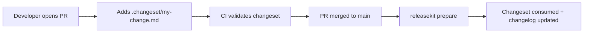

# Changesets

Changesets provide an **explicit, file-based** alternative to
conventional commits for declaring version bumps. They are especially
useful when:

- Your team doesn't use conventional commit messages.
- You want human-reviewed bump decisions in PRs.
- You need to override the bump level inferred from commits.

---

## How It Works

ReleaseKit supports **hybrid mode** — changeset bumps are merged with
conventional-commit bumps, and the higher bump wins for each package.

```text
Conventional commits:  genkit → patch  (fix: typo)
Changeset file:        genkit → minor  (add streaming support)
                       ─────────────────────────
Result:                genkit → minor  (higher wins)
```

---

## Creating a Changeset

Create a markdown file in the `.changeset/` directory at your workspace
root:

```markdown title=".changeset/add-streaming.md"
---
"genkit": minor
"genkit-plugin-firebase": patch
---

Add streaming support to the genkit core library.
```

The file has two parts:

1. **YAML frontmatter** — package name → bump level (`major`, `minor`,
   or `patch`).
2. **Body** — human-readable summary included in the changelog.

---

## Consuming Changesets

During `releasekit prepare` or `releasekit publish`, changeset files
are automatically:

1. **Read** — parsed from `.changeset/*.md`.
2. **Merged** — combined with conventional-commit bumps (higher wins).
3. **Consumed** — deleted after the release so they don't apply again.

```bash
# Preview what changesets would do.
releasekit plan

# Publish (changesets are consumed after release).
releasekit publish
```

---

## Configuration

Enable changeset support in `releasekit.toml`:

```toml
[workspace.py]
changeset_dir = ".changeset"   # Default location.

# Set to true to require changesets (disables conventional commits).
changeset_only = false
```

---

## Workflow

A typical PR-based changeset workflow:



---

## FAQ

??? question "Can I use changesets and conventional commits together?"
    Yes! This is the default ("hybrid mode"). For each package, the
    higher bump between changesets and conventional commits wins.

??? question "What happens if a changeset references a package not in the workspace?"
    ReleaseKit logs a warning and ignores that entry. The rest of the
    changeset still applies.

??? question "Can I have multiple changeset files per PR?"
    Yes. Each `.changeset/*.md` file is independent. This is useful
    when a PR touches multiple packages with different bump levels.
