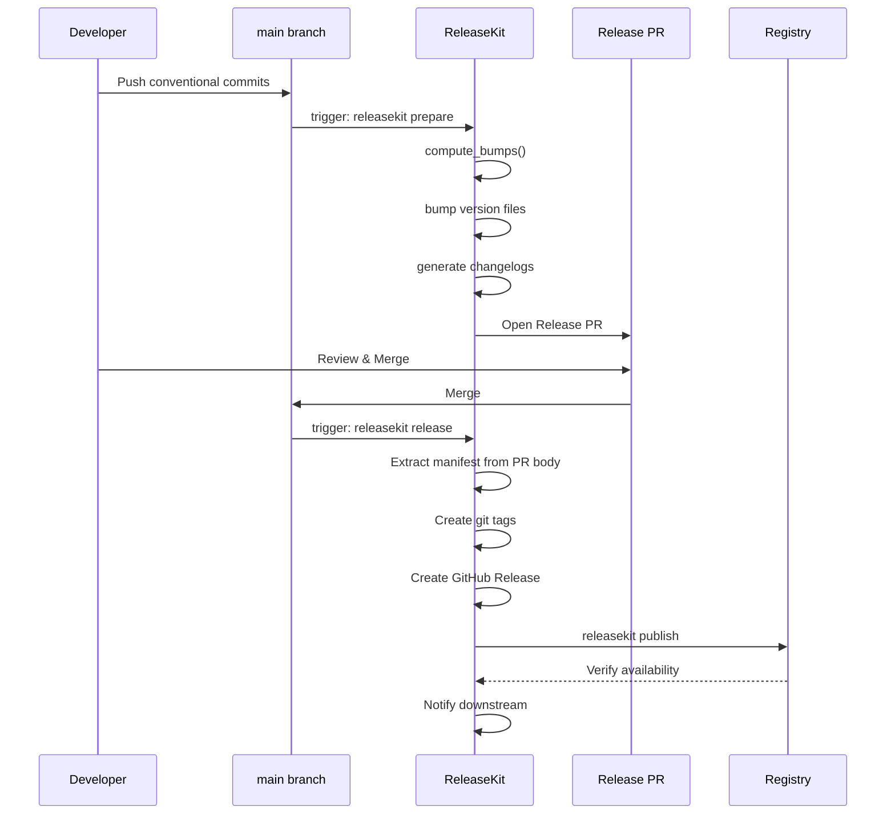

# CI/CD Integration

ReleaseKit provides two **composite actions** for GitHub Actions:

- **`setup-releasekit`** — installs uv, Python, releasekit (with AI
  extras), optionally Ollama, and configures git identity.
- **`run-releasekit`** — builds and runs the `releasekit` CLI command
  with structured inputs and parses outputs.

These actions are used together in every job to keep workflows DRY.

## Release Flow



## Job Dependency Graph

Every ReleaseKit workflow follows this pattern:

```
auth → prepare   (on push to main)
auth → release → publish → verify → notify   (on PR merge / dispatch)
```

The **auth** job resolves a token (GitHub App → PAT → GITHUB_TOKEN)
and outputs `token`, `auth-method`, `git-user-name`, and
`git-user-email` for downstream jobs.

## GitHub Actions — Composite Actions

### Minimal Example (Prepare)

```yaml
jobs:
  prepare:
    runs-on: ubuntu-latest
    steps:
      - uses: actions/checkout@v6
      - uses: ./.github/actions/setup-releasekit
        with:
          token: ${{ secrets.GITHUB_TOKEN }}
          releasekit-dir: py/tools/releasekit
          git-user-name: github-actions[bot]
          git-user-email: github-actions[bot]@users.noreply.github.com

      - uses: ./.github/actions/run-releasekit
        id: prepare
        with:
          command: prepare
          workspace: py
          releasekit-dir: py/tools/releasekit
        env:
          GH_TOKEN: ${{ secrets.GITHUB_TOKEN }}
```

### Full Pipeline (Auth → Prepare / Release → Publish → Verify → Notify)

See the sample workflows in
[`py/tools/releasekit/github/workflows/`](https://github.com/firebase/genkit/tree/main/py/tools/releasekit/github/workflows)
for complete, production-ready examples for each ecosystem:

| Workflow | Ecosystem | Registry |
|----------|-----------|----------|
| `releasekit-uv.yml` | Python (uv) | PyPI |
| `releasekit-pnpm.yml` | JavaScript (pnpm) | npm |
| `releasekit-cargo.yml` | Rust (Cargo) | crates.io |
| `releasekit-dart.yml` | Dart (pub) | pub.dev |
| `releasekit-go.yml` | Go | Go module proxy |
| `releasekit-gradle.yml` | Java/Kotlin (Gradle) | Maven Central |
| `releasekit-rollback.yml` | Any | — |

### setup-releasekit Inputs

| Input | Default | Description |
|-------|---------|-------------|
| `token` | `""` | GitHub token for checkout and API calls |
| `releasekit-dir` | `py/tools/releasekit` | Path to the releasekit source directory |
| `git-user-name` | `""` | Git committer name |
| `git-user-email` | `""` | Git committer email |
| `enable-ollama` | `"true"` | Install Ollama for local AI models |

### run-releasekit Inputs

| Input | Default | Description |
|-------|---------|-------------|
| `command` | *(required)* | Subcommand: `prepare`, `release`, `publish`, `rollback` |
| `workspace` | *(required)* | Workspace name (e.g. `py`, `go`, `js`) |
| `releasekit-dir` | `py/tools/releasekit` | Path to the releasekit source directory |
| `dry-run` | `"false"` | Simulate without side effects |
| `force` | `"false"` | Skip preflight checks |
| `group` | `""` | Target a specific release group |
| `bump-type` | `""` | Override semver bump (auto/patch/minor/major) |
| `prerelease` | `""` | Prerelease suffix (e.g. `rc.1`) |
| `concurrency` | `"0"` | Max parallel publish jobs (0 = auto) |
| `max-retries` | `"0"` | Retry failed publishes |
| `check-url` | `""` | Registry URL for version existence checks |
| `index-url` | `""` | Custom registry URL for uploads |
| `show-plan` | `"false"` | Show execution plan before running |
| `no-ai` | `"false"` | Disable AI features (summarization, codenames) |
| `model` | `""` | Override AI model (e.g. `ollama/gemma3:12b`) |
| `codename-theme` | `""` | Override codename theme (e.g. `galaxies`) |
| `tag` | `""` | Git tag to roll back (rollback only) |
| `all-tags` | `"false"` | Delete all tags on same commit (rollback only) |
| `yank` | `"false"` | Yank from registry (rollback only) |
| `yank-reason` | `""` | Reason for yanking (rollback only) |

### run-releasekit Outputs

| Output | Description |
|--------|-------------|
| `has_bumps` | `"true"` if prepare found version bumps |
| `pr_url` | URL of the Release PR (prepare only) |
| `release_url` | URL of the GitHub Release (release only) |

## Required Configuration

### Repository Variables (Settings → Variables → Actions)

| Variable | Description |
|----------|-------------|
| `RELEASEKIT_APP_ID` | GitHub App ID (for App-based auth) |
| `RELEASEKIT_GIT_USER_NAME` | Git committer name for CLA-signed identity |
| `RELEASEKIT_GIT_USER_EMAIL` | Git committer email for CLA-signed identity |

### Repository Secrets (Settings → Secrets → Actions)

| Secret | Description |
|--------|-------------|
| `RELEASEKIT_APP_PRIVATE_KEY` | GitHub App private key (PEM) |
| `RELEASEKIT_TOKEN` | PAT fallback (if no App configured) |
| `GEMINI_API_KEY` | Gemini API key (for AI features) |

Ecosystem-specific secrets:

| Secret | Ecosystem | Description |
|--------|-----------|-------------|
| `NPM_TOKEN` | JS (pnpm) | npm access token |
| `CARGO_REGISTRY_TOKEN` | Rust | crates.io API token |
| `PUB_CREDENTIALS_JSON` | Dart | pub.dev service account JSON key |
| `OSSRH_USERNAME` | Java | Sonatype OSSRH username |
| `OSSRH_PASSWORD` | Java | Sonatype OSSRH password/token |
| `GPG_SIGNING_KEY` | Java | GPG private key (base64-encoded) |
| `GPG_PASSPHRASE` | Java | GPG key passphrase |

!!! note "GITHUB_TOKEN fallback"
    If neither `RELEASEKIT_APP_ID` nor `RELEASEKIT_TOKEN` is set, the
    workflow falls back to `GITHUB_TOKEN`. In that case, set
    `RELEASEKIT_GIT_USER_NAME` and `RELEASEKIT_GIT_USER_EMAIL` to use
    a CLA-signed identity — otherwise PRs will not trigger CI and may
    fail CLA checks.

## OIDC Trusted Publishing

For PyPI trusted publishing (no tokens needed), the publish job uses
an `environment` and job-level permissions:

```yaml
publish:
  environment: pypi
  permissions:
    id-token: write      # Trusted publishing (OIDC)
    attestations: write  # PEP 740 attestations
  steps:
    - uses: actions/checkout@v6
    - uses: ./.github/actions/setup-releasekit
      with:
        token: ${{ env.RESOLVED_TOKEN }}
        releasekit-dir: ${{ env.RELEASEKIT_DIR }}
        enable-ollama: "false"

    - uses: ./.github/actions/run-releasekit
      with:
        command: publish
        workspace: py
        releasekit-dir: ${{ env.RELEASEKIT_DIR }}
```

ReleaseKit's preflight checks will warn if trusted publishing is not
configured.

## Idempotency & Resumability

Every job in the workflow is **idempotent** — re-running a failed
workflow is always safe. ReleaseKit checks state before acting:

| Job | What happens on re-run |
|-----|------------------------|
| **auth** | Stateless; always resolves a fresh token |
| **prepare** | Updates the existing Release PR instead of creating a duplicate |
| **release** | Skips tags and GitHub Releases that already exist |
| **publish** | Skips versions already present on the registry |
| **verify** | Re-verifies; always safe to repeat |
| **notify** | Dispatches `repository_dispatch` (downstream deduplicates) |

### Resuming a failed workflow

1. Go to **Actions** → find the failed run
2. Click **"Re-run failed jobs"** (not "Re-run all jobs")
3. Only the failed jobs re-run; successful jobs keep their outputs

No special flags or state files are needed.

### Resuming from the CLI

If a `publish` run was interrupted mid-way (e.g., 3 of 5 packages
published), just re-run:

```bash
releasekit publish
```

ReleaseKit polls each registry before uploading. If a version already
exists, it skips that package and moves to the next one.

## GitLab CI

```yaml
release:
  stage: deploy
  image: python:3.12
  before_script:
    - pip install uv
    - uv sync --active
  script:
    - uv run releasekit prepare --forge-backend cli
  only:
    - main
```

## Testing Releases

### Test PyPI

```bash
releasekit publish \
  --index-url https://test.pypi.org/simple/ \
  --check-url https://test.pypi.org/simple/ \
  --dry-run
```

### Local Dry Run

```bash
# Preview the full plan
releasekit plan --format json

# Dry-run publish (no uploads)
releasekit publish --dry-run
```

## Scheduled / Cadence Releases *(planned)*

ReleaseKit will support scheduled releases via the `should-release`
command and `[schedule]` config. This enables daily, weekly, or
custom-cadence releases driven by CI cron triggers.

### Daily Release (GitHub Actions)

```yaml
name: Daily Release
on:
  schedule:
    - cron: '0 14 * * *'  # 2 PM UTC daily

jobs:
  release:
    runs-on: ubuntu-latest
    permissions:
      contents: write
      id-token: write
    steps:
      - uses: actions/checkout@v6

      - uses: ./.github/actions/setup-releasekit
        with:
          token: ${{ secrets.GITHUB_TOKEN }}
          releasekit-dir: py/tools/releasekit

      - name: Check if release needed
        id: check
        run: |
          uv run releasekit should-release || echo "skip=true" >> "$GITHUB_OUTPUT"

      - uses: ./.github/actions/run-releasekit
        if: steps.check.outputs.skip != 'true'
        with:
          command: prepare
          workspace: py
          releasekit-dir: py/tools/releasekit
        env:
          GH_TOKEN: ${{ secrets.GITHUB_TOKEN }}
```

### Configuration

```toml
# releasekit.toml — scheduled release settings (planned)
[schedule]
cadence          = "daily"          # daily | weekly:monday | biweekly | on-push
release_window   = "14:00-16:00"   # UTC time range
cooldown_minutes = 60               # min time between releases
min_bump         = "patch"          # skip if only chore/docs commits
```

## Continuous Deploy Mode *(planned)*

For projects that want a release on every push to `main` (like
semantic-release's default behavior), ReleaseKit will support a
`release_mode = "continuous"` config that skips PR creation and
goes directly to tag + publish.

### Per-Commit Release (GitHub Actions)

```yaml
name: Continuous Deploy
on:
  push:
    branches: [main]

jobs:
  release:
    runs-on: ubuntu-latest
    permissions:
      contents: write
      id-token: write
    steps:
      - uses: actions/checkout@v6

      - uses: ./.github/actions/setup-releasekit
        with:
          token: ${{ secrets.GITHUB_TOKEN }}
          releasekit-dir: py/tools/releasekit

      - uses: ./.github/actions/run-releasekit
        with:
          command: publish
          workspace: py
          releasekit-dir: py/tools/releasekit
        env:
          GH_TOKEN: ${{ secrets.GITHUB_TOKEN }}
```

### Configuration

```toml
# releasekit.toml — continuous deploy settings (planned)
release_mode = "continuous"   # skip PR, tag + publish directly
```

## Lifecycle Hooks *(planned)*

ReleaseKit will support lifecycle hooks that run custom scripts at
key points in the release pipeline. Unlike semantic-release's plugin
system, hooks are simple shell commands configured in TOML — no
JavaScript plugins required.

### Configuration

```toml
# releasekit.toml — lifecycle hooks (planned)
[hooks]
before_prepare = ["./scripts/pre-release-checks.sh"]
after_tag      = ["./scripts/notify-slack.sh ${version}"]
before_publish = ["./scripts/build-docs.sh"]
after_publish  = [
  "./scripts/update-homebrew-formula.sh ${version}",
  "./scripts/announce-release.sh ${name} ${version}",
]
```

Template variables available in hooks:

| Variable | Description |
|----------|-------------|
| `${version}` | The new version being released |
| `${name}` | Package name |
| `${tag}` | Git tag (e.g. `genkit-v0.6.0`) |
