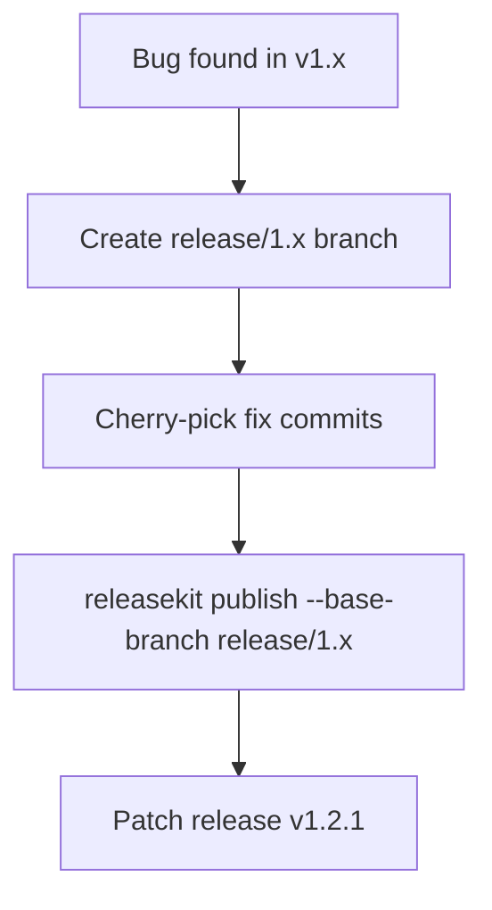

# Hotfix & Maintenance Releases

ReleaseKit supports releasing from **non-default branches** for hotfix
and maintenance releases. This is common when you need to patch an
older major version while `main` has moved ahead.

---

## Workflow



---

## CLI Flags

| Flag | Description |
|------|-------------|
| `--base-branch` | Override the branch to release from |
| `--since-tag` | Override the starting tag for commit scanning |

```bash
# Release from a maintenance branch.
releasekit publish --base-branch release/1.x

# Specify which tag to start scanning from.
releasekit publish --base-branch release/1.x --since-tag genkit-v1.2.0
```

---

## Cherry-Picking

Use `git cherry-pick` to backport specific commits onto a maintenance branch:

```bash
# Cherry-pick specific commits onto the maintenance branch.
git checkout release/1.x
git cherry-pick abc1234 def5678
```

Each SHA is cherry-picked in order. If a cherry-pick fails due to
conflicts, resolve them with `git cherry-pick --continue` or skip with
`git cherry-pick --skip`.

---

## Branch Resolution Priority

The effective base branch is resolved in this order:

1. `--base-branch` CLI flag (highest priority)
2. `publish_branch` in workspace config
3. `default_branch` in global config (default: `main`)

---

## Configuration

```toml
[workspace.py]
# Default branch for publishing (can be overridden with --base-branch).
publish_branch = "main"

# Default branch for version tag scanning.
default_branch = "main"
```

---

## Commit-Back PRs

After a hotfix release, ReleaseKit can automatically create a
**commit-back PR** to merge the version bump back to `main`.
See [Commit-Back PRs](commitback.md) for details.
