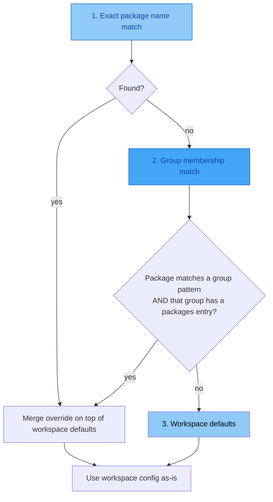

# Per-Package Configuration

Sometimes a single workspace contains packages with different needs —
a Python library that publishes to PyPI and a JS wrapper that publishes
to npm, or a package that needs a custom registry URL for testing.

Per-package configuration lets you override workspace-level settings
for specific packages without splitting them into separate workspaces.

## ELI5: How It Works

```
┌─────────────────────────────────────────────────────────┐
│                   Your Workspace                         │
│                                                         │
│  [workspace.mono]                                       │
│  versioning_scheme = "pep440"    ← default for all      │
│  smoke_test = true                                      │
│                                                         │
│  ┌─────────────┐  ┌─────────────┐  ┌─────────────┐     │
│  │ my-py-lib   │  │ my-py-util  │  │ my-js-sdk   │     │
│  │             │  │             │  │             │     │
│  │ pep440  ✓   │  │ pep440  ✓   │  │ semver  ★   │     │
│  │ (inherited) │  │ (inherited) │  │ (override)  │     │
│  └─────────────┘  └─────────────┘  └─────────────┘     │
│                                                         │
│  ✓ = inherited from workspace                           │
│  ★ = overridden per-package                             │
└─────────────────────────────────────────────────────────┘
```

## Quick Start

Add a `[workspace.<label>.packages."<name>"]` section to your
`releasekit.toml`:

```toml
[workspace.mono]
ecosystem = "python"
root = "."

# Override for one specific package
[workspace.mono.packages."my-js-sdk"]
versioning_scheme = "semver"
dist_tag = "latest"
```

That's it. `my-js-sdk` now uses semver while everything else uses
pep440 (the Python default).

## Available Override Fields

| Field | Type | What It Does |
|-------|------|-------------|
| `versioning_scheme` | `string` | `"semver"`, `"pep440"`, or `"calver"` |
| `calver_format` | `string` | CalVer format (e.g. `"YYYY.MM.MICRO"`) |
| `prerelease_label` | `string` | Default pre-release label (`"alpha"`, `"beta"`, `"rc"`, `"dev"`) |
| `changelog` | `bool` | Generate CHANGELOG.md entries for this package |
| `changelog_template` | `string` | Path to a custom Jinja2 changelog template |
| `smoke_test` | `bool` | Run install smoke test after publishing |
| `major_on_zero` | `bool` | Allow `0.x` → `1.0.0` on breaking changes |
| `extra_files` | `list[string]` | Extra files with version strings to bump |
| `dist_tag` | `string` | npm dist-tag (e.g. `"latest"`, `"next"`) |
| `registry_url` | `string` | Custom registry URL for publishing |
| `provenance` | `bool` | Generate npm provenance attestation |
| `skip_checks` | `list[string]` | Health checks to skip for this package (see [Skipping Checks](skip-checks.md)) |

!!! tip "Only set what you need"
    You don't need to repeat workspace-level values. Unset fields
    automatically inherit from the workspace. Only specify the fields
    you want to override.

## Resolution Order

ReleaseKit resolves configuration in this order (most specific wins):



### Example: Exact Name vs Group

```toml
[workspace.mono]
versioning_scheme = "pep440"

[workspace.mono.groups]
plugins = ["myorg-plugin-*"]

# Group-level override: all plugins use semver
[workspace.mono.packages.plugins]
versioning_scheme = "semver"

# Package-level override: this one plugin uses calver
[workspace.mono.packages."myorg-plugin-special"]
versioning_scheme = "calver"
calver_format = "YYYY.MM.MICRO"
```

Resolution for each package:

| Package | Matches | Resolved Scheme |
|---------|---------|-----------------|
| `myorg-core` | no override | `pep440` (workspace default) |
| `myorg-plugin-foo` | group `plugins` | `semver` (group override) |
| `myorg-plugin-special` | exact name | `calver` (exact override wins) |

## Codelab: Publishing to Test PyPI

**Goal:** Publish one experimental package to Test PyPI while everything
else goes to production PyPI.

### Step 1: Add the override

```toml
[workspace.py]
ecosystem = "python"
root = "py"

[workspace.py.packages."myorg-experimental"]
registry_url = "https://test.pypi.org/legacy/"
smoke_test = false  # Test PyPI doesn't always have deps
```

### Step 2: Verify

```bash
releasekit plan
```

All packages show their normal versions. The override only affects
*where* `myorg-experimental` publishes, not *how* it's versioned.

### Step 3: Publish

```bash
releasekit publish
```

`myorg-experimental` goes to Test PyPI. Everything else goes to
production PyPI.

## Codelab: Publishing via Google's Wombat Dressing Room

**Goal:** Publish npm packages through [Wombat Dressing Room](https://github.com/GoogleCloudPlatform/wombat-dressing-room),
Google's npm publish proxy that enforces 2FA and single-account
publishing to reduce the attack surface of `npm publish`.

!!! info "How Wombat works"
    Wombat Dressing Room is a **full registry proxy**. It proxies
    both **reads** (`GET /<package>` → `registry.npmjs.org`) and
    **writes** (`PUT /<package>` with auth/2FA enforcement →
    `registry.npmjs.org`). All publishes go through a single npm
    bot account with 2FA enabled, and Wombat verifies that the
    publisher has push access to the package's GitHub repository.

### Step 1: Deploy Wombat Dressing Room

Follow the [Wombat deployment guide](https://github.com/GoogleCloudPlatform/wombat-dressing-room#deployment)
to deploy the proxy on Google App Engine. You'll end up with two
services:

- **External** (`https://my-wombat-external.appspot.com`) — the
  registry proxy that clients publish to and read from
- **Internal** (`https://my-wombat.appspot.com`) — the login/auth
  server, protected by [IAP](https://cloud.google.com/iap/)

The Wombat server requires these environment variables:

| Variable | Description |
|----------|-------------|
| `NPM_TOKEN` | npm bot account token (2FA-enabled account) |
| `NPM_OTP_SECRET` | TOTP secret for the bot account's 2FA |
| `GITHUB_CLIENT_ID` | GitHub OAuth App client ID |
| `GITHUB_CLIENT_SECRET` | GitHub OAuth App client secret |
| `DATASTORE_PROJECT_ID` | GCP Datastore project for token storage |
| `REGISTRY_URL` | External URL of the Wombat proxy itself |
| `LOGIN_URL` | URL of the internal login server |
| `LOGIN_ENABLED` | `yes-this-is-a-login-server` (internal only) |

### Step 2: Configure releasekit.toml

Set `registry_url` to your Wombat external service URL. ReleaseKit
passes this URL to both `pnpm publish --registry` (the write path)
and the `NpmRegistry` backend (the read/poll path). Since Wombat
proxies reads transparently to `registry.npmjs.org`, both paths
work correctly.

```toml
[workspace.js]
ecosystem = "javascript"
tool = "pnpm"
root = "js"
registry_url = "https://my-wombat-external.appspot.com"
provenance = true
```

Or, if only some packages should go through Wombat:

```toml
[workspace.js]
ecosystem = "javascript"
tool = "pnpm"
root = "js"

[workspace.js.groups]
public = ["@myorg/*"]

# Only public packages go through Wombat
[workspace.js.packages.public]
registry_url = "https://my-wombat-external.appspot.com"
```

### Step 3: Authenticate with Wombat

Wombat authenticates publishers via **GitHub OAuth**. Each developer
creates a publish token through the Wombat web UI after logging in
with GitHub. Wombat then verifies that the token holder has push
access to the package's GitHub repository before forwarding the
publish to npm.

```bash
# Log in to Wombat and create a publish token
npm login --registry https://my-wombat-external.appspot.com
```

This opens a browser for GitHub OAuth. Once authenticated, npm
stores the Wombat token in `~/.npmrc`. For CI, set the token
directly:

```bash
# CI: set the Wombat publish token
echo "//my-wombat-external.appspot.com/:_authToken=${WOMBAT_TOKEN}" >> .npmrc
```

!!! tip "Release-backed tokens"
    Wombat supports **release-backed 2FA** — tokens that only allow
    publishing when a matching GitHub Release exists. This is ideal
    for CI: the release tag acts as a second factor, ensuring only
    tagged releases can be published.

### Step 4: Publish

```bash
releasekit publish
```

ReleaseKit will:

1. **Build** each package with `pnpm pack`
2. **Publish** via `pnpm publish --registry https://my-wombat-external.appspot.com`
3. **Poll** the Wombat proxy (which forwards to `registry.npmjs.org`) until the version appears
4. **Verify** checksums against the registry

### Step 5: Verify

```bash
# Check the package appeared on public npm
pnpm view @myorg/my-package version
```

!!! note "CLI override"
    You can also pass the Wombat URL on the command line without
    changing `releasekit.toml`:

    ```bash
    releasekit publish --registry-url https://my-wombat-external.appspot.com
    ```

    `--registry-url` takes precedence over `registry_url` in the config.

## Codelab: Publishing to Google Cloud Artifact Registry

**Goal:** Publish npm packages to a private
[Google Cloud Artifact Registry](https://cloud.google.com/artifact-registry)
npm repository instead of the public npm registry.

!!! info "How Artifact Registry works"
    Artifact Registry is a **full read/write** package registry hosted
    on Google Cloud. It supports npm (and many other formats), provides
    IAM-based access control, vulnerability scanning, and integrates
    natively with Cloud Build, GKE, and Cloud Run.

### Step 1: Create an npm repository

```bash
gcloud artifacts repositories create my-npm-repo \
    --repository-format=npm \
    --location=us-central1 \
    --description="Private npm packages"
```

Your registry URL will be:

```text
https://us-central1-npm.pkg.dev/MY_PROJECT/my-npm-repo/
```

### Step 2: Configure releasekit.toml

Set `registry_url` to your Artifact Registry repository URL:

```toml
[workspace.js]
ecosystem = "javascript"
tool = "pnpm"
root = "js"
registry_url = "https://us-central1-npm.pkg.dev/my-project/my-npm-repo/"
```

Or scope it to specific packages:

```toml
[workspace.js]
ecosystem = "javascript"
tool = "pnpm"
root = "js"

[workspace.js.groups]
internal = ["@myorg/internal-*"]

# Only internal packages go to Artifact Registry
[workspace.js.packages.internal]
registry_url = "https://us-central1-npm.pkg.dev/my-project/my-npm-repo/"
```

### Step 3: Authenticate

Artifact Registry uses Google Cloud credentials. The recommended
approach is the
[`google-artifactregistry-auth`](https://www.npmjs.com/package/google-artifactregistry-auth)
credential helper.

**Option A: Credential helper (recommended)**

Add the registry to your project `.npmrc`:

```ini
@myorg:registry=https://us-central1-npm.pkg.dev/my-project/my-npm-repo/
//us-central1-npm.pkg.dev/my-project/my-npm-repo/:always-auth=true
```

Then refresh credentials before publishing:

```bash
npx google-artifactregistry-auth
```

The helper uses
[Application Default Credentials](https://cloud.google.com/docs/authentication/application-default-credentials)
(ADC), which automatically picks up:

- `GOOGLE_APPLICATION_CREDENTIALS` env var (service account key)
- Default service account on GCE / GKE / Cloud Run / Cloud Build
- `gcloud auth application-default login` credentials

**Option B: Service account key (CI)**

```bash
# Create a service account with Artifact Registry Writer role
gcloud iam service-accounts create releasekit-publisher
gcloud artifacts repositories add-iam-policy-binding my-npm-repo \
    --location=us-central1 \
    --member="serviceAccount:releasekit-publisher@my-project.iam.gserviceaccount.com" \
    --role="roles/artifactregistry.writer"

# Export credentials for the credential helper
export GOOGLE_APPLICATION_CREDENTIALS=/path/to/key.json
npx google-artifactregistry-auth
```

### Step 4: Publish

```bash
releasekit publish
```

ReleaseKit will:

1. **Build** each package with `pnpm pack`
2. **Publish** via `pnpm publish --registry https://us-central1-npm.pkg.dev/my-project/my-npm-repo/`
3. **Poll** Artifact Registry until the version appears
4. **Verify** checksums against the registry

### Step 5: Verify

```bash
# Check the package is available
pnpm view @myorg/my-package version \
    --registry https://us-central1-npm.pkg.dev/my-project/my-npm-repo/
```

!!! tip "Artifact Registry as an npm proxy"
    Artifact Registry also supports
    [remote repositories](https://cloud.google.com/artifact-registry/docs/repositories/remote-repo)
    that proxy the public npm registry. This lets you cache public
    packages alongside your private ones, all behind a single URL.

## Codelab: Publishing Java/Kotlin to Google Cloud Artifact Registry (Maven)

**Goal:** Publish Java or Kotlin packages to a private
[Google Cloud Artifact Registry](https://cloud.google.com/artifact-registry)
Maven repository using Gradle or Maven.

!!! info "Google's Maven repositories"
    **`maven.google.com`** is Google's **read-only** public repository
    (Android SDK, Firebase, etc.) — you cannot publish to it.
    **Artifact Registry** is Google Cloud's managed, private Maven
    hosting with IAM-based access control.

### Step 1: Create a Maven repository

```bash
gcloud artifacts repositories create my-maven-repo \
    --repository-format=maven \
    --location=us-central1 \
    --description="Private Maven packages"
```

Your repository URL will be:

```text
https://us-central1-maven.pkg.dev/MY_PROJECT/my-maven-repo
```

### Step 2: Configure your build tool

**For Gradle projects**, add the Artifact Registry Gradle plugin and
repository to `build.gradle`:

```groovy
plugins {
    id "maven-publish"
    id "com.google.cloud.artifactregistry.gradle-plugin" version "2.2.5"
}

publishing {
    publications {
        mavenJava(MavenPublication) {
            groupId = "com.example"
            from components.java
        }
    }
    repositories {
        maven {
            def mavenUrl = project.findProperty("mavenUrl")
            url = mavenUrl ?: "artifactregistry://us-central1-maven.pkg.dev/my-project/my-maven-repo"
        }
    }
}
```

The `mavenUrl` property lets ReleaseKit override the repository URL
via `registry_url` (passed as `-PmavenUrl=<url>`).

**For Maven projects**, add the Artifact Registry wagon extension and
distribution management to `pom.xml`:

```xml
<build>
  <extensions>
    <extension>
      <groupId>com.google.cloud.artifactregistry</groupId>
      <artifactId>artifactregistry-maven-wagon</artifactId>
      <version>2.2.5</version>
    </extension>
  </extensions>
</build>

<distributionManagement>
  <repository>
    <id>artifact-registry</id>
    <url>artifactregistry://us-central1-maven.pkg.dev/MY_PROJECT/my-maven-repo</url>
  </repository>
</distributionManagement>
```

### Step 3: Configure releasekit.toml

```toml
[workspace.java]
ecosystem = "java"
tool = "gradle"  # or "maven"
root = "java"
registry_url = "https://us-central1-maven.pkg.dev/my-project/my-maven-repo"
```

!!! note "Gradle vs Maven URL handling"
    - **Gradle**: `registry_url` is passed as `-PmavenUrl=<url>`.
      Your `build.gradle` must read this property (see Step 2).
    - **Maven**: `registry_url` is passed as
      `-DaltDeploymentRepository=releasekit::default::<url>`,
      which overrides the `<distributionManagement>` in `pom.xml`.

### Step 4: Authenticate

The Artifact Registry Gradle/Maven plugins use
[Application Default Credentials](https://cloud.google.com/docs/authentication/application-default-credentials)
automatically.

```bash
# Local development
gcloud auth application-default login

# CI: use a service account
export GOOGLE_APPLICATION_CREDENTIALS=/path/to/key.json
```

Grant the service account the **Artifact Registry Writer** role:

```bash
gcloud artifacts repositories add-iam-policy-binding my-maven-repo \
    --location=us-central1 \
    --member="serviceAccount:releasekit-publisher@my-project.iam.gserviceaccount.com" \
    --role="roles/artifactregistry.writer"
```

### Step 5: Publish

```bash
releasekit publish
```

ReleaseKit will:

1. **Build** each package with `gradle build` or `mvn package`
2. **Publish** via `gradle publish -PmavenUrl=<url>` or
   `mvn deploy -DaltDeploymentRepository=releasekit::default::<url>`
3. **Poll** Maven Central for availability (see note below)
4. **Verify** the artifact was published

!!! warning "Polling limitation"
    The `MavenCentralRegistry` polling backend uses the Maven Central
    Search API (`search.maven.org`). When publishing to Artifact
    Registry (not Maven Central), polling will not detect the artifact
    on `search.maven.org`. You can verify publication directly:

    ```bash
    # Check via gcloud
    gcloud artifacts versions list \
        --package=com.example:my-lib \
        --repository=my-maven-repo \
        --location=us-central1
    ```

## Codelab: Mixed Python + JS Workspace

**Goal:** A monorepo with Python libraries and a JS SDK, all in one
workspace.

### Step 1: Configure groups and overrides

```toml
[workspace.mono]
ecosystem = "python"
root = "."

[workspace.mono.groups]
py-libs = ["myproject-*"]
js-sdk  = ["myproject-js-*"]

# JS packages use semver and publish to npm
[workspace.mono.packages.js-sdk]
versioning_scheme = "semver"
dist_tag = "latest"
provenance = true
```

### Step 2: Check the plan

```bash
releasekit plan --prerelease rc
```

Python packages get PEP 440 pre-releases (`1.2.0rc1`), JS packages
get semver pre-releases (`1.2.0-rc.1`).

## Advanced: Group Overrides

You can apply overrides to an entire group by using the group name
as the package key:

```toml
[workspace.mono.groups]
plugins   = ["myorg-plugin-*"]
internals = ["myorg-internal-*"]

# All plugins: disable changelog, enable provenance
[workspace.mono.packages.plugins]
changelog = false
provenance = true

# All internals: publish to private registry
[workspace.mono.packages.internals]
registry_url = "https://private.registry.example.com"
smoke_test = false
```

!!! warning "Group names must match"
    The key in `[workspace.X.packages.GROUP]` must exactly match a
    group name defined in `[workspace.X.groups]`. If the group doesn't
    exist, the override is treated as a literal package name.

## How Merging Works

When an override is found, non-empty fields replace the workspace
default. Empty or unset fields inherit from the workspace:

```
Workspace:  versioning_scheme = "pep440"
            dist_tag          = "latest"
            major_on_zero     = true
            smoke_test        = true

Override:   registry_url      = "https://test.pypi.org"
            smoke_test        = false

Result:     versioning_scheme = "pep440"    ← inherited
            dist_tag          = "latest"    ← inherited
            major_on_zero     = true        ← inherited
            smoke_test        = false       ← overridden
            registry_url      = "https://test.pypi.org"  ← overridden
```

## Next Steps

- [Versioning Schemes](versioning-schemes.md) — Deep dive into semver vs PEP 440 vs CalVer
- [Configuration Reference](../reference/config-file.md) — Full schema
- [CI/CD Integration](ci-cd.md) — Automate releases with GitHub Actions
