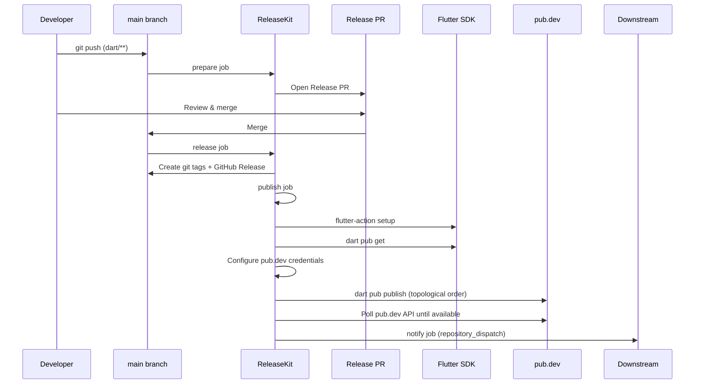

# Dart/Flutter — `releasekit-dart.yml`

Release workflow for Dart and Flutter packages managed by a
[melos workspace](https://melos.invertase.dev/) or
[pubspec workspace](https://dart.dev/tools/pub/workspaces).
Publishes to [pub.dev](https://pub.dev/).

## Sequence Diagram

## Trigger Matrix

| Event | Jobs that run |
|-------|---------------|
| Push to `main` (matching `dart/**`, `flutter/**`) | `prepare` |
| Release PR merged | `release` → `publish` → `notify` |
| Manual dispatch: `prepare` | `prepare` |
| Manual dispatch: `release` | `release` → `publish` → `notify` |

## Manual Dispatch Inputs

| Input | Type | Default | Description |
|-------|------|---------|-------------|
| `action` | choice | `release` | Pipeline stage: `prepare` or `release` |
| `dry_run` | boolean | `true` | Simulate without side effects |
| `force_prepare` | boolean | `false` | Force PR creation even without bumps |
| `group` | string | *(all)* | Target a specific release group |
| `bump_type` | choice | `auto` | Override: `auto`, `patch`, `minor`, `major` |
| `prerelease` | string | *(none)* | Prerelease suffix (e.g. `rc.1`) |
| `skip_publish` | boolean | `false` | Tag + release but skip pub.dev upload |
| `concurrency` | string | `0` | Max parallel publish jobs (`0` = auto) |
| `max_retries` | string | `2` | Retry failed publishes |

## Authentication

| Method | How |
|--------|-----|
| **Service account** | Set `PUB_CREDENTIALS_JSON` secret — a Google Cloud service account key with "Service Account Token Creator" role |
| **Workload Identity** | Use [Workload Identity Federation](https://cloud.google.com/iam/docs/workload-identity-federation) for keyless auth in Google Cloud |

The workflow writes the credentials JSON to
`$HOME/.config/dart/pub-credentials.json` before publishing.

## Key Details

- **Flutter SDK** — uses
  [subosito/flutter-action](https://github.com/subosito/flutter-action)
  for SDK setup with caching enabled.
- **`dart pub get`** — dependencies are resolved before publish.
- **Topological order** — packages are published in dependency order
  with polling between each level.

## Source

:material-file-code: [`github/workflows/releasekit-dart.yml`](https://github.com/firebase/genkit/blob/main/py/tools/releasekit/github/workflows/releasekit-dart.yml)
