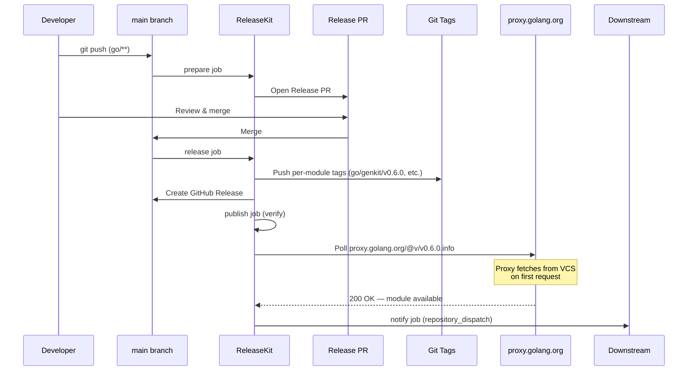

# Go — `releasekit-go.yml`

Release workflow for Go modules managed by a
[`go.work` workspace](https://go.dev/doc/tutorial/workspaces).
Go modules don't need an explicit upload step — the
[Go module proxy](https://proxy.golang.org/) fetches tagged versions
from VCS on first request. The publish job **polls** the proxy to
confirm availability.

## Sequence Diagram

!!! info "No upload step"
    Unlike PyPI or npm, Go modules are published by pushing **git tags**.
    The Go proxy picks them up automatically. ReleaseKit's publish job
    just verifies the proxy has indexed the new version.

## Trigger Matrix

| Event | Jobs that run |
|-------|---------------|
| Push to `main` (matching `go/**`) | `prepare` |
| Release PR merged | `release` → `publish` (verify) → `notify` |
| Manual dispatch: `prepare` | `prepare` |
| Manual dispatch: `release` | `release` → `publish` (verify) → `notify` |

## Manual Dispatch Inputs

| Input | Type | Default | Description |
|-------|------|---------|-------------|
| `action` | choice | `release` | Pipeline stage: `prepare` or `release` |
| `dry_run` | boolean | `true` | Simulate without side effects |
| `force_prepare` | boolean | `false` | Force PR creation even without bumps |
| `group` | string | *(all)* | Target a specific release group |
| `bump_type` | choice | `auto` | Override: `auto`, `patch`, `minor`, `major` |
| `prerelease` | string | *(none)* | Prerelease suffix (e.g. `rc.1`) |
| `skip_publish` | boolean | `false` | Tag + release but skip proxy verification |
| `concurrency` | string | `0` | Max parallel verify jobs (`0` = auto) |
| `max_retries` | string | `2` | Retry failed verifications |

## Authentication

| Method | How |
|--------|-----|
| **Git push** | The `GITHUB_TOKEN` (automatic) has write access to push tags |

No registry tokens needed — Go uses VCS tags, not a registry upload.

## Key Details

- **Per-module tags** — Go multi-module repos use path-prefixed tags
  like `go/genkit/v0.6.0`, `go/ai/v0.6.0`. ReleaseKit creates the
  correct tag format automatically.
- **`go.work`** — The workspace file tells ReleaseKit which modules
  to manage.
- **No `id-token: write`** — Go doesn't have a registry upload, so
  OIDC is not needed for publishing (but can still be used for
  provenance signing).

## Source

:material-file-code: [`github/workflows/releasekit-go.yml`](https://github.com/firebase/genkit/blob/main/py/tools/releasekit/github/workflows/releasekit-go.yml)
