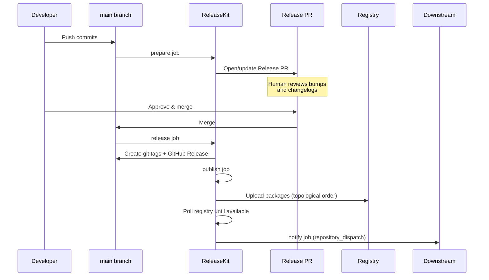

# Workflow Templates

ReleaseKit ships production-ready GitHub Actions workflows for every
supported ecosystem. Each template follows the same four-job pattern —
**prepare → release → publish → notify** — with ecosystem-specific
tooling and authentication.

## Which Template Do I Need?

| Your ecosystem | Template | Registry |
|----------------|----------|----------|
| Python (uv) | [releasekit-uv.yml](python-uv.md) | [PyPI](https://pypi.org/) |
| JavaScript (pnpm) | [releasekit-pnpm.yml](javascript-pnpm.md) | [npm](https://www.npmjs.com/) |
| Go | [releasekit-go.yml](go.md) | [Go module proxy](https://proxy.golang.org/) |
| Rust (Cargo) | [releasekit-cargo.yml](rust-cargo.md) | [crates.io](https://crates.io/) |
| Dart/Flutter | [releasekit-dart.yml](dart-flutter.md) | [pub.dev](https://pub.dev/) |
| Java/Kotlin (Gradle) | [releasekit-gradle.yml](java-gradle.md) | [Maven Central](https://central.sonatype.com/) |
| Rollback (any) | [releasekit-rollback.yml](rollback.md) | *(deletes tags, yanks versions)* |

## The Shared Pattern

Every production template follows this sequence:



### Common Features

All templates share these characteristics:

| Feature | How |
|---------|-----|
| **Idempotent** | Re-running any job is safe — already-created tags and already-published versions are skipped |
| **Concurrency guard** | `cancel-in-progress: false` ensures a running release is never cancelled |
| **Dry-run by default** | Manual dispatch defaults to `dry_run: true` for safety |
| **Release PR gate** | Automatic flow requires merging a PR with `autorelease: pending` label |
| **Manifest artifact** | Published state is saved as a GitHub Actions artifact for audit trail |
| **Downstream notification** | `repository_dispatch` event lets other repos react to releases |

### Installation

Copy the template for your ecosystem to `.github/workflows/`:

```bash
cp py/tools/releasekit/github/workflows/releasekit-uv.yml \
   .github/workflows/release-python.yml
```

For starter templates (simpler variants), see the
[workflow patterns](../workflow-templates.md) guide.
