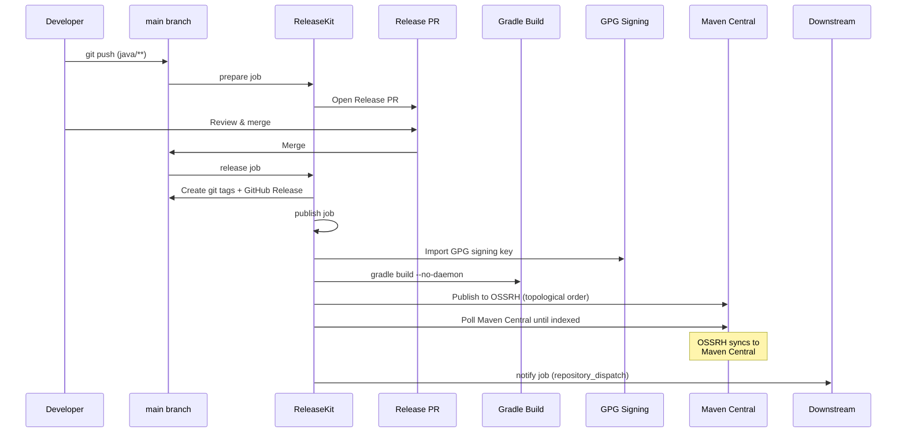

# Java/Kotlin (Gradle) — `releasekit-gradle.yml`

Release workflow for Java and Kotlin projects managed by
[Gradle](https://gradle.org/) (`settings.gradle` /
`settings.gradle.kts`). Publishes to
[Maven Central](https://central.sonatype.com/) via Sonatype OSSRH,
with GPG signing.

## Sequence Diagram



## Trigger Matrix

| Event | Jobs that run |
|-------|---------------|
| Push to `main` (matching `java/**`, `jvm/**`) | `prepare` |
| Release PR merged | `release` → `publish` → `notify` |
| Manual dispatch: `prepare` | `prepare` |
| Manual dispatch: `release` | `release` → `publish` → `notify` |

## Manual Dispatch Inputs

| Input | Type | Default | Description |
|-------|------|---------|-------------|
| `action` | choice | `release` | Pipeline stage: `prepare` or `release` |
| `target` | choice | `maven-central` | Registry: `maven-central` or `staging` |
| `dry_run` | boolean | `true` | Simulate without side effects |
| `force_prepare` | boolean | `false` | Force PR creation even without bumps |
| `group` | string | *(all)* | Target a specific release group |
| `bump_type` | choice | `auto` | Override: `auto`, `patch`, `minor`, `major` |
| `prerelease` | string | *(none)* | Prerelease suffix (e.g. `rc.1`) |
| `skip_publish` | boolean | `false` | Tag + release but skip Maven upload |
| `concurrency` | string | `0` | Max parallel publish jobs (`0` = auto) |
| `max_retries` | string | `2` | Retry failed publishes |

## Authentication

Four secrets are required:

| Secret | Purpose |
|--------|---------|
| `OSSRH_USERNAME` | Sonatype OSSRH username |
| `OSSRH_PASSWORD` | Sonatype OSSRH password or token |
| `GPG_SIGNING_KEY` | GPG private key (base64-encoded) |
| `GPG_PASSPHRASE` | GPG key passphrase |

### Generating the GPG key

```bash
# Generate a key
gpg --full-generate-key

# Export and base64-encode it
gpg --export-secret-keys YOUR_KEY_ID | base64 -w0
```

Store the base64 output as `GPG_SIGNING_KEY` in GitHub secrets.

## Key Details

- **Staging target** — set target to `staging` to publish to the
  Sonatype staging repository for validation before promotion to
  Maven Central.
- **GPG signing** — Maven Central requires all artifacts to be GPG
  signed. The workflow imports the key before building.
- **`gradle build --no-daemon`** — no-daemon mode avoids caching
  issues in CI environments.
- **Two setup actions** — uses both
  [actions/setup-java](https://github.com/actions/setup-java) and
  [gradle/actions/setup-gradle](https://github.com/gradle/actions)
  for proper toolchain and dependency caching.

## Source

:material-file-code: [`github/workflows/releasekit-gradle.yml`](https://github.com/firebase/genkit/blob/main/py/tools/releasekit/github/workflows/releasekit-gradle.yml)
