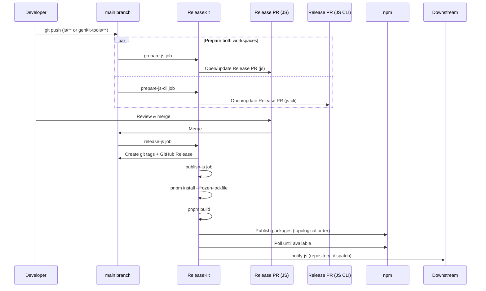

# JavaScript (pnpm) — `releasekit-pnpm.yml`

Release workflow for JavaScript/TypeScript packages managed by a
[pnpm workspace](https://pnpm.io/workspaces). Publishes to
[npm](https://www.npmjs.com/). Supports **two workspaces** in a single
workflow — `js` (core SDK + plugins) and `js-cli` (CLI tools).

## Sequence Diagram

## Trigger Matrix

| Event | Jobs that run |
|-------|---------------|
| Push to `main` (matching `js/**`, `genkit-tools/**`) | `prepare-js` + `prepare-js-cli` |
| Release PR merged | `release-js` → `publish-js` → `notify-js` |
| Manual dispatch: `prepare` | `prepare-js` + `prepare-js-cli` |
| Manual dispatch: `release` | `release-js` → `publish-js` → `notify-js` |

## Manual Dispatch Inputs

| Input | Type | Default | Description |
|-------|------|---------|-------------|
| `action` | choice | `release` | Pipeline stage: `prepare` or `release` |
| `target` | choice | `npm` | Registry: `npm` |
| `dry_run` | boolean | `true` | Simulate without side effects |
| `force_prepare` | boolean | `false` | Force PR creation even without bumps |
| `group` | string | *(all)* | Target a specific release group |
| `bump_type` | choice | `auto` | Override: `auto`, `patch`, `minor`, `major` |
| `prerelease` | string | *(none)* | Prerelease suffix (e.g. `rc.1`) |
| `skip_publish` | boolean | `false` | Tag + release but skip npm upload |
| `concurrency` | string | `0` | Max parallel publish jobs (`0` = auto) |
| `max_retries` | string | `2` | Retry failed publishes |

## Authentication

| Method | How |
|--------|-----|
| **npm token** | Set `NPM_TOKEN` secret ([create one on npm](https://docs.npmjs.com/creating-and-viewing-access-tokens)) |
| **Provenance** | [npm provenance](https://docs.npmjs.com/generating-provenance-statements) is enabled via `id-token: write` |

## Key Details

- **Two workspaces** — `js` and `js-cli` get separate Release PRs but
  share the same workflow file. Each has its own `pnpm-lock.yaml`.
- **Frozen lockfile** — `pnpm install --frozen-lockfile` ensures
  reproducible builds in CI.
- **Build step** — `pnpm build` runs *before* publish, compiling
  TypeScript and bundling assets.

## Source

:material-file-code: [`github/workflows/releasekit-pnpm.yml`](https://github.com/firebase/genkit/blob/main/py/tools/releasekit/github/workflows/releasekit-pnpm.yml)
