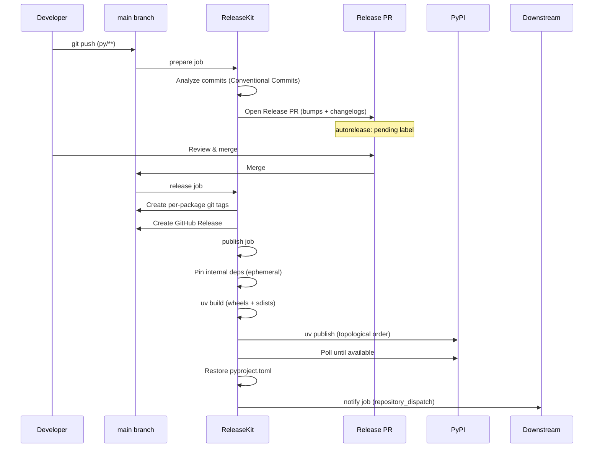

# Python (uv) — `releasekit-uv.yml`

Release workflow for Python packages managed by a
[uv workspace](https://docs.astral.sh/uv/concepts/workspaces/).
Publishes to [PyPI](https://pypi.org/) with
[OIDC trusted publishing](https://docs.pypi.org/trusted-publishers/)
support.

## Sequence Diagram

## Trigger Matrix

| Event | Jobs that run |
|-------|---------------|
| Push to `main` (matching `py/**`) | `prepare` |
| Release PR merged | `release` → `publish` → `notify` |
| Manual dispatch: `prepare` | `prepare` |
| Manual dispatch: `release` | `release` → `publish` → `notify` |

## Manual Dispatch Inputs

| Input | Type | Default | Description |
|-------|------|---------|-------------|
| `action` | choice | `release` | Pipeline stage: `prepare` or `release` |
| `target` | choice | `pypi` | Registry: `pypi` or `testpypi` |
| `dry_run` | boolean | `true` | Simulate without side effects |
| `force_prepare` | boolean | `false` | Force PR creation even without bumps |
| `group` | string | *(all)* | Target a specific release group |
| `bump_type` | choice | `auto` | Override: `auto`, `patch`, `minor`, `major` |
| `prerelease` | string | *(none)* | Prerelease suffix (e.g. `rc.1`) |
| `skip_publish` | boolean | `false` | Tag + release but skip PyPI upload |
| `concurrency` | string | `0` | Max parallel publish jobs (`0` = auto) |
| `max_retries` | string | `2` | Retry failed publishes |

## Authentication

| Method | How |
|--------|-----|
| **Trusted publishing (recommended)** | [Configure OIDC](https://docs.pypi.org/trusted-publishers/creating-a-project-through-oidc/) on PyPI — no secrets needed |
| **API token** | Set `UV_PUBLISH_TOKEN` secret ([create one on PyPI](https://pypi.org/manage/account/token/)) |
| **TestPyPI** | Set target to `testpypi` — uses `TESTPYPI_TOKEN` secret |

## Key Details

- **Ephemeral dependency pinning** — internal deps like `genkit` are
  pinned to exact versions before `uv build`, then restored after
  publish. See [Dependency Pinning](../dependency-pinning.md).
- **Topological publish order** — packages are published in dependency
  order with polling between each level.
- **`id-token: write`** — enables both OIDC trusted publishing and
  [SLSA L3 provenance](../slsa-provenance.md) signing.

## Source

:material-file-code: [`github/workflows/releasekit-uv.yml`](https://github.com/firebase/genkit/blob/main/py/tools/releasekit/github/workflows/releasekit-uv.yml)
