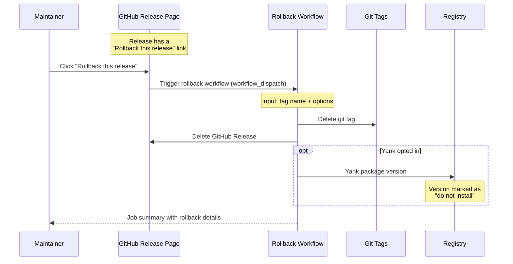

# Rollback — `releasekit-rollback.yml`

A standalone workflow that undoes a release by deleting git tags,
GitHub Releases, and optionally yanking packages from registries.
Works with **any ecosystem**.

## Sequence Diagram

## How It's Triggered

The rollback workflow is designed to be triggered from GitHub's UI in
two ways:

1. **"Rollback this release" link** — The release workflow
   automatically appends this link to every GitHub Release body. It
   pre-fills the tag name in the `workflow_dispatch` form.

2. **Manual dispatch** — Navigate to Actions → Rollback → Run workflow
   and enter the tag name.

## Manual Dispatch Inputs

| Input | Type | Default | Description |
|-------|------|---------|-------------|
| `tag` | string | *(required)* | Git tag to roll back (e.g. `genkit-v0.6.0`) |
| `yank` | boolean | `false` | Also yank the version from the package registry |
| `dry_run` | boolean | `true` | Simulate without side effects |

## What Gets Rolled Back

| Component | Action | Reversible? |
|-----------|--------|-------------|
| Git tag | Deleted | ✅ Can re-tag later |
| GitHub Release | Deleted | ✅ Can re-create |
| Registry version (if yanked) | Yanked ([PEP 592](https://peps.python.org/pep-0592/)) | ⚠️ Yank is typically irreversible |

!!! warning "Yanking is (mostly) irreversible"
    Most registries (PyPI, npm, crates.io) support **yanking** — marking
    a version as "don't install this." But you typically **cannot re-use
    the same version number** after yanking. Plan accordingly:

    - **PyPI**: Yanked versions cannot be re-uploaded. You must publish
      a new version number.
    - **npm**: `npm unpublish` removes the version within 72 hours.
      After that, it's permanent.
    - **crates.io**: Yanked versions can be un-yanked with
      `cargo yank --undo`.

## Key Details

- **Dry-run by default** — the `dry_run` input defaults to `true` so
  you can preview what would be rolled back before committing.
- **Ecosystem-agnostic** — this single workflow handles rollback for
  Python, JavaScript, Go, Rust, Dart, and Java releases.
- **Concurrency guard** — only one rollback runs at a time to prevent
  race conditions.

## Source

:material-file-code: [`github/workflows/releasekit-rollback.yml`](https://github.com/firebase/genkit/blob/main/py/tools/releasekit/github/workflows/releasekit-rollback.yml)
