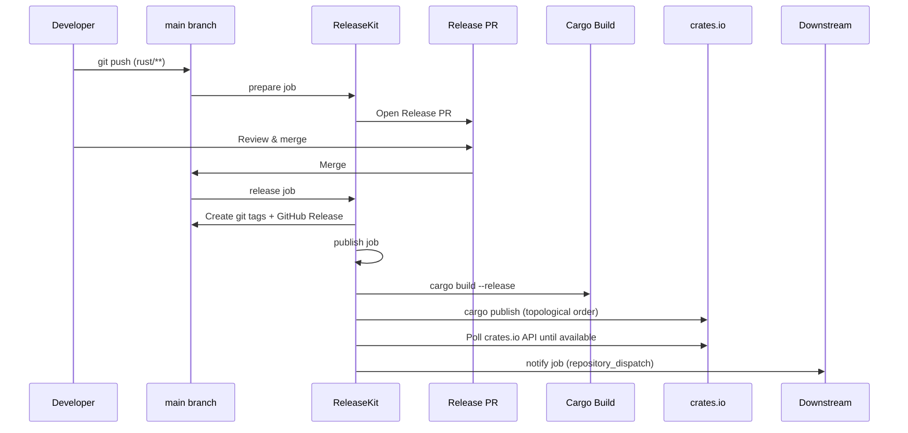

# Rust (Cargo) — `releasekit-cargo.yml`

Release workflow for Rust crates managed by a
[Cargo workspace](https://doc.rust-lang.org/book/ch14-03-cargo-workspaces.html).
Publishes to [crates.io](https://crates.io/) in topological order.

## Sequence Diagram

## Trigger Matrix

| Event | Jobs that run |
|-------|---------------|
| Push to `main` (matching `rust/**`) | `prepare` |
| Release PR merged | `release` → `publish` → `notify` |
| Manual dispatch: `prepare` | `prepare` |
| Manual dispatch: `release` | `release` → `publish` → `notify` |

## Manual Dispatch Inputs

| Input | Type | Default | Description |
|-------|------|---------|-------------|
| `action` | choice | `release` | Pipeline stage: `prepare` or `release` |
| `dry_run` | boolean | `true` | Simulate without side effects |
| `force_prepare` | boolean | `false` | Force PR creation even without bumps |
| `group` | string | *(all)* | Target a specific release group |
| `bump_type` | choice | `auto` | Override: `auto`, `patch`, `minor`, `major` |
| `prerelease` | string | *(none)* | Prerelease suffix (e.g. `rc.1`) |
| `skip_publish` | boolean | `false` | Tag + release but skip crates.io upload |
| `concurrency` | string | `0` | Max parallel publish jobs (`0` = auto) |
| `max_retries` | string | `2` | Retry failed publishes |

## Authentication

| Method | How |
|--------|-----|
| **API token** | Set `CARGO_REGISTRY_TOKEN` secret ([create one on crates.io](https://crates.io/settings/tokens)) |

Scopes needed: `publish-new` and `publish-update`.

## Key Details

- **Cargo workspace** — ReleaseKit reads `[workspace]` from
  `Cargo.toml` to discover crates.
- **Topological order** — crates are published in dependency order,
  with polling between each level to ensure upstream crates are
  available before downstream ones.
- **`cargo build --release`** — the release build runs before publish
  to catch compilation errors early.
- **`rust-cache`** — [Swatinem/rust-cache](https://github.com/Swatinem/rust-cache)
  is used for faster CI builds.

## Source

:material-file-code: [`github/workflows/releasekit-cargo.yml`](https://github.com/firebase/genkit/blob/main/py/tools/releasekit/github/workflows/releasekit-cargo.yml)
