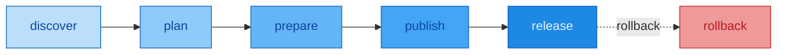
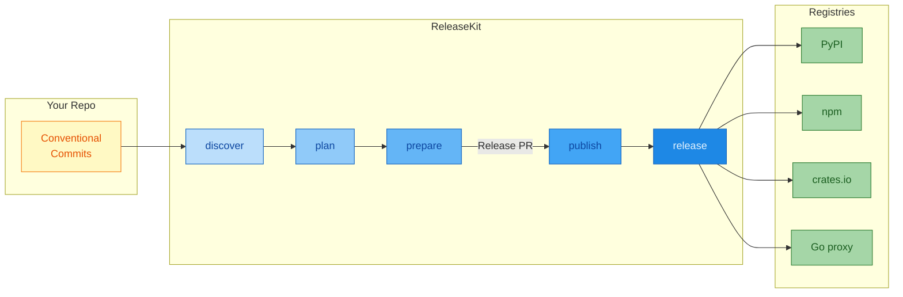

# ReleaseKit

*The release engine behind [Genkit](https://github.com/firebase/genkit).*
{ .subtitle }

**Release orchestration for monorepo workspaces** — publish packages in
topological order with dependency-triggered scheduling, crash-safe resume,
SLSA provenance, and one-click rollback.

!!! info "Built for Genkit, works everywhere"
    ReleaseKit was built to automate releases for the
    [Genkit](https://github.com/firebase/genkit) SDK — a polyglot
    monorepo with Python, JavaScript, and Go packages. While it lives
    inside the Genkit repository at `py/tools/releasekit/`, it is
    **ecosystem-agnostic** and can manage releases for any monorepo
    using Python (uv), JavaScript (pnpm), Go, Rust (Cargo),
    Dart (pub), or Java (Gradle).

<figure markdown="span">
  { width="600" }
  <figcaption><code>releasekit graph --format ascii</code> — dependency graph across topological levels</figcaption>
</figure>

---

## What is ReleaseKit?

ReleaseKit is a CLI tool and GitHub Action that automates the entire release
lifecycle for polyglot monorepo workspaces. One command takes you from
conventional commits to published, signed, verified packages:



| Stage | What it does |
|-------|-------------|
| **Discover** | Scans the workspace for packages and their dependencies |
| **Plan** | Computes version bumps from Conventional Commits |
| **Prepare** | Bumps versions, generates changelogs, opens a Release PR |
| **Publish** | Builds and uploads packages to registries in dependency order |
| **Release** | Tags the repo, creates GitHub Releases with notes |
| **Rollback** | Deletes tags and GitHub Releases if something goes wrong |

---

## The Problem

Publishing a monorepo with dozens of interdependent packages requires:

1. **Correct ordering** — core packages must publish *before* plugins that depend on them.
2. **Automatic workspace handling** — workspace-sourced dependencies must be temporarily rewritten to concrete versions for publishing, then safely reverted so local development keeps working.
3. **Transitive bump propagation** — a bump in the core package triggers patch bumps for all dependents.
4. **Crash safety** — if the process fails at package #37, resume from that point, not from scratch.

**No existing tool does this.** Single-package tools (`uv publish`, `twine`, `flit`) have no concept of dependency ordering. Release-please doesn't understand workspace dependency graphs.

---

## Key Features

<div class="grid cards" markdown>

-   :material-check-decagram:{ .lg .middle } **42 Health Checks — Safety First**

    ---

    Catch issues at PR time, not after a broken release. 19 checks
    are auto-fixable with `--fix`. Never ship a broken version again.

-   :material-graph-outline:{ .lg .middle } **Dependency-Aware Scheduling**

    ---

    Packages publish as soon as their dependencies finish — no waiting
    for entire topological levels.

-   :material-package-variant-closed-check:{ .lg .middle } **Multi-Ecosystem**

    ---

    Python (uv), JavaScript (pnpm), Go, Rust (Cargo), Dart (pub),
    Java (Maven/Gradle) — all in a single monorepo.

-   :material-shield-check:{ .lg .middle } **Crash-Safe Publishing**

    ---

    Atomic state tracking with resume support. Interrupted releases
    pick up exactly where they left off.

-   :material-security:{ .lg .middle } **SLSA Provenance (L0–L3)**

    ---

    In-toto SLSA Provenance v1 with auto-detected build level.
    Sigstore keyless signing. SBOM generation (CycloneDX + SPDX).

-   :material-undo:{ .lg .middle } **One-Click Rollback**

    ---

    Delete tags, GitHub/GitLab releases, and optionally yank from
    registries — with a single command or from the job summary.

-   :material-source-branch:{ .lg .middle } **Multi-Forge Support**

    ---

    Works with GitHub, GitLab, and Bitbucket with graceful
    degradation for forge-specific features.

-   :material-scale-balance:{ .lg .middle } **OSPS Baseline Compliance**

    ---

    Built-in compliance reporting against OpenSSF OSPS Baseline
    (L1–L3) with Rust-style diagnostics and actionable hints.

</div>

---

## Screenshots

<figure markdown="span">
  { width="600" }
  <figcaption><code>releasekit check</code> — workspace health checks</figcaption>
</figure>

<figure markdown="span">
  { width="700" }
  <figcaption>Publish pipeline, scheduler architecture, and key metrics</figcaption>
</figure>

---

## Impact

| Metric | Before | After |
|--------|--------|-------|
| **Release time** | Hours (manual) | Minutes (automated) |
| **Risk of wrong ordering** | High | Zero (topological sort) |
| **Crash recovery** | Start over | Resume from failure point |
| **Version consistency** | Error-prone | Enforced by 42 checks |
| **Missing metadata** | Found after publish | Caught at PR time |
| **Changelog** | Manual | Auto-generated from commits |
| **PyPI verification** | Manual spot-check | Automated checksum + smoke test |
| **Rollback** | Manual tag deletion | One command or one click |

<small>
*Based on the [Genkit](https://github.com/firebase/genkit) monorepo
— 60+ packages across Python, JavaScript, and Go.*
</small>

---

## Quick Start

```bash
# Install (or run directly with uvx)
uv tool install releasekit

# Initialize config
releasekit init

# Discover workspace packages
releasekit discover

# Run health checks
releasekit check

# Preview what a release would look like
releasekit plan

# Publish all changed packages
releasekit publish
```

[:octicons-arrow-right-24: Follow the full tutorial](guides/getting-started.md){ .md-button }

---

## How It Works



For the full module breakdown, see [Architecture → Module Map](architecture/module-map.md).
