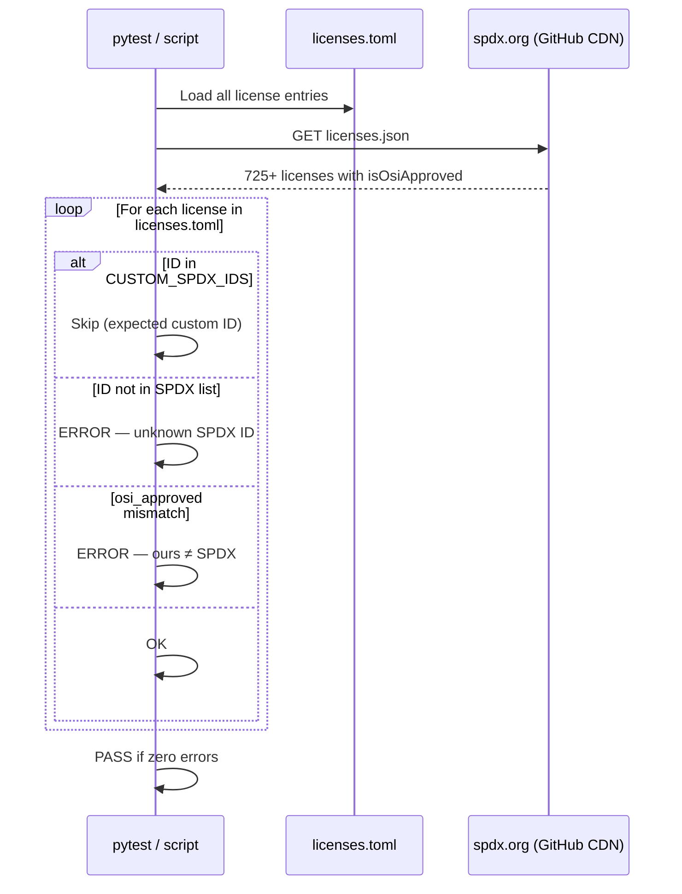
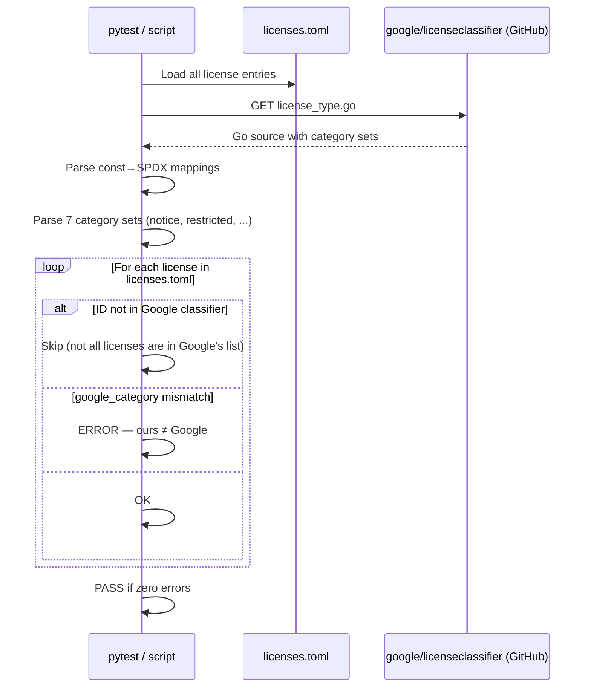
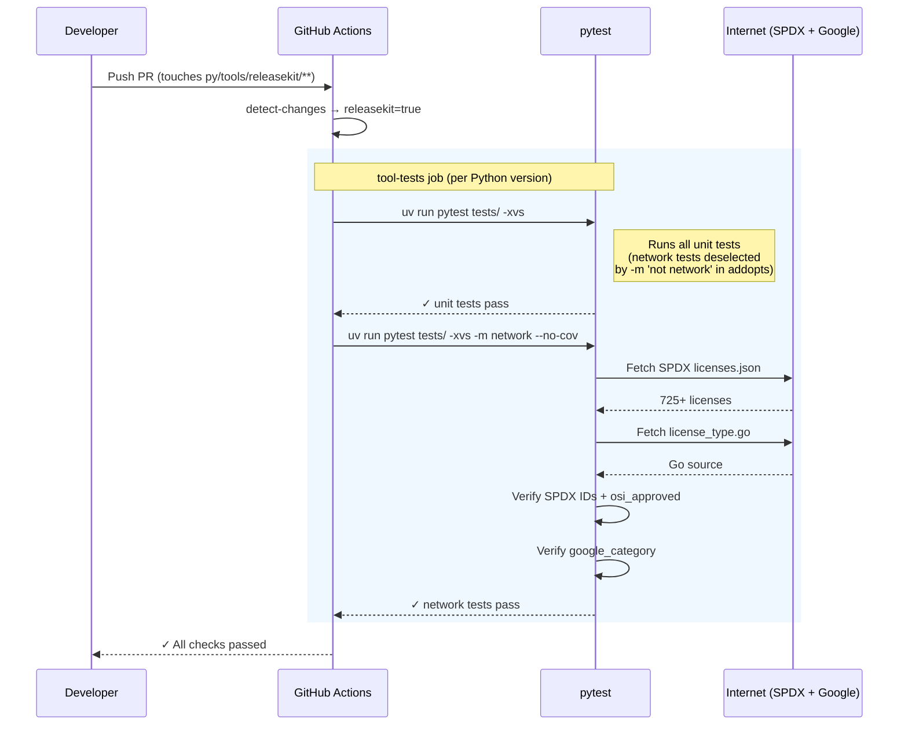

# License Data Verification

ReleaseKit maintains a curated license database in two TOML files:

| File | Purpose |
|------|---------|
| `src/releasekit/data/licenses.toml` | SPDX IDs, names, categories, OSI approval, aliases |
| `src/releasekit/data/license_compatibility.toml` | Directed compatibility graph between licenses |

These files are verified against two authoritative upstream sources:

1. **[SPDX License List](https://spdx.org/licenses/)** — the canonical
   registry of open-source license identifiers.
2. **[Google licenseclassifier](https://github.com/google/licenseclassifier)** —
   Google's license categorization used internally (`notice`, `reciprocal`,
   `restricted`, `permissive`, `unencumbered`, `by_exception_only`,
   `forbidden`).

## How it works

### SPDX verification flow

Every SPDX ID and `osi_approved` value in `licenses.toml` is checked
against the official SPDX license list JSON:



### Google licenseclassifier verification flow

Every `google_category` value is checked against the category sets
defined in `license_type.go`:



### CI integration flow

On every PR that touches `py/tools/releasekit/**`, the verification
tests run automatically as part of the `tool-tests` job:



## What is checked

### SPDX check

- Every SPDX ID in `licenses.toml` exists in the official SPDX license
  list (custom IDs like `Proprietary` or `Python-2.0-complete` are
  allowlisted).
- The `osi_approved` field matches the SPDX-provided value.

### Google licenseclassifier check

- Every `google_category` value matches the category assigned in
  `license_type.go` from `google/licenseclassifier`.

## Running the checks

### Integration tests (recommended for CI)

The checks are implemented as pytest integration tests marked with
`@pytest.mark.network`.  They are **deselected by default** so they
never run offline or slow down the normal test suite.

```shell
# Run the network integration tests explicitly.
pytest -m network tests/rk_license_data_integ_test.py --no-cov

# Run everything including network tests.
pytest -m '' --no-cov
```

If the machine has no internet access, the tests skip automatically
via a socket probe — they will never fail due to connectivity.

### Standalone script

A richer CLI is available for interactive use:

```shell
# Run both checks (default).
python scripts/verify_license_data.py

# Run only the SPDX check.
python scripts/verify_license_data.py --spdx

# Run only the Google classifier check.
python scripts/verify_license_data.py --google
```

## CI configuration

In the GitHub Actions workflow (`python.yml`), the `tool-tests` job
runs the network integration tests as a separate step after the main
unit tests:

```yaml
- name: Run tool tests
  run: |
    cd py/tools/${{ matrix.tool }}
    uv run pytest tests/ -xvs

- name: Run network integration tests
  run: |
    cd py/tools/${{ matrix.tool }}
    uv run pytest tests/ -xvs -m network --no-cov
```

### Porting to a new repo

When moving ReleaseKit to a standalone repository:

1. **pytest marker** — The `network` marker is registered in
   `pyproject.toml` under `[tool.pytest.ini_options]`:

    ```toml
    [tool.pytest.ini_options]
    addopts = "... -m 'not network'"
    markers = [
        "network: requires internet access (deselected by default, run with: pytest -m network)",
    ]
    ```

2. **CI step** — Add a step that runs `pytest -m network --no-cov`
   after the main test step.  CI runners have internet access so these
   tests will always execute.

3. **Files involved**:

    | File | Role |
    |------|------|
    | `tests/rk_license_data_integ_test.py` | pytest integration tests (3 tests) |
    | `scripts/verify_license_data.py` | Standalone CLI script |
    | `pyproject.toml` | `network` marker registration + default deselection |

4. **Custom SPDX IDs** — Both the test file and the script maintain a
   `CUSTOM_SPDX_IDS` frozenset of IDs that are not in the official SPDX
   list (e.g. `Proprietary`, `Python-2.0-complete`, `JSON`).  If you add
   a new custom license to `licenses.toml`, add its ID to this set in
   both files to avoid false failures.

## Editing the license database

After editing `licenses.toml` or `license_compatibility.toml`:

1. Run the verification script or tests to catch errors immediately:

    ```shell
    python scripts/verify_license_data.py
    ```

2. Run the license graph unit tests to ensure compatibility rules are
   consistent:

    ```shell
    pytest tests/rk_license_graph_test.py -xvs
    ```

3. Commit.  CI will run both the unit tests and the network integration
   tests on your PR.

## SPDX `WITH` exceptions and linking semantics

### What are `WITH` exceptions?

SPDX expressions can include a `WITH` clause that attaches a license
exception to a base license, relaxing certain terms.  Common examples:

| Expression | What it means |
|------------|---------------|
| `GPL-2.0-only WITH Classpath-exception-2.0` | GPL-2.0 but classpath linking doesn't trigger copyleft |
| `GPL-2.0-only WITH GCC-exception-3.1` | GPL-2.0 but GCC output isn't covered |
| `LGPL-2.1-only WITH OCaml-LGPL-linking-exception` | LGPL-2.1 with OCaml-specific linking relaxation |

These exceptions exist because **copyleft licenses trigger their
obligations through "linking"** — creating a combined work.  The
exception says: "even though you're linking, the copyleft terms don't
apply to your code."

### How ReleaseKit handles `WITH`

**ReleaseKit uses the conservative approach**: strip the exception and
check compatibility against the **base license only**.

```
GPL-2.0 WITH Classpath-exception-2.0
  └── checked as: GPL-2.0  (exception ignored)
```

This means:

- If the base license is **compatible** (e.g. MIT, Apache-2.0), the
  result is correct — exceptions only relax further.
- If the base license is **incompatible** (e.g. GPL-2.0 with an
  Apache-2.0 project), ReleaseKit reports it as incompatible **even if**
  the exception might make it compatible in your ecosystem.

This is a deliberate design choice.  See "Why conservative?" below.

### Linking semantics by language

The concept of "linking" — and thus when copyleft obligations are
triggered — varies dramatically by language and runtime:

| Language | Linking model | Copyleft risk | Exception relevance |
|----------|---------------|---------------|---------------------|
| **C/C++** | Static linking creates a single binary; dynamic linking creates a runtime dependency | **High** — static clearly creates "combined work" | **Critical** — GCC exception, linking exception directly applicable |
| **Java** | Classpath loading via classloader; JARs are separate artifacts | **Medium** — Classpath Exception exists specifically for this | **High** — Classpath-exception-2.0 is the canonical example |
| **Python** | `import` at runtime; packages installed as site-packages; no compilation linking | **Low** — but legally debated; FSF considers `import` similar to dynamic linking | **Ambiguous** — LGPL linking exceptions were written for C; application to Python is unclear |
| **Go** | Always statically compiled into a single binary | **High** — every Go binary is a single combined work | **Critical** — any linking exception is important |
| **Rust** | Statically compiled by default; dynamic linking rare | **High** — same as Go | **Critical** — same as Go |
| **JavaScript** | Bundled (webpack/esbuild create a single file) or loaded as modules | **Varies** — bundling ≈ static linking; module loading ≈ dynamic | **Context-dependent** |

### Why conservative?

1. **Legal safety** — False negatives (saying "compatible" when it's not)
   are worse than false positives (saying "incompatible" when it might be
   OK).  A false negative exposes the project to license violations.

2. **Language-agnostic** — ReleaseKit works across Python, JavaScript,
   Go, and Rust ecosystems.  What counts as "linking" depends on the
   ecosystem, the build toolchain, and sometimes the specific deployment
   model.  Automating this requires legal judgments we can't make.

3. **User escape hatches** — When a WITH exception makes a dependency
   compatible for your specific ecosystem, you can explicitly allow it:

   ```toml
   # In releasekit.toml

   [license]
   # Option 1: Allow the base license globally (for any dep).
   allow_licenses = ["GPL-2.0-only"]

   # Option 2: Override the detected license for a specific dep.
   [license.overrides]
   "some-gpl-lib" = "GPL-2.0-only WITH Classpath-exception-2.0"

   # Option 3: Exempt the package entirely.
   exempt_packages = ["some-gpl-lib"]
   ```

### Future: ecosystem-aware exception handling

A future enhancement could add ecosystem-aware exception evaluation:

- **Python**: Treat LGPL as effectively compatible with permissive
  licenses (since `import` ≠ linking in the traditional sense).
- **Go/Rust**: Be stricter (all linking is static).
- **Java**: Recognize Classpath-exception-2.0 as making GPL compatible
  with permissive licenses.

This would be opt-in via configuration and would require clear
documentation of the legal assumptions being made.  Until then, the
conservative approach ensures safety, and the escape hatches
(`allow_licenses`, `license_overrides`, `exempt_packages`) provide
flexibility for ecosystems where exceptions are well-understood.

