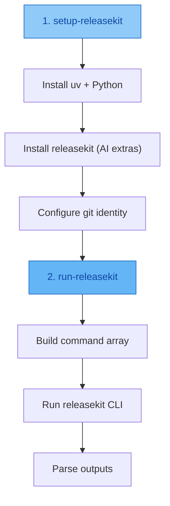

# GitHub Actions

ReleaseKit provides two **composite actions** that work together:

- **`setup-releasekit`** — installs uv, Python, releasekit (with AI
  extras), optionally Ollama, and configures git identity.
- **`run-releasekit`** — builds and runs the `releasekit` CLI command
  with structured inputs and parses outputs.

## Usage

```yaml
steps:
  - uses: actions/checkout@v6
  - uses: ./.github/actions/setup-releasekit
    with:
      token: ${{ secrets.GITHUB_TOKEN }}
      releasekit-dir: py/tools/releasekit
      git-user-name: github-actions[bot]
      git-user-email: github-actions[bot]@users.noreply.github.com

  - uses: ./.github/actions/run-releasekit
    id: prepare
    with:
      command: prepare
      workspace: py
      releasekit-dir: py/tools/releasekit
    env:
      GH_TOKEN: ${{ secrets.GITHUB_TOKEN }}
```

## Execution Flow



## setup-releasekit Inputs

| Input | Required | Default | Description |
|-------|----------|---------|-------------|
| `token` | ❌ | `""` | GitHub token for checkout and API calls |
| `releasekit-dir` | ❌ | `py/tools/releasekit` | Path to releasekit source |
| `git-user-name` | ❌ | `""` | Git committer name |
| `git-user-email` | ❌ | `""` | Git committer email |
| `enable-ollama` | ❌ | `"true"` | Install Ollama for local AI models |

## run-releasekit Inputs

| Input | Required | Default | Description |
|-------|----------|---------|-------------|
| `command` | ✅ | — | Subcommand: `prepare`, `release`, `publish`, `rollback` |
| `workspace` | ✅ | — | Workspace name (e.g. `py`, `go`, `js`) |
| `releasekit-dir` | ❌ | `py/tools/releasekit` | Path to releasekit source |
| `dry-run` | ❌ | `"false"` | Simulate without side effects |
| `force` | ❌ | `"false"` | Skip preflight checks |
| `group` | ❌ | `""` | Target a specific release group |
| `bump-type` | ❌ | `""` | Override semver bump (auto/patch/minor/major) |
| `prerelease` | ❌ | `""` | Prerelease suffix (e.g. `rc.1`) |
| `concurrency` | ❌ | `"0"` | Max parallel publish jobs (0 = auto) |
| `max-retries` | ❌ | `"0"` | Retry failed publishes |
| `check-url` | ❌ | `""` | Registry URL for version checks |
| `index-url` | ❌ | `""` | Custom registry URL for uploads |
| `show-plan` | ❌ | `"false"` | Show execution plan before running |
| `no-ai` | ❌ | `"false"` | Disable AI features |
| `model` | ❌ | `""` | Override AI model |
| `codename-theme` | ❌ | `""` | Override codename theme |
| `tag` | ❌ | `""` | Git tag to roll back (rollback only) |
| `all-tags` | ❌ | `"false"` | Delete all tags on same commit (rollback only) |
| `yank` | ❌ | `"false"` | Yank from registry (rollback only) |
| `yank-reason` | ❌ | `""` | Reason for yanking (rollback only) |

## run-releasekit Outputs

| Output | Description |
|--------|-------------|
| `has_bumps` | `"true"` if prepare found version bumps |
| `pr_url` | URL of the Release PR (prepare only) |
| `release_url` | URL of the GitHub Release (release only) |

## Security

The workflow uses a token resolved by the **auth** job (GitHub App →
PAT → GITHUB_TOKEN). For publish operations, configure **OIDC trusted
publishing** on PyPI:

```yaml
permissions:
  contents: write       # For tags and releases
  pull-requests: write  # For Release PRs
  id-token: write       # For OIDC trusted publishing + SLSA L3 provenance
```

!!! success "SLSA L3 by default on hosted runners"
    With `id-token: write` on GitHub-hosted runners, ReleaseKit
    **automatically** achieves SLSA Build L3 — signed provenance with
    hardened, isolated builds. No extra flags needed.
    See the [SLSA Provenance guide](../guides/slsa-provenance.md) for details.

!!! warning "Command injection prevention"
    The `run-releasekit` action builds the command as a **bash array**
    to prevent injection from free-form inputs.

## Example Workflows

### Prepare a Release PR

```yaml
- uses: ./.github/actions/setup-releasekit
  with:
    token: ${{ env.RESOLVED_TOKEN }}
    releasekit-dir: ${{ env.RELEASEKIT_DIR }}
    git-user-name: ${{ needs.auth.outputs.git-user-name }}
    git-user-email: ${{ needs.auth.outputs.git-user-email }}

- uses: ./.github/actions/run-releasekit
  id: prepare
  with:
    command: prepare
    workspace: py
    releasekit-dir: ${{ env.RELEASEKIT_DIR }}
  env:
    GH_TOKEN: ${{ env.RESOLVED_TOKEN }}
    GEMINI_API_KEY: ${{ secrets.GEMINI_API_KEY }}
```

### Publish to a Release Group

```yaml
- uses: ./.github/actions/run-releasekit
  with:
    command: publish
    workspace: py
    releasekit-dir: ${{ env.RELEASEKIT_DIR }}
    group: plugins
    concurrency: "5"
    max-retries: "2"
```

### Publish to Test PyPI

```yaml
- uses: ./.github/actions/run-releasekit
  with:
    command: publish
    workspace: py
    releasekit-dir: ${{ env.RELEASEKIT_DIR }}
    index-url: https://test.pypi.org/simple/
    check-url: https://test.pypi.org/simple/
```
