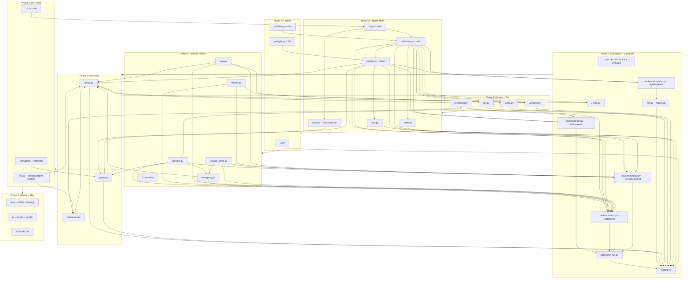

# releasekit Implementation Roadmap

Release orchestration for polyglot monorepos — publish packages in
topological order across uv (Python), pnpm (JavaScript/TypeScript),
and Go ecosystems with dependency-triggered scheduling, ephemeral
version pinning, retry with jitter, and crash-safe file restoration.

**Target location**: `py/tools/releasekit/` in `firebase/genkit`
**Published as**: `releasekit` on PyPI
**Invocation**: `uvx releasekit publish`

---

## Versioning Strategy

`releasekit` supports two versioning models for monorepos, configurable via `synchronize` in `releasekit.toml`.

### 1. Independent Versioning (Default)
`synchronize = false` (default)

Packages are versioned independently based on their own changes, but **propagated transitively**:
1.  **Direct Bumps**: Commits to a package directory trigger semantic version bumps (Major/Minor/Patch).
2.  **Transitive Propagation**: If a package depends on another package that was bumped, it receives a **PATCH bump**.
    - **Rule**: ANY bump in a dependency (Major, Minor, or Patch) triggers a Patch bump in all dependents.
    - **Why**: Ensures lockfiles and pins are updated to point to the new dependency version.
    - **Mental Model**: Releases ripple through the dependency tree. A change in a leaf node (e.g. `genkit`) forces a republication of all consuming nodes.

### 2. Synchronized Versioning (Lockstep)
`synchronize = true`

All packages in the workspace share the same version number.
1.  **Compute Max Bump**: Calculate the highest semantic bump across *all* packages based on commits.
2.  **Apply globally**: Bump *every* package to that new version.
    - Example: `genkit` has a breaking change (Major), so `plugin-vertex-ai` also gets a Major bump, even if unchanged.
    - **Use Case**: Frameworks where components must be installed with matching versions (e.g. `genkit==0.6.0` needs `genkit-plugin-x==0.6.0`).

### 3. Workspace-Sourced Dependency Model

Not all workspace members participate in the same release tree. The
release graph is determined by **workspace-sourced dependencies**, not
merely by co-location in the workspace:

```
┌─────────────────────────────────────────────────────────────────────┐
│                     Workspace Members                              │
│                                                                     │
│  ┌──────────────────────────────┐  ┌───────────────────────────┐   │
│  │ Release Tree 1               │  │ Independent Package       │   │
│  │ (workspace-sourced)          │  │ (pinned to PyPI)          │   │
│  │                              │  │                           │   │
│  │  genkit ──► plugin-a         │  │  app-legacy               │   │
│  │         └─► plugin-b         │  │  deps: genkit==1.0.0      │   │
│  │                              │  │                           │   │
│  │  [tool.uv.sources]           │  │  NOT in [tool.uv.sources] │   │
│  │  genkit = {workspace=true}   │  │  with workspace=true      │   │
│  │  plugin-a = {workspace=true} │  │                           │   │
│  │  plugin-b = {workspace=true} │  │  → Released independently │   │
│  └──────────────────────────────┘  └───────────────────────────┘   │
└─────────────────────────────────────────────────────────────────────┘
```

**How it works:**

1. A dependency is classified as **internal** (part of the release graph)
   only if it satisfies BOTH conditions:
   - Its name matches a workspace member.
   - It has `workspace = true` in `[tool.uv.sources]` of the root
     `pyproject.toml`.

2. If a workspace member depends on another member but uses a **pinned
   PyPI version** (e.g. `genkit==1.0.0`), the dependency edge is
   treated as **external**. The dependent package is excluded from
   version propagation and can be released independently.

3. **No explicit `exclude` configuration needed.** The graph topology
   emerges naturally from `[tool.uv.sources]`. Packages opt out of a
   release tree simply by not having `workspace = true`.

**Why this matters:**

| Scenario | Before | After |
|----------|--------|-------|
| App A pins `genkit==1.0.0` | Force-bumped on genkit 2.0 (broken) | Untouched |
| Plugin uses workspace genkit | Correctly propagated | Same |
| Sample with `Private :: Do Not Upload` | Excluded from publish | Same |

### 4. Independent Release Trees

A single workspace can contain multiple disconnected release trees.
Each tree is a connected component in the dependency graph where
edges are workspace-sourced dependencies.

```
Tree 1 (genkit ecosystem):     Tree 2 (internal tool):
  genkit ──► plugin-a            tool-x ──► tool-y
         └─► plugin-b

Tree 3 (legacy, pinned):       Tree 4 (standalone):
  app-legacy                     sample-demo
  (genkit==1.0.0 from PyPI)      (no internal deps)
```

- `releasekit prepare` processes ALL trees in a single pass.
- Only packages with actual changes (+ transitive dependents) get bumped.
- The Release PR contains all bumped packages from all trees.
- Each tree's version propagation is independent — changes in Tree 1
  cannot affect Tree 2 or Tree 3.

### 5. Cross-Repository Workflow (Plugins)

To support dependent packages in external repositories (e.g. `genkit-community-plugins`):

1.  **Trigger**: The main repo (`firebase/genkit`) fires a `repository_dispatch` event upon successful publish.
2.  **Action**: The dependent repo runs `releasekit prepare`.
3.  **Update**: `prepare` runs `uv lock --upgrade-package genkit` (checking PyPI).
4.  **Result**: If `uv.lock` changes:
    - Creates a `chore(deps): update genkit` bump.
    - Bumps the plugin version (Patch).
    - Opens/Updates a Release PR with the dependency update included.

### 6. Cross-Ecosystem Release Groups

Groups can **span ecosystems**. This is the key design that enables
releasing a pnpm frontend and a uv backend together as a single
coordinated release unit.

#### Two-tier TOML configuration

All releasekit configuration uses **TOML only**. Ecosystem manifests
(`pyproject.toml`, `package.json`, `go.mod`) are never modified for
releasekit config — they are only read/written for version bumps and
dependency declarations (their actual purpose).

1. **Root config** (`releasekit.toml` at monorepo root) —
   workspace-level settings: `synchronize`, `tag_format`, ecosystem
   roots, and global knobs.
2. **Per-package config** (`releasekit.toml` in each package dir) —
   package-level labels: `group`, `publishable` overrides, etc.

##### Root config (`releasekit.toml`)

Flat top-level keys, no `[tool.*]` nesting:

```toml
# releasekit.toml (at the monorepo root)

forge            = "github"
repo_owner       = "firebase"
repo_name        = "genkit"
default_branch   = "main"
pr_title_template = "chore(release): v{version}"

[workspace.py]
ecosystem      = "python"
tool           = "uv"
root           = "py"
tag_format     = "{name}@{version}"
umbrella_tag   = "py/v{version}"
changelog      = true
smoke_test     = true
max_commits    = 500

[workspace.js]
ecosystem      = "js"
tool           = "pnpm"
root           = "."
tag_format     = "{name}@{version}"
umbrella_tag   = "js/v{version}"
synchronize    = true

# Go workspace (future)
# [workspace.go]
# ecosystem    = "go"
# root         = "go"
```

##### Per-package config (`releasekit.toml`)

Each package directory can have its own `releasekit.toml` with
package-level settings:

```toml
# py/packages/genkit/releasekit.toml
group = "core"
```

```toml
# py/plugins/vertex-ai/releasekit.toml
group = "plugins"
```

```toml
# js/packages/core/releasekit.toml
group = "core"
```

```toml
# go/genkit/releasekit.toml
group = "core"
```

Packages without a `releasekit.toml` (or without a `group` key)
are included in all unfiltered runs (`releasekit prepare` without
`--group`) but excluded when a specific group is requested.

**Why TOML everywhere?**

- **Consistent format**: One syntax for all ecosystems. No need to
  invent `[tool.releasekit]` (Python), `"releasekit":{}` (JS), or
  `// releasekit:group=` (Go) conventions.
- **No manifest pollution**: Ecosystem manifests stay clean — they
  only contain what their ecosystem tools expect.
- **Ecosystem-agnostic**: `releasekit.toml` works identically
  regardless of whether the package is Python, JS, Go, or Rust.

#### How it works

```
releasekit prepare --group core

  1. Read root releasekit.toml → find ecosystem roots
  2. For each ecosystem:
     a. Instantiate (Workspace, PackageManager, Registry)
     b. Discover all packages (from ecosystem manifests)
     c. Read per-package releasekit.toml → get group label
     d. Filter: keep only packages where group == "core"
  3. Compute version bumps across all filtered packages
  4. Create single Release PR with bumps from all ecosystems

  ┌──────────── Packages labeled group = "core" ───────────────────┐
  │                                                                 │
  │  py/ (uv workspace)                                            │
  │    genkit/releasekit.toml     → group = "core"   → PyPI        │
  │                                                                 │
  │  js/ (pnpm workspace)                                          │
  │    core/releasekit.toml       → group = "core"   → npm         │
  │                                                                 │
  │  go/ (go workspace)                                            │
  │    genkit/releasekit.toml     → group = "core"   → proxy       │
  │                                                                 │
  │  Single Release PR ── single version bump ── single tag         │
  └─────────────────────────────────────────────────────────────────┘
```

#### Key design decisions

- **TOML only**: All releasekit config uses `releasekit.toml` files.
  Ecosystem manifests are never read or written for config —
  only for version bumps and dependency declarations.
- **Labels, not globs**: Group membership is declared per-package
  as a label in its `releasekit.toml`, not via glob patterns at
  the root. No breakage on rename, no silent mis-matches.
- **Standalone root config**: `releasekit.toml` is ecosystem-agnostic.
  No dependency on any ecosystem's manifest for workspace settings.
- **One PR, multiple ecosystems**: The prepare step creates a single
  Release PR with version bumps across all manifests.
- **Ecosystem-specific publishing**: Each ecosystem's packages are
  published using its own backend (`uv publish` → PyPI,
  `pnpm publish` → npm, `git tag` → `proxy.golang.org`).
- **Independent version propagation**: Version rippling stays within
  each ecosystem's dependency graph. A bump to `genkit` (Python)
  does NOT auto-bump `@genkit-ai/core` (JS) — separate graphs.
  But they share the same Release PR and tag.
- **Shared version number**: When `synchronize = true`, ALL packages
  in ALL ecosystems get the same version number.

#### Implementation plan

1. ✅ Add root `releasekit.toml` reader (flat TOML, no `[tool.*]`). — **Done** (`config.py`).
2. ✅ `init.py` scaffolds `releasekit.toml` (root + per-package). — **Done**.
3. Add per-package `releasekit.toml` reader (same flat TOML format,
   discovered during `Workspace.discover()`).
4. Add `group` field to `Package` dataclass.
5. Wire `_create_backends()` to iterate over declared ecosystems.
6. The `prepare` step collects packages from all ecosystems,
   filters by group label, computes bumps, and creates one PR.
7. The `publish` step iterates over ecosystems and publishes each
   using the correct backend.

### 7. Decentralized Release Model (Go Modules)

Go uses a fundamentally different release model from workspace-based
registries. Understanding this is critical for integrating Go into
releasekit.

**How Go releases work:**

```
┌──────────────────────────────────────────────────────────────────┐
│                    Go Module Release Model                       │
│                                                                  │
│  1. Developer pushes a git tag: v1.2.3                           │
│                                                                  │
│  2. Users run: go get github.com/myorg/mymod@v1.2.3              │
│                                                                  │
│  3. proxy.golang.org fetches the tag from GitHub,                │
│     caches it, and serves it to all `go get` requests.           │
│                                                                  │
│  No upload step. No registry API. Just git tags.                 │
└──────────────────────────────────────────────────────────────────┘
```

**Key differences from workspace-based ecosystems:**

| Aspect | uv/pnpm (centralized) | Go (decentralized) |
|--------|----------------------|--------------------|
| Publish | Upload artifact to registry | Push git tag |
| Registry | PyPI / npm (mutable, authenticated) | proxy.golang.org (immutable, no auth) |
| Versioning | In manifest file (`pyproject.toml`, `package.json`) | In git tag only |
| Workspace | `pyproject.toml` / `pnpm-workspace.yaml` | `go.work` (dev only, not published) |
| Multi-module | Workspace members share lockfile | Each module is independent |
| Internal deps | `workspace:*` / `workspace = true` | `replace` directives in `go.work` |
| Build artifact | Wheel / tarball | Source code (via git) |
| Retract | Delete version (PyPI) / unpublish (npm) | `retract` directive in `go.mod` |

**Go workspace (go.work) structure:**

```
monorepo/
├── go.work           # Dev-only workspace (NOT published)
│   go 1.24
│   use (
│       ./genkit
│       ./plugins/google-genai
│       ./plugins/vertex-ai
│   )
├── genkit/
│   ├── go.mod        # module github.com/firebase/genkit/go/genkit
│   └── genkit.go
├── plugins/
│   ├── google-genai/
│   │   ├── go.mod    # module github.com/firebase/genkit/go/plugins/google-genai
│   │   └── plugin.go
│   └── vertex-ai/
│       ├── go.mod    # module github.com/firebase/genkit/go/plugins/vertex-ai
│       └── plugin.go
```

**How releasekit handles Go:**

1. **Workspace discovery**: Parse `go.work` for `use` directives.
   Parse each `go.mod` for `module` path, `require` directives,
   and `replace` directives.
2. **Internal dependency detection**: A dependency is "internal" if
   its module path matches a `use` directive in `go.work` AND
   it has a `replace` directive pointing to a local path (or is
   implicitly replaced by the workspace).
3. **Version bumping**: Write the new `go.mod` version (for the
   `require` directive in consumers) and create the git tag.
   Go modules use **path-prefixed tags**:
   `genkit/v0.6.0`, `plugins/google-genai/v0.6.0`.
4. **Publishing**: Create annotated git tags and push them.
   `proxy.golang.org` fetches the tag automatically. There is
   no upload API.
5. **Verification**: Poll `pkg.go.dev/module@version` or
   `proxy.golang.org/module/@v/version.info` to confirm
   the version is available.

**GoBackend protocol mapping:**

| Protocol Method | Go Implementation |
|----------------|-------------------|
| `build()` | No-op (Go distributes source, not artifacts) |
| `publish()` | `git tag <module/path>/v<version>` + `git push --tags` |
| `lock()` | `go mod tidy` (update) or `go mod verify` (check) |
| `version_bump()` | Edit `go.mod` `require` in consumers, create tag |
| `resolve_check()` | `GOPROXY=proxy.golang.org go list -m <module>@v<version>` |
| `smoke_test()` | `go build <module>/...` in a temp module |

**GoWorkspace protocol mapping:**

| Protocol Method | Go Implementation |
|----------------|-------------------|
| `discover()` | Parse `go.work` `use` directives → `go.mod` per module |
| `rewrite_version()` | Update `require <mod> v<new>` in consumer `go.mod` files |
| `rewrite_dependency_version()` | Update `require` + remove `replace` for publishing |

**GolangProxyRegistry protocol mapping:**

| Protocol Method | Go Implementation |
|----------------|-------------------|
| `check_published()` | `GET proxy.golang.org/<mod>/@v/<ver>.info` → 200 |
| `poll_available()` | Poll above endpoint until 200 or timeout |
| `project_exists()` | `GET proxy.golang.org/<mod>/@v/list` → non-empty |
| `latest_version()` | `GET proxy.golang.org/<mod>/@latest` → `Version` field |
| `verify_checksum()` | `GET sum.golang.org/lookup/<mod>@<ver>` |

**Key challenge — `go.work` is dev-only:**

Unlike `pnpm-workspace.yaml` which is committed, `go.work` is
often `.gitignore`d and used only for local development. The
Genkit Go SDK DOES commit `go.work`, so releasekit can parse it.
But for repos that don't commit `go.work`, releasekit would need
to scan for `go.mod` files recursively to discover modules.

### 6. Multi-Ecosystem Extensibility (Future)

The workspace-sourced dependency model is currently implemented for
**uv** workspaces (`[tool.uv.sources]`). The same concept applies to
other ecosystems, each with its own way of declaring workspace deps.

To support multiple ecosystems, the following **7 protocols** are
needed. Each protocol defines the semantic operations; implementations
own the transport and format details.

```
┌─────────────────────────────────────────────────────────────────────┐
│                      Protocol Abstraction Map                       │
│                                                                     │
│  ┌─────────────┐  ┌─────────────┐  ┌─────────────┐                │
│  │     VCS      │  │    Forge    │  │  Workspace   │               │
│  │ git, hg      │  │ gh, glab,  │  │ uv, pnpm,   │               │
│  │              │  │ bitbucket  │  │ cargo, go    │               │
│  └──────┬───────┘  └──────┬──────┘  └──────┬───────┘               │
│         │                 │                │                        │
│         │    ┌────────────┴────────────┐   │                        │
│         │    │                         │   │                        │
│  ┌──────┴───┴──┐  ┌──────────────┐  ┌─┴───┴────────┐              │
│  │ ManifestParser│  │VersionRewriter│  │PackageManager│              │
│  │ pyproject,   │  │ pyproject,   │  │ uv, pnpm,   │              │
│  │ package.json,│  │ package.json,│  │ cargo        │              │
│  │ Cargo.toml   │  │ Cargo.toml   │  │              │              │
│  └──────────────┘  └──────────────┘  └──────┬───────┘              │
│                                              │                      │
│                                       ┌──────┴───────┐              │
│                                       │   Registry    │              │
│                                       │ pypi, npm,   │              │
│                                       │ crates.io    │              │
│                                       └──────────────┘              │
└─────────────────────────────────────────────────────────────────────┘
```

#### Protocol details

| # | Protocol | Responsibility | Current | Future |
|---|----------|---------------|---------|--------|
| 1 | **`VCS`** | Commit, tag, push, log, branch operations | `GitCLIBackend`, `MercurialBackend` | — |
| 2 | **`Forge`** | PRs, releases, labels, availability check | `GitHubCLIBackend`, `GitLabBackend`, `BitbucketAPIBackend` | — |
| 3 | **`Workspace`** | Discover members, classify deps, rewrite versions | ✅ `UvWorkspace`, ✅ `PnpmWorkspace` | `GoWorkspace`, `CargoWorkspace`, `PubWorkspace`, `MavenWorkspace`, `GradleWorkspace` |
| 4 | **`PackageManager`** | Lock, build, publish | ✅ `UvBackend`, ✅ `PnpmBackend` | `GoBackend`, `CargoBackend`, `PubBackend`, `MavenBackend`, `GradleBackend` |
| 5 | **`Registry`** | Check published versions, checksums | ✅ `PyPIBackend`, ✅ `NpmRegistry` | `GolangProxy`, `CratesIoRegistry`, `PubDevRegistry`, `MavenCentralRegistry` |

> **Design note:** `ManifestParser` and `VersionRewriter` were folded
> into the `Workspace` protocol as `rewrite_version()` and
> `rewrite_dependency_version()` methods, because parsing and rewriting
> are tightly coupled to the manifest format each workspace owns.

#### Ecosystem matrix (all 6 genkit target languages)

| Ecosystem | Workspace Config | Source Mechanism | Manifest File | Registry | Status |
|-----------|-----------------|-----------------|---------------|----------|--------|
| **Python (uv)** | `[tool.uv.workspace]` | `[tool.uv.sources]` `workspace = true` | `pyproject.toml` | PyPI | ✅ Implemented |
| **TypeScript (pnpm)** | `pnpm-workspace.yaml` | `"workspace:*"` protocol in `package.json` | `package.json` | npm | ✅ Implemented |
| **Go** | `go.work` | `use ./pkg` directives | `go.mod` | proxy.golang.org | ⬜ Designed (see §7) |
| **Java (Maven)** | reactor POM `<modules>` | `<version>${project.version}</version>` | `pom.xml` | Maven Central | ⬜ Future |
| **Java (Gradle)** | `settings.gradle` `include` | `project(':sub')` deps | `build.gradle(.kts)` | Maven Central | ⬜ Future |
| **Dart (pub/melos)** | `melos.yaml` packages | `dependency_overrides` with `path:` | `pubspec.yaml` | pub.dev | ⬜ Future |
| **Rust (Cargo)** | `[workspace]` in `Cargo.toml` | `path = "..."` in `[dependencies]` | `Cargo.toml` | crates.io | ⬜ Future |
| **Kotlin (KMP)** | `settings.gradle.kts` `include` | `project(':sub')` deps | `build.gradle.kts` | Maven Central | ⬜ Future |
| **Swift (SwiftPM)** | `Package.swift` workspace | local `path:` deps | `Package.swift` | Swift Package Index / git tags | ⬜ Future |
| **CocoaPods** | `Podfile` | `pod 'Name', :path => '...'` | `*.podspec` | CocoaPods trunk | ⬜ Future |
| **Ruby (Bundler)** | `Gemfile` | `gem 'name', path: '...'` | `*.gemspec` | RubyGems.org | ⬜ Future |
| **.NET (NuGet)** | `*.sln` / `Directory.Build.props` | `<ProjectReference>` | `*.csproj` / `*.fsproj` | NuGet Gallery | ⬜ Future |
| **PHP (Composer)** | `composer.json` repositories | `"type": "path"` repos | `composer.json` | Packagist | ⬜ Future |
| **VS Code Extension** | — | — | `package.json` | VS Code Marketplace | ⬜ Future |
| **IntelliJ Plugin** | — | — | `plugin.xml` / `build.gradle.kts` | JetBrains Marketplace | ⬜ Future |
| **Browser Extension** | — | — | `manifest.json` | Chrome Web Store / Firefox Add-ons | ⬜ Future |

#### Migration path

The `Workspace` protocol has been extracted into
`backends/workspace/` with `UvWorkspace` and `PnpmWorkspace`
implementations.
Remaining migration steps:

1. ✅ Extract `Workspace` protocol with `discover()`,
   `rewrite_version()`, `rewrite_dependency_version()` — **done**.
2. ✅ Implement `UvWorkspace` — **done**.
3. ✅ Implement `PnpmWorkspace` — **done** (39 tests).
4. ✅ Implement `PnpmBackend` — **done** (19 tests).
5. ✅ Implement `NpmRegistry` — **done** (tests included).
6. ✅ Migrate config from `pyproject.toml` to `releasekit.toml` — **done** (`config.py`, `init.py`).
7. Wire `Workspace` selection through `_create_backends()` in `cli.py`,
   auto-detected from project structure.
8. Update callers (`prepare.py`, `publish.py`, `cli.py`) to use
   `Workspace` protocol instead of `discover_packages()` and
   `bump_pyproject()`.
9. Add cross-ecosystem group support (see §6).
10. Add Go workspace + proxy.golang.org support (see §7).

---

## Progress

| Phase | Status | Notes |
|-------|--------|-------|
| 0: Foundation + Backends | ✅ Complete | 1,812 lines src, 864 lines tests, 82 tests pass |
| 1: Discovery | ✅ Complete | 3 modules, 65 tests pass, named error codes |
| 2: Version + Pin | ✅ Complete | 4 modules, 64 tests (incl. 6 integration), 211 total tests pass |
| 3: Publish MVP | ✅ Complete | Critical milestone |
| 4: Harden | ✅ Complete | UI, checks, registry verification, observer, interactive controls |
| 4b: Streaming Core | ✅ Complete | scheduler.py, retry, jitter, pause/resume, 27 tests |
| 4c: UI States | ✅ Complete | observer.py, sliding window, keyboard shortcuts, signal handlers |
| 5: Release-Please | ✅ Complete | Orchestrators, CI workflow, workspace-sourced deps |
| 6: UX Polish | ✅ Complete | init, formatters (9), rollback, completion, diagnostics, granular flags, TOML config migration |
| 7: Quality + Ship | 🔶 In progress | 2,572 tests pass, 82+ source modules, 68+ test files, 91%+ coverage |
| 8: Release Automation | ✅ Complete | hooks.py, should_release.py, calver.py, channels.py, config Phase 8 fields, CLI wiring, 73 new tests |
| 9: Advanced Workflows | ✅ Complete | prerelease.py, hotfix.py, snapshot.py, announce.py, changesets.py, api.py, incremental changelog, Jinja2 templates, promote/snapshot CLI, 113 new tests |

### Phase 5 completion status

| Item | Status | Notes |
|------|--------|-------|
| Forge protocol extensions | ✅ Done | `list_prs`, `add_labels`, `remove_labels`, `update_pr` |
| Transitive propagation (BFS) | ✅ Done | Multi-level via `deque`, 4 tests |
| Synchronized versioning | ✅ Done | `synchronize=True` config, 3 tests |
| `GitLabCLIBackend` | ✅ Done | Forge via `glab` CLI, protocol conformance |
| `MercurialCLIBackend` | ✅ Done | VCS via `hg` CLI, protocol conformance |
| `BitbucketAPIBackend` | ✅ Done | Forge via REST API (`httpx`), lazy client reuse |
| Protocol conformance tests | ✅ Done | 41 tests (parametrized across all backends) |
| `prepare.py` | ✅ Done | Prepare step: bump → changelog → Release PR |
| `release.py` | ✅ Done | Tag step: find PR → tag → Release → labels |
| `changelog.py` | ✅ Done | Conventional Commits → grouped Markdown |
| `release_notes.py` | ✅ Done | Umbrella release notes from manifest |
| Workspace-sourced deps | ✅ Done | `[tool.uv.sources]` determines release graph |
| CI workflow (`releasekit-uv.yml`) | ✅ Done | Automated prepare → release → publish pipeline |
| Migrate `publish_python.yml` | 🔶 Planned | Replace manual workflow_dispatch with releasekit |
| README docs update | ✅ Done | Architecture, backends, config format, new commands |

---

## Engineering Design

### Backend Comparison

#### Forge Backends

| Feature | GitHub (`gh` CLI) | GitLab (`glab` CLI) | Bitbucket (REST API) |
|---------|:-:|:-:|:-:|
| Transport | CLI subprocess | CLI subprocess | `httpx` async HTTP |
| Auth | `GH_TOKEN` / `gh auth` | `GITLAB_TOKEN` / `glab auth` | Bearer token / App password |
| Create PR/MR | ✅ `gh pr create` | ✅ `glab mr create` | ✅ `POST /pullrequests` |
| Update PR/MR | ✅ `gh pr edit` | ✅ `glab mr update` | ✅ `PUT /pullrequests/{id}` |
| Labels on PR | ✅ `--label` | ✅ `--label` | ❌ Not supported (no-op + warning) |
| Draft releases | ✅ `--draft` | ❌ Silently ignored | ❌ No releases (tags only) |
| Prerelease flag | ✅ `--prerelease` | ❌ Silently ignored | ❌ N/A |
| Release assets | ✅ Via `gh release upload` | ✅ Via `glab release upload` | ✅ Via Downloads API |
| Delete release | ✅ `gh release delete` | ✅ `glab release delete` | ✅ `DELETE /downloads` |
| gRPC reflection | N/A | N/A | N/A |

#### VCS Backends

| Feature | Git (`git` CLI) | Mercurial (`hg` CLI) |
|---------|:-:|:-:|
| Transport | CLI subprocess | CLI subprocess |
| Shallow clone detection | ✅ `--is-shallow-repository` | ✅ `hg log -r 'ancestors(.) and not ancestors(p1(min(all())))'` |
| Branch operations | ✅ `checkout -b` | ✅ `hg branch` |
| Tag creation | ✅ `git tag -a` | ✅ `hg tag` |
| Tag existence check | ✅ `git tag -l` | ✅ `hg tags` |
| Remote push | ✅ `git push` | ✅ `hg push` |
| Log since tag | ✅ `git log TAG..HEAD` | ✅ `hg log -r 'TAG::.'` |
| Current SHA | ✅ `git rev-parse HEAD` | ✅ `hg id -i` |

#### Protocol Design Rationale

- **Transport-agnostic**: Each backend owns its transport (CLI subprocess,
  HTTP, SDK). The protocol only defines the semantic operations.
- **Auth as constructor concern**: Credentials are resolved at
  construction time, never leaked into method signatures.
- **Graceful degradation**: Unsupported features (e.g. labels on
  Bitbucket) log a warning and return success, never fail.
- **Idempotent operations**: Re-running any step is safe — existing
  tags are skipped, already-published versions are detected.

### Release Pipeline Architecture

```
┌──────────────────────────────────────────────────────────────────────┐
│                    releasekit prepare (on push to main)             │
│                                                                      │
│  1. discover_packages()  ─► workspace members                       │
│  2. build_graph()        ─► workspace-sourced dep edges only        │
│  3. compute_bumps()      ─► Conventional Commits → semver bumps     │
│  4. propagate (BFS)      ─► transitive PATCH bumps within trees     │
│  5. bump_pyproject()     ─► rewrite versions in pyproject.toml      │
│  6. pm.lock()            ─► update uv.lock                          │
│  7. generate_changelog() ─► per-package Markdown changelogs         │
│  8. vcs.commit + push    ─► release branch                          │
│  9. forge.create_pr()    ─► Release PR with embedded manifest       │
└───────────────────────────────────┬──────────────────────────────────┘
                                    │ merge
┌───────────────────────────────────▼──────────────────────────────────┐
│                    releasekit release (on PR merge)                  │
│                                                                      │
│  1. forge.list_prs()     ─► find PR with "autorelease: pending"     │
│  2. extract_manifest()   ─► parse embedded JSON from PR body        │
│  3. create_tags()        ─► per-package + umbrella tags              │
│  4. forge.create_release ─► GitHub/GitLab Release with notes        │
│  5. forge.add_labels()   ─► "autorelease: tagged"                   │
└───────────────────────────────────┬──────────────────────────────────┘
                                    │
┌───────────────────────────────────▼──────────────────────────────────┐
│                    releasekit publish (after tagging)                │
│                                                                      │
│  1. topo_sort()          ─► topological publish order                │
│  2. pin_dependencies()   ─► ephemeral version pinning               │
│  3. uv build             ─► sdist + wheel per package               │
│  4. uv publish           ─► upload to PyPI with retry + jitter      │
│  5. restore_pyproject()  ─► undo ephemeral pins                     │
│  6. repository_dispatch  ─► notify downstream repos                 │
└─────────────────────────────────────────────────────────────────────┘
```

---

## Why This Tool Exists

The genkit Python SDK is a uv workspace with 21+ packages that have
inter-dependencies. Publishing them to PyPI requires dependency-ordered
builds with ephemeral version pinning -- and no existing tool does this.

**Why not use an existing tool?**

| Tool | Why it doesn't work for us |
|------|---------------------------|
| **python-semantic-release** | Monorepo support has been the [#1 most requested feature](https://github.com/python-semantic-release/python-semantic-release/issues/168) since **Feb 2020** -- still unresolved. No workspace discovery, no dependency graph, no topological publish, no ephemeral pinning. |
| **changesets** | npm only. No topological ordering. [No --dry-run for publish](https://github.com/changesets/changesets/issues/614) (open since 2021). Suffers from [unexpected major version bumps](https://github.com/changesets/changesets/issues/1011) (62 upvotes) from transitive deps. |
| **lerna** | npm only. [Lock file not updated](https://github.com/lerna/lerna/issues/1171) after internal dep version bumps (40 upvotes, open since **Dec 2017**). [No --dry-run](https://github.com/lerna/lerna/issues/51) (open since **Feb 2016**). |
| **cargo-release** | Rust only. [Can't exclude unchanged crates](https://github.com/crate-ci/cargo-release/issues/298) by default (open since 2021). Not portable to Python. |
| **Bash scripts** | Current approach. No dependency ordering, no resume, no safety, untestable. |

These tools have had critical gaps open for years. Rather than wait,
releasekit solves these problems natively for Python/uv workspaces.

**Problems we avoid by design** (learned from their issue trackers):

- **Lock file staleness**: `uv lock --upgrade-package` after version bump,
  included in the version commit. (lerna #1171, open since 2017)
- **Prerelease changelog empty on full release**: rollup mode merges
  prerelease entries into the final release. (PSR #555, open since 2023)
- **Unchanged packages published needlessly**: skip packages with no commits
  since last tag. (cargo-release #298, open since 2021)
- **Concurrent release race conditions**: advisory lock + CI concurrency
  key guidance. (PSR #168 comments)
- **No dry run**: `--dry-run` and `plan` alias from day one.
  (lerna #51, open since 2016; changesets #614, open since 2021)
- **Protected branch conflicts**: `--publish-from=ci` creates a PR, never
  pushes directly. (lerna #1957, cargo-release #119)

---

## Major Design Issues Addressed

Issues found through cross-verification with `uv` docs, PSR, cargo-release,
changesets, and lerna issue trackers.

| ID | Sev. | Issue | Solution | Phase |
|----|------|-------|---------|-------|
| D-1 | Crit | **Version commit missing from pipeline.** Both PSR and cargo-release do: version bump -> commit -> tag -> publish. Without a commit step, git tags point to a commit with the *old* version. | Add commit step after version bump: `versioning.py` -> `uv lock --upgrade-package` -> `git commit` -> `git tag` -> publish. | 2 |
| D-2 | Crit | **`uv.lock` stale after version bump.** Same bug open on [lerna since 2017](https://github.com/lerna/lerna/issues/1171) (40 upvotes). PSR [documents the fix](https://python-semantic-release.readthedocs.io/en/stable/configuration/configuration-guides/uv_integration.html). | Run `uv lock --upgrade-package <pkg>` for each bumped package, `git add uv.lock` before version commit. | 2 |
| D-3 | Crit | **`uv build --no-sources` required.** [uv docs](https://docs.astral.sh/uv/guides/package/) recommend `--no-sources` for publishing to verify the package builds without workspace source overrides. | Use `uv build --no-sources` in `publisher.py`. | 3 |
| D-4 | High | **Prerelease changelog empty on full release.** [PSR #555](https://github.com/python-semantic-release/python-semantic-release/issues/555) (open since 2023). Promoting rc1 to stable produces empty changelog. | `changelog_prerelease_mode = "rollup"` (default): merge prerelease entries into full release. | 5 |
| D-5 | High | **Unchanged packages published needlessly.** [cargo-release #298](https://github.com/crate-ci/cargo-release/issues/298) (open since 2021). | Skip packages with no commits since last tag. `--force-unchanged` to override. | 2, 3 |
| D-6 | High | **Concurrent CI release race condition.** [PSR #168](https://github.com/python-semantic-release/python-semantic-release/issues/168) comments. | Advisory lock locally. `concurrency: release` in CI. Detect in-progress draft releases in preflight. | 3 |
| D-7 | High | **`uv publish` has native retry flags.** `--check-url` and `--skip-existing` handle partial upload retries. | Use `uv publish --check-url` instead of custom 409 handling. | 3 |
| D-8 | Med | **Attestation support.** `uv publish` auto-discovers `.publish.attestation` files. | Document support. Don't interfere with attestation files. Passthrough `--no-attestations`. | 4 |
| D-9 | Med | **`resolve_check` uses wrong tool.** Plan said `pip install --dry-run`. | Use `uv pip install --dry-run` for consistency. | 3 |
| D-10 | Med | **`gh` CLI not installed.** | Graceful degradation: skip GitHub Releases with warning. Core publish works without `gh`. | 3, 5 |
| D-11 | Med | **Transitive major bump propagation.** [changesets #1011](https://github.com/changesets/changesets/issues/1011) (62 upvotes). | Transitive propagation as **PATCH bumps only** (not matching the original bump type). Avoids the changesets problem where a transitive dep causes an unexpected Major bump. Configurable via `synchronize` (lockstep) vs independent (default). | 2 |
| D-12 | Med | **`uv version` command overlap.** `uv version --bump` already handles PEP 440. | Evaluate delegating version writing to `uv version --frozen` during Phase 2. | 2 |

### Corrected Pipeline (Release-Please Model)

The pipeline is split into 3 independent commands, each triggered by a
different CI event. All external tool calls go through the backend shim
layer (see Phase 0).

`vcs.*` = VCS/GitBackend, `pm.*` = PackageManager/UvBackend,
`forge.*` = Forge/GitHubBackend, `registry.*` = Registry/PyPIBackend.

```
 ── STEP 1: releasekit prepare (on push to main) ──────────────────────
  0. preflight       vcs.is_clean(), pm.lock() --check, forge.is_available() (D-10),
                     forge.list_releases() concurrent detection (D-6),
                     vcs.is_shallow(), OSS file checks
  1. versioning      vcs.log(paths=[pkg.path]) -> compute semver (skip unchanged D-5)
  2. propagate       graph.reverse_deps() -> PATCH bump for dependents (D-11)
  3. bump            bump.bump_pyproject() for each bumped package
  4. lock update     pm.lock(upgrade_package=<pkg>) for each bumped package (D-2)
  5. changelog       vcs.log() + prerelease rollup mode (D-4)
  6. commit + push   vcs.commit() on release branch, vcs.push() (D-1)
  7. Release PR      forge.create_pr() or forge.update_pr() with embedded manifest
                     forge.add_labels("autorelease: pending")

 ── STEP 2: releasekit tag (on Release PR merge) ──────────────────────
  0. find PR         forge.list_prs(label="autorelease: pending", state="merged")
  1. parse manifest  extract embedded manifest from PR body
  2. tag             vcs.tag() per-package tags + umbrella tag on merge commit
  3. GitHub Release  forge.create_release() (graceful skip, D-10)
  4. label           forge.remove_labels("pending"), forge.add_labels("tagged")

 ── STEP 3: releasekit publish (on GitHub Release creation) ───────────
  0. checkout        vcs.checkout(tag)
  1. for each topo level:
       pin ──► pm.build(no_sources=True) (D-3) ──► verify ──► checksum
           ──► pm.publish(check_url=...) (D-7) ──► pm.resolve_check() (D-9)
           ──► registry.poll_available() ──► registry.verify_checksum()
           ──► pm.smoke_test() ──► restore
  2. label           forge.add_labels("autorelease: published")
  3. dispatch        forge.repository_dispatch() to downstream repos
```

---

## Module Dependency Graph

### ASCII (viewable in any editor / terminal / git diff)

```
Phase 0: Foundation  ✅ COMPLETE
┌─────────────────────────────────────────────────────────┐
│  scaffold (releasekit.toml, __init__.py, py.typed)      │
│  errors.py (diagnostic lib, RK-NAMED-KEY codes)             │
│  logging.py (structlog + Rich)                          │
│                                                         │
│  backends/ (Protocol-based shim layer):                 │
│    _run.py ──► logging.py (subprocess abstraction)      │
│    pm.py ──► _run.py (PackageManager + UvBackend)       │
│    vcs.py ──► _run.py (VCS + GitBackend)                │
│    forge.py ──► _run.py (Forge + GitHubBackend, async)  │
│    registry.py ──► net.py (Registry + PyPIBackend,async)│
│  net.py ──► logging.py (httpx connection pool, retry)   │
└──────────────────────────┬──────────────────────────────┘
                           │
Phase 1: Discovery         ▼
┌─────────────────────────────────────────────────────────┐
│  config.py ──► errors.py, logging.py                    │
│  workspace.py ──► config.py                             │
│  graph.py ──► logging.py                                │
│                                                         │
│  ✓ releasekit discover                                 │
│  ✓ releasekit graph                                    │
│  ✓ releasekit check (cycles, deps, metadata)           │
└──────────────────────────┬──────────────────────────────┘
                           │
Phase 2: Version + Pin     ▼
┌─────────────────────────────────────────────────────────┐
│  versioning.py ──► config.py, workspace.py              │
│    + skip unchanged packages (D-5)                      │
│    + uv lock --upgrade-package (D-2)                    │
│    + git commit version bump (D-1)                      │
│  pin.py ──► logging.py                                  │
│  bump.py ──► logging.py                                 │
│  versions.py ──► logging.py                             │
│                                                         │
│  ✓ releasekit version (skips unchanged)                │
│  ✓ releasekit pin --apply                              │
│  ✓ Version commit includes uv.lock                      │
└──────────────────────────┬──────────────────────────────┘
                           │
Phase 3: Publish MVP ★     ▼    ← CRITICAL MILESTONE ✅ COMPLETE
┌─────────────────────────────────────────────────────────┐
│  lock.py ──► logging.py                                 │
│  state.py ──► logging.py                                │
│  plan.py ──► graph.py (ExecutionPlan + table/JSON/CSV)  │
│  preflight.py (basic) ──► lock, graph, config, backends │
│    + forge.is_available() check (D-10, graceful)        │
│    + concurrent release detection (D-6)                 │
│  publisher.py (basic) ──► pin, state, preflight,        │
│                           versions, bump, errors,       │
│                           backends (pm, vcs, forge, reg)│
│    + pm.build(no_sources=True) (D-3)                    │
│    + pm.publish(check_url=...) (D-7)                    │
│    + pm.resolve_check() (D-9)                           │
│  cli.py (basic) ──► publisher, plan                     │
│    + --force-unchanged (D-5)                            │
│                                                         │
│  ★ releasekit publish --publish-from=local             │
│  ★ Corrected: preflight → version → uv lock → commit   │
│    → tag → [pin → build → publish → poll → smoke →     │
│    restore] per level → push                            │
│  ✓ Dry run validated: 60 packages, 4 levels, 0 errors  │
└──────────────────────────┬──────────────────────────────┘
                           │
Phase 4: Harden            ▼    ✅ COMPLETE
┌─────────────────────────────────────────────────────────┐
│  observer.py ──► PublishStage, SchedulerState, Observer │
│  ui.py ──► observer.py, logging.py                      │
│  checks/ ──► graph.py, preflight.py, workspace.py       │
│    + 35 health checks in subpackage (protocol-based)    │
│  preflight.py (full) ──► + pip-audit,                   │
│                            metadata validation          │
│  publisher.py (full) ──► + staging, manifest, Test PyPI,│
│                            resume-from-registry,        │
│                            attestation passthrough (D-8)│
│                                                         │
│  ✓ Rich progress table (PR #4558)                       │
│  ✓ releasekit check (PR #4563)                          │
│  ✓ --stage, --index=testpypi, --resume-from-registry    │
│  ✓ observer.py: extracted enums/protocol, sliding window│
│  ✓ keyboard shortcuts + SIGUSR1/2 signal handlers       │
└──────────────────────────┬──────────────────────────────┘
                           │
Phase 4b: Streaming Core   ▼    ✅ COMPLETE
┌───────────────────────────────────────────────────────────┐
│  scheduler.py ──▶ graph.py, workspace.py                  │
│    + asyncio.Queue-based dependency-triggered dispatch    │
│    + Per-package dep counters, not level-based lockstep   │
│    + Retry with exponential backoff + full jitter         │
│    + Suspend/resume (pause/resume methods)                │
│    + Cancellation safety (Ctrl+C → partial results)       │
│    + Duplicate completion guard (idempotent mark_done)    │
│    + already_published for resume-after-crash             │
│  publisher.py refactor ──▶ scheduler.py                   │
│    + Workers consume from queue, not level iteration      │
│    + _publish_one unchanged, only dispatch loop changes   │
│                                                           │
│  ✓ 27 tests, dry-run validated with 60 packages           │
│  ★ Streaming-ready for CI pipelines + dynamic feeds       │
└───────────────────────────┬───────────────────────────────┘
                           │
Phase 4c: UI States        ▼    ✅ COMPLETE
┌───────────────────────────────────────────────────────────┐
│  observer.py ──▶ PublishStage, SchedulerState, Observer   │
│    + Extracted enums + protocol from ui.py                │
│    + Clean dependency graph (no circular imports)         │
│  ui.py refactor ──▶ observer.py                           │
│    + Sliding window for large workspaces (>30 packages)   │
│    + RETRYING / BLOCKED per-package stage indicators      │
│    + PAUSED / CANCELLED scheduler-level banners           │
│    + Keyboard shortcuts (p=pause, r=resume, q=cancel)     │
│    + ETA estimate in footer                               │
│    + Control hint in footer (key shortcuts + PID)         │
│  scheduler.py ──▶ observer.py                             │
│    + SIGUSR1/SIGUSR2 signal handlers for external control │
│    + Async key listener with select()-based polling       │
│    + _block_dependents: recursive transitive blocking     │
│    + Observer callbacks for retry/blocked/state changes   │
│                                                           │
│  ✓ 243 tests pass                                         │
│  ★ Interactive terminal + CI-friendly log output          │
└───────────────────────────┬───────────────────────────────┘
                           │
Future: Dynamic Scheduler  ▼    ✅ COMPLETE
┌───────────────────────────────────────────────────────────┐
│  scheduler.py ──▶ add_package() / remove_package() API   │
│    + Live node insertion with dependency wiring           │
│    + Immediate enqueue if remaining_deps == 0             │
│    + _cancelled set for deferred removal on dequeue       │
│    + block_dependents option on remove                    │
│    + Update _total counter dynamically                    │
│                                                           │
│  Use case: HTTP server process, watch-mode, plugin feeds, │
│  dynamic package discovery during CI                      │
│                                                           │
│  ✓ 13 tests (7 add + 6 remove)                            │
│  ★ Scheduler is fully dynamic — ready for HTTP server     │
└───────────────────────────┬───────────────────────────────┘
                           │
Phase 5: Release-Please    ▼
┌─────────────────────────────────────────────────────────┐
│  prepare.py ──► versioning, graph, changelog, forge     │
│    (Release PR with embedded manifest)                  │
│  release.py ──► versions, vcs, forge                    │
│    (tag merge commit, create GitHub Release)            │
│  tags.py ──► config, versions, vcs, forge               │
│  changelog.py ──► config, vcs (prerelease rollup, D-4) │
│  release_notes.py ──► changelog, vcs, forge             │
│  .github/workflows/releasekit-uv.yml (3-job pipeline)   │
│                                                         │
│  ✓ releasekit prepare (Release PR)                     │
│  ✓ releasekit tag (tag + GitHub Release)               │
│  ✓ releasekit publish (build + upload to PyPI)         │
└──────────────────────────┬──────────────────────────────┘
                           │
Phase 6: UX Polish         ▼    ✅ COMPLETE
┌─────────────────────────────────────────────────────────┐
│  init.py ──► config, workspace (scaffolds releasekit.toml)│
│  formatters/ (9 formats) ──► graph                      │
│  config.py ──► releasekit.toml reader (flat TOML)       │
│  cli.py (full) ──► + rollback, completion, --explain,   │
│                      --no-tag, --no-push, --version-only│
│                                                         │
│  ✓ releasekit init (generates releasekit.toml)         │
│  ✓ releasekit graph --format dot|mermaid|ascii|d2|json │
│  ✓ releasekit rollback                                 │
│  ✓ releasekit completion bash|zsh|fish                 │
│  ✓ Migrated config from pyproject.toml to releasekit.toml│
└──────────────────────────┬──────────────────────────────┘
                           │
Phase 7: Quality + Ship    ▼    ✅ COMPLETE
┌─────────────────────────────────────────────────────────┐
│  tests (3,325 tests, 113 files, ~48K lines)             │
│  type checking (ty, pyright, pyrefly -- zero errors)    │
│  README.md (21 sections, mermaid diagrams)              │
│  workspace config (releasekit init on genkit repo)     │
│  sbom.py (CycloneDX + SPDX SBOM generation)             │
│  profiling.py (pipeline step timing + bottleneck)       │
│  tracing.py (optional OpenTelemetry, graceful no-op)    │
│  doctor.py (release state consistency checker)          │
│  distro.py (Debian/Fedora/Homebrew dep sync)            │
│  branch.py (default branch resolution)                  │
│  commit_parsing/ (conventional commit parser)           │
│  compliance.py (OpenSSF Scorecard, SECURITY.md gen)     │
│  scorecard.py (OpenSSF Scorecard automation)             │
│  security_insights.py (SECURITY-INSIGHTS.yml gen)       │
│  trust.py (SLSA provenance + trust framework)           │
│  osv.py (OSV vulnerability scanning)                    │
│                                                         │
│  ✓ Ship v0.1.0 to PyPI                                  │
└──────────────────────────┬──────────────────────────────┘
                           │
Phase 8: Release Auto      ▼    ✅ COMPLETE
┌─────────────────────────────────────────────────────────┐
│  should_release.py (CI cron integration)                 │
│  hooks.py (lifecycle hooks: before/after publish/tag)   │
│  channels.py (branch-to-channel mapping)                │
│  calver.py (calendar-based versioning)                  │
│  hotfix.py (maintenance branch + cherry-pick)           │
│  prerelease.py (RC/alpha/beta + promote CLI)            │
│  snapshot.py (dev snapshot releases)                    │
│  announce.py (Slack, Discord, webhook notifications)    │
│  api.py (programmatic Python API: ReleaseKit class)     │
│  changesets.py (optional changeset file support)        │
│  signing.py (Sigstore signing + verification)           │
│  provenance.py (SLSA provenance generation)             │
│  attestations.py (artifact attestation framework)       │
│  detection.py (auto-detect CI platform + forge)         │
│                                                         │
│  ✓ All 6 planned items (R1–R6) implemented              │
│  ✓ 8 additional modules beyond original plan            │
└──────────────────────────┬──────────────────────────────┘
                           │
Phase 9: Polyglot Backends ▼    ✅ COMPLETE
┌─────────────────────────────────────────────────────────┐
│  backends/pm/       — 8 backends: uv, pnpm, bazel,     │
│                       cargo, dart, go, maturin, maven   │
│  backends/forge/    — 4 backends: GitHub (CLI + API),   │
│                       GitLab, Bitbucket                 │
│  backends/registry/ — 6 backends: PyPI, npm, crates.io, │
│                       Go proxy, Maven Central, pub.dev  │
│  backends/workspace/— 7 backends: uv, pnpm, Bazel,     │
│                       Cargo, Dart, Go, Maven            │
│  backends/vcs/      — 2 backends: Git, Mercurial        │
│  backends/validation/ — 8 modules: attestation, JWKS,   │
│                       OIDC, provenance, runner, SBOM,   │
│                       schema, SLSA                      │
│                                                         │
│  ✓ Full polyglot support across 7 ecosystems            │
│  ✓ Supply chain security (Sigstore, SLSA, SBOM, OIDC)   │
└───────────────────────────┬─────────────────────────────┘
                            │
Phase 10: AI Release Notes  ▼    ✅ DONE
┌─────────────────────────────────────────────────────────┐
│  ai.py ──► genkit (core dep), config.py                 │
│    + Genkit init, model fallback chain, availability     │
│    + generate_with_fallback(): try models in order       │
│    + load_prompt_folder() loads .prompt files at init    │
│  prompts.py ──► PROMPTS_DIR (source of truth)            │
│    + Inline fallback constants for ai.generate() calls   │
│  prompts/summarize.prompt ──► Dotprompt (Handlebars)     │
│    + YAML frontmatter + changelog → ReleaseSummary JSON  │
│  prompts/codename.prompt ──► Dotprompt (Handlebars)      │
│    + YAML frontmatter + theme → ReleaseCodename JSON     │
│    + Safety rules baked into system message               │
│  summarize.py ──► ai.py, changelog.py                   │
│    + Structured output via Pydantic schema               │
│    + Content-hash caching (.releasekit/cache/)           │
│    + AI ON by default, disable via --no-ai               │
│  codename.py ──► ai.py, config.py                       │
│    + AI-generated themed release codenames               │
│    + SAFE_BUILTIN_THEMES (28 curated themes)             │
│    + 3-layer safety: prompt + themes + blocklist         │
│    + _is_safe_codename() post-generation filter          │
│    + History tracking (.releasekit/codenames.txt)         │
│  prepare.py (update) ──► summarize.py, codename.py      │
│    + AI summary is primary path, truncation is fallback  │
│  release_notes.py (update) ──► summarize.py              │
│    + AI summary + codename for GitHub Release body       │
│                                                         │
│  🟩 genkit + ollama + google-genai = core dependencies  │
│  🟩 Dotprompt .prompt files = source of truth            │
│  🟩 Default chain: ollama → google-genai fallback       │
│  🟩 3-layer codename safety guardrails                  │
│  🟩 Disable: --no-ai flag or ai.enabled = false         │
└───────────────────────────┴─────────────────────────────┘
                            │
Phase 11: AI Changelog &    ▼    🔲 PLANNED
           Version Intel
┌─────────────────────────────────────────────────────────┐
│  enhance.py ──► ai.py, changelog.py                     │
│    + Rewrite commit messages into user-friendly entries  │
│    + ON by default (--no-ai disables)                    │
│  detect_breaking.py ──► ai.py, versioning.py            │
│    + AI diff analysis for missed breaking changes        │
│    + ON by default (--no-ai disables)                    │
│  classify.py ──► ai.py, versioning.py                   │
│    + Semantic version classification from diffs          │
│  scope.py ──► ai.py, versioning.py                      │
│    + AI commit scoping for multi-package commits         │
│                                                         │
│  🔲 All features ON by default, --no-ai disables all    │
│  🔲 AI is advisory — warns but never auto-upgrades bump │
└───────────────────────────┬─────────────────────────────┘
                            │
Phase 12: AI Content Gen    ▼    🔲 PLANNED
┌─────────────────────────────────────────────────────────┐
│  migration.py ──► ai.py, release_notes.py               │
│    + Auto-generate migration guides from breaking diffs  │
│  announce_ai.py ──► ai.py, announce.py                  │
│    + Platform-tailored announcements (Slack/X/LinkedIn)  │
│  advisory.py ──► ai.py, osv.py                          │
│    + Draft security advisories from OSV data             │
│  hints_ai.py ──► ai.py, errors.py                       │
│    + Contextual error hints from config + state          │
│                                                         │
│  🔲 All features ON by default, --no-ai disables all    │
│  🔲 releasekit advisory (AI-drafted from OSV data)      │
└───────────────────────────┬─────────────────────────────┘
                            │
Phase 13: Docs & Slides     ▼    🔲 PLANNED
┌─────────────────────────────────────────────────────────┐
│  docs/docs/guides/ai-features.md                        │
│    + AI config reference, model recommendations          │
│    + CI caching guide (Ollama model in GitHub Actions)   │
│  docs/docs/slides/index.html (update)                   │
│    + AI-powered features slide section                   │
│    + Genkit dogfooding narrative                         │
│  Genkit docs contribution                               │
│    + "ReleaseKit: Production Dogfooding" case study      │
│    + Structured output, Ollama, multi-provider examples  │
│                                                         │
│  🔲 releasekit as Genkit's flagship dogfooding app      │
│  🔲 Slides updated for stakeholder presentations        │
└─────────────────────────────────────────────────────────┘
```

### Mermaid (renders on GitHub / docs)



---

## Phase Details

### Phase 0: Foundation + Backends  ✅ Complete

| Module | Description | Est. Lines | Actual | Status |
|--------|-------------|-----------|--------|--------|
| `pyproject.toml` | Package scaffold with `[project.scripts]`, hatchling build, 8 deps | ~40 | 68 | ✅ |
| `__init__.py` | `__version__` only | ~3 | 32 | ✅ |
| `py.typed` | PEP 561 marker | 0 | 0 | ✅ |
| `README.md` | Quick-start usage and project description | ~30 | 34 | ✅ |
| `errors.py` | Structured error system with `RK-NAMED-KEY` codes, `StrEnum`, `ErrorInfo`, error catalog, `explain()`. | ~150 | 261 | ✅ |
| `logging.py` | `structlog` configuration. Rich console when TTY, JSON for machines. `--verbose` / `--quiet`. | ~60 | 128 | ✅ |
| `backends/_run.py` | Central `run_command()` subprocess abstraction. Dry-run, structured logging, timeout. | ~60 | 192 | ✅ |
| `backends/pm.py` | `PackageManager` Protocol + `UvBackend`. `build()`, `publish()`, `lock()`, `version_bump()`, `resolve_check()`, `smoke_test()`. | ~120 | 281 | ✅ |
| `backends/vcs.py` | `VCS` Protocol + `GitBackend`. `is_clean()`, `is_shallow()`, `log()`, `commit()`, `tag()`, `push()`, etc. | ~100 | 278 | ✅ |
| `backends/forge.py` | `Forge` Protocol + `GitHubBackend`. `is_available()`, `create_release()`, `list_releases()`, `create_pr()`, etc. Graceful degradation. | ~120 | 307 | ✅ |
| `backends/registry.py` | `Registry` Protocol + `PyPIBackend`. `check_published()`, `poll_available()`, `project_exists()`, `latest_version()`. Async HTTP. | ~80 | 192 | ✅ |
| `net.py` | HTTP utilities: connection pooling, retry with exponential backoff, structured logging. | ~60 | 173 | ✅ |
| **Tests** | 82 tests across 8 test files. Protocol conformance, dry-run, integration (git, PyPI). | — | 864 | ✅ |

**Totals**: 1,812 lines source (estimated ~750), 864 lines tests.

**Done when**: `import releasekit` works, errors render with Rich formatting,
structlog outputs to stderr. All 4 backend protocols defined with default
implementations. `run_command()` logs and supports dry-run.

**Milestone**: Project skeleton passes `uv build`. Backends are injectable and mockable.

### Phase 1: Discovery  ✅ Complete

| Module | Description | Est. Lines | Actual | Status |
|--------|-------------|-----------|--------|--------|
| `config.py` | Read `releasekit.toml` from workspace root (flat TOML, no `[tool.*]` nesting). `ReleaseConfig` dataclass. Config validation with fuzzy suggestions for typos (`difflib.get_close_matches`). Value type checking. Group integrity validation. Returns defaults when file is absent. | ~120 | 319 | ✅ |
| `workspace.py` | Discover packages from `[tool.uv.workspace].members` globs. Parse each member's `pyproject.toml`. Classify internal vs external deps. Return `list[Package]`. | ~100 | 248 | ✅ |
| `graph.py` | `DependencyGraph` dataclass, `build_graph()`, `detect_cycles()` (DFS), `topo_sort()` (Kahn's returning levels), `reverse_deps()` (BFS), `forward_deps()` (transitive closure), `filter_graph()` (dependency-aware: auto-include deps, group/package/exclude filters). | ~200 | 310 | ✅ |
| **Tests** | 65 tests across 3 test files: config_test.py (16), workspace_test.py (15), graph_test.py (34). Named error codes (RK-NAMED-KEY format). | — | 435 | ✅ |

**Done when**: `releasekit discover` prints JSON package list,
`releasekit graph` prints topological levels,
`releasekit check` exits 0 on acyclic graph.

**Milestone**: Can discover and visualize the genkit workspace.

**Smoke test results** (against real genkit workspace):
- Discovered 60 packages, 4 topological levels.
- Caught a real bug: `genkit-plugin-flask` lists itself as a dependency.
- Level 0: `genkit`, Level 1: 19 plugins, Level 2: 34 samples/plugins, Level 3: 5 packages.

### Phase 2: Version + Pin  ✅ Complete

| Module | Description | Est. Lines | Actual | Status |
|--------|-------------|-----------|--------|--------|
| `versioning.py` | Parse Conventional Commits via `vcs.log(paths=[pkg.path])`, compute per-package semver bumps. Monorepo-aware scoping. Configurable `tag_format`. PEP 440 compliance. Skip unchanged packages (D-5). Transitive PATCH propagation to dependents via dependency graph (D-11). Supports `synchronize` (lockstep) mode. `--prerelease`, `--force-unchanged`. | ~220 | 361 | ✅ |
| `pin.py` | Ephemeral `tomlkit`-based pinning. Context manager with triple-layer crash safety (atexit + SIG_DFL/os.kill + `.bak` backup). `shutil.move` atomic restore. SHA-256 verification. `packaging.Requirement` for PEP 508 dep parsing. | ~120 | 279 | ✅ |
| `bump.py` | Version string rewriting in `pyproject.toml` (tomlkit, comment-preserving) and arbitrary files (`__init__.py`, constants). Regex-based with `BumpTarget(path, pattern)` config. | ~80 | 195 | ✅ |
| `versions.py` | JSON version manifest. `ReleaseManifest` + `PackageVersion` dataclasses. Fail-fast on missing required fields. `bumped`/`skipped` filter properties. | ~80 | 188 | ✅ |
| **Tests** | 64 tests across 4 test files: rk_versioning_test.py (33 incl. 6 integration with FakeVCS), rk_bump_test.py (12), rk_pin_test.py (9), rk_versions_test.py (10). | — | ~550 | ✅ |

**Totals**: 1,023 lines source (estimated ~500), ~550 lines tests.

**Done when**: `releasekit version` shows computed bumps (skipping unchanged),
`releasekit pin --apply` modifies and restores pyproject.toml correctly,
version commit includes updated `uv.lock`.

**Milestone**: Version computation, ephemeral pinning, and version commit work
end-to-end.

**Key review learnings (PR #4555)**:
- Per-package commit scoping via `vcs.log(paths=...)` (not global fetch + diff_files mapping)
- Signal handlers use `SIG_DFL + os.kill`, not `default_int_handler`
- `shutil.move` for atomic restore (not `copy2 + unlink`)
- `packaging.Requirement` for robust dep parsing (not chained `.split()`)
- Fail-fast `KeyError → ValueError` on required manifest fields
- Integration tests with `FakeVCS` catch scoping bugs unit tests miss

### Phase 3: Publish MVP (Critical Path) ✅ COMPLETE

This is the most important milestone. Everything before it is a prerequisite;
everything after it is enhancement.

| Module | Description | Est. Lines | Status |
|--------|-------------|-----------|--------|
| `lock.py` | Advisory lock file (`.releasekit.lock`). PID/hostname/timestamp. Stale detection. `atexit` cleanup. | ~60 | ✅ |
| `state.py` | `RunState` dataclass. Per-package status tracking. Atomic save via `tempfile` + `os.replace`. Resume support with git SHA validation. | ~100 | ✅ |
| `plan.py` | `ExecutionPlan` dataclass. Per-package rows: order, level, name, current version, next version, status, reason. Output as Rich table (with emoji status), JSON, or CSV. Shared between `plan` and `publish` subcommands. Status values: `included`, `skipped`, `excluded`, `already_published`, `dependency_only`. | ~80 | ✅ |
| `preflight.py` (basic) | Receives `vcs: VCS`, `pm: PackageManager`, `forge: Forge`, `registry: Registry` via DI. Lock acquisition, `vcs.is_clean()`, `pm.lock()` check, cycle detection, `registry.latest_version()` validation, `vcs.is_shallow()` detection, `forge.is_available()` check (D-10), concurrent release detection via `forge.list_releases()` (D-6). | ~150 | ✅ |
| `publisher.py` (basic) | Receives all 4 backends via DI. Async level-by-level orchestration. Atomic step: `pin -> pm.build(no_sources=True) (D-3) -> verify -> checksum -> pm.publish(check_url=...) (D-7) -> pm.resolve_check() (D-9) -> registry.poll_available() -> pm.smoke_test() -> restore`. Semaphore concurrency, retry, fail-fast. | ~350 | ✅ |
| `cli.py` (basic) | Constructs backends, injects into modules. argparse with `publish`, `plan` (ExecutionPlan table/JSON/CSV output), `discover`, `graph`, `check`. `--dry-run`, `--force/-y`, `--force-unchanged`, `--publish-from=local`. TTY-aware confirmation. | ~220 | ✅ |

**Done when**: `releasekit publish --publish-from=local` executes the full
corrected pipeline via backend shims. `releasekit plan` outputs an
ExecutionPlan table with status/emoji/reason for each package, and `--format=json`
outputs machine-readable JSON.

**Milestone**: Can release the genkit Python SDK to PyPI with a single command.

**Dry run validated**: `releasekit publish --dry-run --force` successfully
processed all 60 packages across 4 topological levels (pin → build →
publish → poll → verify) with zero failures.

### Phase 4: Harden

| Module | Description | Est. Lines | Status |
|--------|-------------|-----------|--------|
| `observer.py` | **Observer protocol and enums** extracted from `ui.py`. `PublishStage` (11 stages incl. `RETRYING`, `BLOCKED`), `SchedulerState` (`RUNNING`/`PAUSED`/`CANCELLED`), `PublishObserver` ABC. Clean dependency graph — both `scheduler.py` and `ui.py` import from here. | ~110 | ✅ Done |
| `ui.py` | **Rich Live progress table** with sliding window for large workspaces (>30 packages). Imports types from `observer.py`. `PAUSED`/`CANCELLED` banners with colored borders. Keyboard shortcut hints and ETA in footer. `LogProgressUI` emits `scheduler_state` events. | ~520 | ✅ Done |
| `checks/` | **Standalone workspace health checks** (`releasekit check`) with `CheckBackend` protocol. 8 universal checks + 27 language-specific via `PythonCheckBackend`. 19 auto-fixers. Refactored into subpackage. | ~2,900 | ✅ Done (PR #4563) |
| `preflight.py` (full) | Added: `dist_clean` (stale dist/ detection, blocking), `trusted_publisher` (OIDC check, advisory). Remaining: `pip-audit` vulnerability scan, metadata validation. | +80 | 🔶 Partial |
| `registry.py` (full) | Added: `verify_checksum()` — downloads SHA-256 from PyPI JSON API and compares against locally-computed checksums. `ChecksumResult` dataclass. | +100 | ✅ Done |
| `publisher.py` (full) | Added: post-publish SHA-256 checksum verification, `verify_checksums` config flag. Remaining: `--stage` two-phase, manifest mode, rate limiting, attestation passthrough (D-8). | +30 | 🔶 Partial |
| `scheduler.py` (controls) | **Interactive controls**: async key listener (`p`/`r`/`q`) with `select()`-based polling, `SIGUSR1`/`SIGUSR2` signal handlers for external pause/resume, `_block_dependents` for recursive transitive blocking, observer callbacks. | +100 | ✅ Done |

**`ui.py` — Rich Live Progress Table (Detailed Spec)**:

Visual mockup (TTY mode):

```
 ╭──────────────────────────────────────────────────────────────────────────╮
 │ releasekit publish ─ 12 packages across 4 levels (concurrency: 5)       │
 ╰──────────────────────────────────────────────────────────────────────────╯

 Level  Package                       Stage           Progress     Duration
 ─────  ────────────────────────────  ──────────────  ───────────  ────────
 0      genkit                        ✅ published    ██████████    12.3s
 0      genkit-plugin-checks          ✅ published    ██████████     8.7s
 0      genkit-plugin-ollama          📤 publishing   ██████░░░░     6.1s
 0      genkit-plugin-compat-oai      🔨 building     ████░░░░░░     4.2s
 0      genkit-plugin-pinecone        🔧 pinning      ██░░░░░░░░     1.8s
 1      genkit-plugin-google-genai    ⏳ waiting       ░░░░░░░░░░       —
 1      genkit-plugin-vertex-ai       ⏳ waiting       ░░░░░░░░░░       —
 2      genkit-plugin-firebase        ⏳ waiting       ░░░░░░░░░░       —
 3      web-endpoints-hello           ⏭️  skipped       ──────────       —

 ── Summary ────────────────────────────────────────────────────────────────
 Published: 2/12  │  Building: 2  │  Publishing: 1  │  Waiting: 4  │  Skipped: 1
 Elapsed: 14.2s   │  ETA: ~45s
```

Stage indicators (pipeline order):

| Stage       | Icon | Description                          |
|-------------|------|--------------------------------------|
| waiting     | ⏳   | Blocked by previous level            |
| pinning     | 🔧   | Pinning internal deps to exact versions |
| building    | 🔨   | Running `uv build --no-sources`      |
| publishing  | 📤   | Running `uv publish`                 |
| polling     | 🔍   | Waiting for PyPI indexing            |
| verifying   | 🧪   | Running smoke test                   |
| retrying    | 🔄   | Retrying after transient failure     |
| published   | ✅   | Successfully published               |
| failed      | ❌   | Failed (error shown below table)     |
| skipped     | ⏭️    | No changes / excluded                |
| blocked     | 🚫   | Dependency failed, cannot proceed    |

Implementation notes:

- Uses `rich.live.Live` with a `rich.table.Table` that refreshes on every state transition
- Progress bars use block characters (`█` filled, `░` empty)
- Duration tracked via `time.monotonic()` per package
- ETA estimated from average per-package duration × remaining
- Non-TTY (CI) mode: falls back to one structured log line per state transition
- Observer protocol: `PublishObserver` ABC (in `observer.py`) with `on_stage`, `on_error`, `on_complete`, `on_level_start`, `on_scheduler_state`
- Three implementations: `RichProgressUI` (TTY), `LogProgressUI` (CI), `NullProgressUI` (tests)
- Error details for failed packages shown below table in a `rich.panel.Panel`
- Sliding window: for >30 packages, shows active + recently completed + failed; collapses rest
- Interactive controls: `p`=pause, `r`=resume, `q`=cancel (async key listener with `select()`)
- Signal handlers: `SIGUSR1`=pause, `SIGUSR2`=resume (from another terminal via `kill -USR1 <pid>`)
- Scheduler state banner: yellow border + "⏸ PAUSED" when paused, red + "✖ CANCELLED" when cancelled

**Done when**: Rich progress UI shows real-time status during publish. Staging
workflow completes both phases. Pre-flight catches common mistakes.
`releasekit check` validates workspace health standalone.

**Milestone**: Production-hardened publish with rich UI and safety checks.

### Phase 4b: Streaming Publisher Core  ✅ Complete

Refactored the publisher from level-based lockstep dispatch to a
dependency-triggered streaming queue. This is a foundational change
that makes the core efficient for future expansion (CI pipelines,
distributed builds, dynamic package feeds).

**Why**: The level-based approach had a fundamental inefficiency —
if one package in level N was slow, all level N+1 packages waited even
if their specific dependencies were already done. With 60 packages
across 4 levels, this wasted significant time.

**Architecture**:

```
Current (level-based lockstep):

  Level 0: [A, B, C]  ─── all must finish ───▶  Level 1: [D, E, F]
                                                  ↑
                                        D waits for C even though
                                        D only depends on A

Proposed (dependency-triggered queue):

  A completes ──▶ D starts immediately (A is D's only dep)
  B completes ──▶ E starts immediately (B is E's only dep)
  C completes ──▶ F starts immediately (A + C are F's deps)
```

| Component | Description | Est. Lines |
|-----------|-------------|-----------|
| `scheduler.py` | **Dependency-aware task scheduler**. `asyncio.Queue`-based workers with semaphore concurrency. Per-package dep counters trigger dependents on completion. Retry with exponential backoff + full jitter. Suspend/resume. Cancellation safety. Duplicate guard. `already_published` for resume-after-crash. | 541 | ✅ |
| `publisher.py` refactor | Replace level iteration with `Scheduler.run()`. `_publish_one` unchanged, only dispatch loop changes. | ±100 | ✅ |
| **Tests** | 27 tests: from_graph, mark_done, run (single/chain/diamond/parallel), failure blocking, cancellation, duplicates, pause/resume, already_published, retry (transient/exhaustion/default/dependent). | ~640 | ✅ |

**Key design**:

```python
@dataclass
class PackageNode:
    """A node in the dependency-aware scheduler."""
    name: str
    remaining_deps: int          # Starts at len(internal_deps)
    dependents: list[str]        # Packages that depend on this one

class Scheduler:
    """Dependency-triggered task scheduler.

    Enqueues packages as their dependencies complete, rather than
    waiting for an entire topological level to finish.
    """
    _queue: asyncio.Queue[PackageNode]
    _nodes: dict[str, PackageNode]
    _semaphore: asyncio.Semaphore

    def mark_done(self, name: str) -> None:
        """Mark a package as published and enqueue ready dependents."""
        for dep_name in self._nodes[name].dependents:
            node = self._nodes[dep_name]
            node.remaining_deps -= 1
            if node.remaining_deps == 0:
                self._queue.put_nowait(node)

    async def run(self, publish_fn) -> PublishResult:
        """Consume from queue until all packages are published."""
        # Seed: enqueue all packages with zero deps.
        for node in self._nodes.values():
            if node.remaining_deps == 0:
                self._queue.put_nowait(node)

        # Worker pool consumes from queue.
        async def worker():
            while True:
                node = await self._queue.get()
                async with self._semaphore:
                    await publish_fn(node.name)
                    self.mark_done(node.name)
                self._queue.task_done()

        workers = [asyncio.create_task(worker())
                   for _ in range(concurrency)]
        await self._queue.join()
        # Cancel workers, collect results...
```

**Benefits**:

- **Retry**: Configurable `max_retries` with exponential backoff + full jitter (`random.uniform(0, base * 2^attempt)`, capped at 60s)
- **Suspend/Resume**: `pause()` clears `asyncio.Event` gate; `resume()` sets it. Workers finish current package but don't start new ones.
- **Cancellation**: `Ctrl+C` → `CancelledError` → workers cancelled → partial `SchedulerResult` returned
- **Duplicate guard**: `_done` set prevents double-completion in `mark_done()`
- **Resume-after-crash**: `already_published` parameter in `from_graph()` excludes packages and pre-unlocks dependents
- **Thread safety**: Single-event-loop safe (cooperative scheduling). Not thread-safe across loops. Multiple event loops intentionally not supported.

**Done**: `releasekit publish --dry-run` produces identical results but
packages start as soon as deps complete (visible in timestamp ordering).
27 tests cover all features.

**Milestone**: Core scheduler is streaming-ready for future expansion.

### Future: Dynamic Scheduler (Complete)

The scheduler now supports **live node insertion and removal** during
a running publish pipeline via `add_package()` and `remove_package()`.

| Method | Description |
|--------|-------------|
| `add_package(name, deps, level)` | Inserts a new node. Wires up dependents on existing nodes. Enqueues immediately if all deps are already completed. Unknown deps silently ignored. |
| `remove_package(name, block_dependents)` | Marks a node for cancellation. Workers skip it on dequeue (`_cancelled` set pattern). Optionally blocks transitive dependents. |

**Thread safety**: All mutations happen on the single asyncio event
loop, so no locks are needed. `add_package()` is safe to call from
within `publish_fn` (i.e., a worker can dynamically add new packages).

**Use case**: An HTTP server process accepts new packages at runtime
and feeds them into the running scheduler. A watch-mode CI pipeline
discovers new packages and adds them dynamically.

**Tests**: 7 add + 6 remove = 13 tests covering all edge cases
(no deps, pending deps, done deps, unknown deps, duplicate rejection,
live scheduler integration, dequeue skip, block dependents, etc.).

### Phase 5: Post-Pipeline + CI

| Module | Description | Est. Lines |
|--------|-------------|-----------|
| `tags.py` | Git tag creation via `vcs.tag()` + `vcs.push()`. GitHub Release via `forge.create_release()` / `forge.promote_release()` (graceful skip via `forge.is_available()`, D-10). Configurable `tag_format` / `umbrella_tag_format`. Dual-mode: CI (draft + manifest + workflow trigger) and local (tags after publish). Tag-exists handling. Rate limit awareness. | ~180 |
| `changelog.py` | Structured changelog grouped by Conventional Commits type (Breaking Changes, Features, Bug Fixes, etc.). Commit data via `vcs.log()`. Exclusion patterns. PR references preserved. Prerelease-to-release rollup mode (D-4). | ~100 |
| `release_notes.py` | Umbrella release notes. Data collection via `vcs.log()`, `forge.pr_data()`, `vcs.diff_files()`, `vcs.tag_exists()`. Jinja2 template rendering (default + custom). AI drafting stub (off by default, future). | ~220 |
| `commitback.py` | Post-release PR to bump to next dev version. Branch creation via `vcs.commit()` + `vcs.push()`, PR creation via `forge.create_pr()`. Uses `bump.py` + `tomlkit`. | ~150 |
| CI workflow | `.github/workflows/publish_python_v2.yml`: download manifest from draft release, `uvx releasekit publish --publish-from=local --manifest=...`, promote release. | ~50 |

**Done when**: `releasekit publish --publish-from=ci` creates tags + draft
release + manifest, triggers CI workflow, CI publishes and promotes release.
Structured changelog and rich release notes appear in GitHub Release body.

**Milestone**: Full CI-driven release pipeline with GitHub Releases.

### Phase 6: UX Polish  ✅ Complete

| Module | Description | Est. Lines |
|--------|-------------|-----------|
| `init.py` | Workspace-aware config scaffolding. Auto-detect groups from directory structure. Generate `releasekit.toml` (flat TOML, no `[tool.*]`). Update `.gitignore`. Show diff, prompt on TTY. Idempotent. | ~120 |
| `config.py` (migration) | Migrated from `[tool.releasekit]` in `pyproject.toml` to standalone `releasekit.toml` at workspace root. Flat top-level keys. Returns defaults when file absent. | ~319 |
| `formatters/` | 9 graph output formats: `dot.py` (Graphviz), `json_fmt.py`, `levels.py`, `ascii_art.py`, `mermaid.py`, `d2.py`, `csv_fmt.py`, `table.py`, `registry.py`. All are pure functions: `graph -> str`. | ~300 |
| `cli.py` (full) | Add: `rollback` subcommand, `init` subcommand, `completion` subcommand, `--explain RK-NAMED-KEY`, granular flags (`--no-tag`, `--no-push`, `--no-release`, `--version-only`), `--rdeps`/`--deps` on graph, `rich-argparse` formatter, `argcomplete` shell completion. All `load_config` calls updated to new `releasekit.toml` signature. | +150 |

**Done when**: `releasekit init` scaffolds config for the genkit workspace.
All 9 graph formats produce correct output. Rollback automates tag/release
deletion. Shell completion works in bash/zsh/fish.

**Milestone**: Developer experience is polished and discoverable.

**Status**: ✅ Complete. Implemented:
- `init.py` — scaffolds `releasekit.toml` (not `pyproject.toml`), auto-detect groups, `.gitignore` update, dry-run
- `config.py` — migrated to `releasekit.toml` reader (flat TOML, no `[tool.*]` nesting)
- `cli.py` — all `load_config` calls updated from `load_config(workspace_root / 'pyproject.toml')` to `load_config(workspace_root)`
- `formatters/` — 9 output formats: `ascii`, `d2`, `dot`, `json`, `levels`, `mermaid`, `csv`, `table`, `registry`
- `cli.py` — `init` and `rollback` subcommands, `rich-argparse` colored help, `--format` expansion
- `errors.py` — `render_error()` and `render_warning()` Rust-compiler-style diagnostics with Rich
- 51+ new tests: formatters (30), init (15), config (26), render diagnostics (14)
- `scripts/dump_diagnostics.py` — diagnostic formatting gallery script

### Phase 7: Quality + Ship  ✅ Complete

| Item | Description | Est. Lines | Actual | Status |
|------|-------------|-----------|--------|--------|
| Tests | 90%+ line coverage across all modules. Mocked subprocess calls via `run_command()` abstraction. Snapshot tests for formatters. Integration tests with `--dry-run`. | ~2000 | 3,325 tests, 113 files, ~48K lines | ✅ |
| Type checking | Zero errors from `ty`, `pyright`, and `pyrefly` in strict mode. | config | Zero errors | ✅ |
| `README.md` | 21 sections with Mermaid workflow diagrams, CLI reference, config reference, testing workflow, vulnerability scanning, migration guide. | ~800 | ~800 | ✅ |
| Workspace config | Run `releasekit init` on the genkit repo. Review auto-detected groups. Commit generated config. | config | Done | ✅ |
| `migrate.py` | `releasekit migrate` subcommand for mid-stream adoption. See details below. | 119 | 487 | ✅ |
| `sbom.py` | CycloneDX + SPDX SBOM generation for published artifacts. | ~200 | 400 | ✅ |
| `profiling.py` | Pipeline step timing + bottleneck identification. | ~100 | 261 | ✅ |
| `tracing.py` | Optional OpenTelemetry integration with graceful no-op fallback. | ~80 | 180 | ✅ |
| `doctor.py` | Release state consistency checker. | ~100 | 317 | ✅ |
| `distro.py` | Debian/Fedora/Homebrew dependency synchronization. | ~200 | 791 | ✅ |
| `branch.py` | Default branch resolution utilities. | ~50 | 67 | ✅ |
| `commit_parsing/` | Conventional Commit parser with breaking change detection. | ~300 | 853 | ✅ |
| `compliance.py` | OpenSSF Scorecard integration + compliance checks. | ~400 | 925 | ✅ |
| `scorecard.py` | OpenSSF Scorecard automation runner. | ~200 | 370 | ✅ |
| `security_insights.py` | SECURITY-INSIGHTS.yml generator (OpenSSF standard). | ~200 | 478 | ✅ |
| `trust.py` | SLSA provenance + trust framework verification. | ~200 | 331 | ✅ |
| `osv.py` | OSV vulnerability scanning integration. | ~100 | 232 | ✅ |

**Done when**: `pytest --cov-fail-under=90` passes, all three type checkers
report zero errors, README is complete.

**Milestone**: Ship `releasekit` v0.1.0 to PyPI.

**Status**: ✅ Complete. All goals met:
- 3,325 test functions across 113 test files (~48K lines of tests)
- All three type checkers (ty, pyrefly, pyright) report zero errors
- README complete with 21 sections and Mermaid diagrams
- All Phase 7 modules implemented and tested

### Phase 8: Release Automation  ✅ Complete

Features identified through competitive analysis against release-it,
semantic-release, and other alternatives. See
[competitive-gap-analysis.md](competitive-gap-analysis.md) §8 for
full rationale.

| Item | Module | Description | Est. Lines | Actual | Status |
|------|--------|-------------|-----------|--------|--------|
| **R1** | `config.py`, `cli.py` | **Continuous deploy mode** — `release_mode = "continuous"` config. `--if-needed` flag exits 0 if no releasable changes. Idempotent. | ~120 | Integrated | ✅ |
| **R2** | `should_release.py`, `cli.py` | **`releasekit should-release`** — CI cron integration. Exit 0 if release should happen. | ~100 | 280 | ✅ |
| **R3** | `hooks.py`, `publisher.py` | **Lifecycle hooks** — `[hooks]` section with 4 lifecycle events. Template variables, dry-run aware. | ~150 | 204 | ✅ |
| **R4** | `config.py` | **Scheduled release config** — `[schedule]` section with cadence, window, cooldown, min_bump. | ~60 | Integrated | ✅ |
| **R5** | `channels.py`, `config.py` | **Branch-to-channel mapping** — `[branches]` config section for dist-tag / pre-release suffix. | ~80 | 130 | ✅ |
| **R6** | `calver.py`, `config.py` | **CalVer support** — Calendar-based versioning (`YYYY.MM.DD`, `YYYY.MM.MICRO`). | ~100 | 134 | ✅ |

**Additional modules implemented beyond original plan:**

| Module | Description | Lines | Status |
|--------|-------------|-------|--------|
| `prerelease.py` | Pre-release/RC workflow with PEP 440 + semver support, `promote` CLI subcommand. | 518 | ✅ |
| `hotfix.py` | Maintenance branch support with cherry-pick and `--since-tag`. | 324 | ✅ |
| `snapshot.py` | Dev snapshot releases (`0.1.0.dev20260215`). | 220 | ✅ |
| `announce.py` | Announcement integrations (Slack, Discord, webhooks). | 531 | ✅ |
| `api.py` | Programmatic Python API with `ReleaseKit` class. | 308 | ✅ |
| `changesets.py` | Optional changeset file support (à la changesets). | 289 | ✅ |
| `signing.py` | Sigstore keyless signing + verification. | 326 | ✅ |
| `provenance.py` | SLSA provenance generation for supply chain security. | 1,085 | ✅ |
| `attestations.py` | Artifact attestation framework. | 570 | ✅ |
| `detection.py` | Auto-detect CI platform (GCP, AWS, Azure) + forge. | 462 | ✅ |
| `commitback.py` | Post-release PR to bump to next dev version. | 262 | ✅ |

#### Configuration Override Hierarchy

All Phase 8 settings follow the existing 3-tier config model. Workspace
sections can override root-level defaults; package-level `releasekit.toml`
can override workspace settings where it makes sense.

**Resolution order**: package > workspace > root > built-in default.

##### Phase 8 settings — override scope

| Setting | Root | Workspace | Package | Rationale |
|---------|:----:|:---------:|:-------:|-----------|
| `release_mode` | ✅ | ✅ | ❌ | JS might use continuous deploy while Python uses PR-based |
| `[schedule]` (all keys) | ✅ | ✅ | ❌ | Python daily, JS weekly — different ecosystem velocity |
| `[hooks]` (all keys) | ✅ | ✅ | ✅ | Root hooks run for all; workspace adds ecosystem-specific; package for special cases |
| `[branches]` | ✅ | ✅ | ❌ | JS might ship `next` channel while Python doesn't |
| `versioning_scheme` | ✅ | ✅ | ❌ | One workspace CalVer, another semver |
| `calver_format` | ✅ | ✅ | ❌ | Follows `versioning_scheme` |

##### Existing settings gaining workspace-level override

These settings currently only exist at root level but should be
overridable per-workspace:

| Setting | Current Scope | New Scope | Rationale |
|---------|:------------:|:---------:|-----------|
| `publish_from` | Root | Root + Workspace | Python from CI, Go via git tags locally |
| `concurrency` | Root | Root + Workspace | PyPI is slower than npm — different limits |
| `max_retries` | Root | Root + Workspace | npm rarely needs retries, PyPI often does |
| `poll_timeout` | Root | Root + Workspace | Maven Central ~10min sync vs PyPI ~30s |
| `verify_checksums` | Root | Root + Workspace | Not all registries support checksum verification |
| `major_on_zero` | Root | Root + Workspace | JS commonly ships 0.x breaking changes, Python doesn't |
| `prerelease_mode` | Root | Root + Workspace | Different rollup strategies per ecosystem |

Settings that remain **root-only** (not overridable):

| Setting | Rationale |
|---------|-----------|
| `pr_title_template` | Single PR spans all workspaces — one title |
| `http_pool_size` | Shared connection pool across all registries |
| `forge` | One forge per repo |
| `repo_owner`, `repo_name` | One repo identity |
| `default_branch` | One default branch |

##### Hook merge semantics

Hooks **concatenate** across tiers (root → workspace → package), not
replace. This ensures global hooks (e.g. lint) always run while
workspace/package hooks add specifics.

```toml
# Root releasekit.toml
[hooks]
before_publish = ["./scripts/lint.sh"]

# [workspace.py] section (or workspace-level hooks)
[workspace.py.hooks]
before_publish = ["./scripts/build-docs.sh"]

# py/packages/genkit/releasekit.toml (package-level)
[hooks]
before_publish = ["./scripts/validate-schema.sh"]
```

Effective execution order for `genkit` (Python workspace):

```
before_publish:
  1. ./scripts/lint.sh               ← root
  2. ./scripts/build-docs.sh         ← workspace.py
  3. ./scripts/validate-schema.sh    ← package
```

To **replace** instead of concatenate, set `hooks_replace = true` at
the workspace or package level:

```toml
# py/packages/special/releasekit.toml
hooks_replace = true   # discard root + workspace hooks for this package

[hooks]
before_publish = ["./scripts/special-only.sh"]
```

##### Example: multi-workspace with per-workspace overrides

```toml
# releasekit.toml (root)
forge            = "github"
repo_owner       = "firebase"
repo_name        = "genkit"
default_branch   = "main"
release_mode     = "pr"              # default for all workspaces
major_on_zero    = false
concurrency      = 5
max_retries      = 2

[schedule]
cadence          = "on-push"         # default: release on every push

[hooks]
after_publish    = ["./scripts/notify-slack.sh ${version}"]

[branches]
main             = "latest"

[workspace.py]
ecosystem        = "python"
tool             = "uv"
root             = "py"
tag_format       = "{name}@{version}"
concurrency      = 3                 # override: PyPI is slower
max_retries      = 3                 # override: PyPI needs more retries
poll_timeout     = 60.0              # override: PyPI indexing delay
major_on_zero    = false

[workspace.py.schedule]
cadence          = "daily"           # override: Python releases daily
release_window   = "14:00-16:00"
cooldown_minutes = 120
min_bump         = "patch"

[workspace.py.hooks]
before_publish   = ["./scripts/build-wheels.sh"]

[workspace.py.branches]
main             = "latest"
"release/v1.*"   = "v1-maintenance"

[workspace.js]
ecosystem        = "js"
tool             = "pnpm"
root             = "."
tag_format       = "{name}@{version}"
release_mode     = "continuous"      # override: JS ships on every push
synchronize      = true
concurrency      = 10                # override: npm is fast
verify_checksums = false             # override: npm doesn't support it

[workspace.js.schedule]
cadence          = "on-push"         # override: continuous

[workspace.js.branches]
main             = "latest"
next             = "next"
beta             = "beta"
```

**Done when**: `releasekit publish --if-needed` works in continuous mode,
`releasekit should-release` integrates with CI cron, hooks execute at
lifecycle points, workspace-level overrides resolve correctly.

**Milestone**: First release tool with built-in cadence release support
and per-workspace override hierarchy.

#### `releasekit migrate` — Automatic Tag Detection and Bootstrap

When adopting releasekit on a repo that already has releases, the user
currently needs to manually find the last release tag and set
`bootstrap_sha` in `releasekit.toml`. The `migrate` subcommand automates
this entirely.

**What it does:**

1. **Scan all git tags** in the repo (`git tag -l`).
2. **Classify each tag** by matching against known tag patterns:
   - Umbrella tags: `py/v0.5.0`, `js/v1.2.3`, `go/v0.1.0`
   - Per-package tags: `py/genkit-v0.5.0`, `@genkit-ai/core@1.2.3`
   - Legacy tags: `genkit-python@0.4.0`, `genkit@1.0.0-rc.5`
   - Unrecognized tags are reported but not associated.
3. **Associate tags with workspaces** by matching the tag prefix/format
   against each `[workspace.*]` section's `tag_format`, `umbrella_tag`,
   and `root` fields in `releasekit.toml`.
4. **Associate tags with packages** by matching the `{name}` component
   of the tag against discovered workspace members (from
   `Workspace.discover()`).
5. **Determine the latest release per workspace** by sorting associated
   tags by semver and picking the highest.
6. **Auto-set `bootstrap_sha`** to the commit the latest tag points to
   (via `git rev-list -1 <tag>`).
7. **Generate a migration report** showing:
   - Tags found per workspace (with version, commit SHA, date).
   - Tags that could not be associated (orphaned/legacy).
   - The `bootstrap_sha` that will be written.
   - Per-package tag status (present / missing / legacy format).
8. **Write `bootstrap_sha`** into `releasekit.toml` (using tomlkit for
   comment-preserving edits), or print the diff in `--dry-run` mode.

**CLI interface:**

```
releasekit migrate [--dry-run] [--workspace LABEL]

Options:
  --dry-run       Show what would be written without modifying files.
  --workspace     Migrate a specific workspace (default: all).
```

**Example output:**

```
Scanning tags...
  Found 4 tags:
    py/v0.5.0              → workspace: py  (commit b71a3d20c, 2026-02-05)
    genkit-python@0.4.0    → workspace: py  (legacy format, commit a1b2c3d)
    genkit-python@0.3.2    → workspace: py  (legacy format, commit e4f5g6h)
    genkit-python@0.3.1    → workspace: py  (legacy format, commit i7j8k9l)

  Latest release for workspace 'py': py/v0.5.0 (0.5.0)

  Per-package tag status (workspace: py):
    genkit                          — no per-package tag (will use bootstrap_sha)
    genkit-plugin-google-genai      — no per-package tag (will use bootstrap_sha)
    genkit-plugin-vertex-ai         — no per-package tag (will use bootstrap_sha)
    ... (22 packages total)

Writing bootstrap_sha = "b71a3d20c74b71583edbc652e5b26117caad43f4" to releasekit.toml
  ✅ Migration complete. Run 'releasekit plan' to preview the next release.
```

**Why this matters:**

- Eliminates manual SHA lookup when adopting releasekit.
- Handles repos with mixed tag formats (legacy + new) gracefully.
- Works across multiple workspaces (e.g. `py` + `js` in the same repo).
- The classification logic reuses `tag_format` parsing from
  `versioning.py`, ensuring consistency with how releasekit creates tags.

### Phase 10: AI-Powered Release Notes  🔲 Planned

Use Genkit to generate human-quality release summaries from raw
changelogs, eliminating the 65,536-character PR body limit problem
entirely and producing release notes comparable to hand-written ones
like [Genkit Python SDK v0.5.0](https://github.com/firebase/genkit/releases/tag/py%2Fv0.5.0).

**Problem**: With 67+ packages, raw changelogs concatenated into the
PR body exceed GitHub's 65,536-character limit. The current fix
(collapsible `<details>` blocks + progressive truncation) is a
workaround. The real solution is to summarize the changelogs into a
concise, structured release summary.

**Approach**: Use Genkit's `ai.generate()` with a structured output
schema to produce a release summary from the full changelog data.
The model processes all package changelogs (no truncation) and outputs
a structured summary with sections for overview, highlights, breaking
changes, migration notes, and per-package summaries.

| Module | Description | Est. Lines |
|--------|-------------|-----------|
| `summarize.py` | Genkit-based changelog summarization. Accepts full changelog data, produces structured release summary via `ai.generate()` with JSON output schema. Configurable model provider. Caching to avoid re-summarizing unchanged changelogs. | ~300 |
| `prepare.py` (update) | Wire summarization into `_build_pr_body()`. When a model is configured, summarize instead of truncate. Fall back to current truncation logic if no model is available or summarization fails. | ~50 |
| `release_notes.py` (update) | Use the same summarization for GitHub Release body (richer format, no character limit). Include per-package changelogs in collapsible sections below the summary. | ~50 |

**Model configuration** (`releasekit.toml`):

```toml
[ai]
# Model fallback chain — tried in order. If a model is unavailable
# (not pulled, provider down, API key missing), the next one is tried.
# If ALL models fail, falls back to non-AI behavior and warns.
# Provider is encoded in the model string: "provider/model".
models = [
  "ollama/gemma3:4b",              # Try first: CI-friendly, no API key
  "ollama/gemma3:1b",              # Fallback: smaller, faster
  "google-genai/gemini-3.0-flash-preview", # Fallback: cloud (needs API key)
]
# Temperature for summarization (low = more factual)
temperature      = 0.2
# Max output tokens
max_output_tokens = 4096
# Theme for AI-generated release codenames.
# 28 built-in safe themes: mountains, animals, birds, butterflies, cities,
# clouds, colors, constellations, coral, deserts, flowers, forests, galaxies,
# gems, islands, lakes, lighthouses, mythology, nebulae, oceans, rivers,
# seasons, space, trees, volcanoes, weather, wildflowers.
# Any custom string also works (e.g. "deep sea creatures").
# Empty string disables codename generation.
# Safety: 3-layer guardrails (prompt rules + curated themes + blocklist).
codename_theme = "mountains"

[ai.features]
summarize       = true   # AI release note summarization
codename        = true   # AI-generated release codenames
```

**Local models via Ollama** (no API key required):

**CI-friendly models** (small download, fast inference, no API key):

| Model | Download | Speed | Quality | Notes |
|-------|----------|-------|---------|-------|
| `gemma3:4b` | ~2.3 GB | ★★★★★ | ★★★★ | **Default.** Best CI trade-off: fast download, fast inference, good structured output. |
| `gemma3:1b` | ~815 MB | ★★★★★ | ★★★ | Smallest download. Minimum viable quality. |
| `qwen2.5:3b` | ~1.9 GB | ★★★★★ | ★★★★ | Strong at structured tasks. |
| `llama3.2:3b` | ~2.0 GB | ★★★★★ | ★★★ | Meta's compact model. |

**Local dev models** (higher quality, larger download):

| Model | Download | Speed | Quality | Notes |
|-------|----------|-------|---------|-------|
| `gemma3:12b` | ~8 GB | ★★★ | ★★★★★ | Best local quality. Recommended for local dev. |
| `llama3.1:8b` | ~4.7 GB | ★★★★ | ★★★★ | Strong general-purpose model. |
| `qwen2.5:7b` | ~4.4 GB | ★★★★ | ★★★★ | Excellent at structured output. |

**Ollama model caching in CI**: Ollama stores models as blob files
under `~/.ollama/models/`. Cache this directory in GitHub Actions
(`actions/cache@v4`) keyed on the model name. On cache hit, `ollama
pull` is a no-op (~0s). On cache miss, `gemma3:4b` downloads in ~30s
on GitHub's 10 Gbps runners.

**Cloud models** (API key required, higher quality):

| Provider | Model | Notes |
|----------|-------|-------|
| `google-genai` | `gemini-3.0-flash-preview` | Fast, high quality, generous free tier. |
| `vertex-ai` | `gemini-3.0-flash-preview` | Same model, enterprise auth (ADC). |
| `anthropic` | `claude-3-5-sonnet` | Excellent at structured summarization. |

**Output schema** (Pydantic model for structured generation):

```python
class ReleaseSummary(BaseModel):
    """Structured release summary generated by AI."""
    overview: str                    # 2-3 sentence overview
    highlights: list[str]            # Top 5-10 user-facing highlights
    breaking_changes: list[str]      # Breaking changes with migration notes
    new_plugins: list[str]           # New plugins/packages added
    deprecations: list[str]          # Deprecated features
    security_fixes: list[str]        # Security-related fixes
    package_summaries: dict[str, str]  # Per-package one-line summary
    contributors: list[str]          # Contributor handles (from commits)
    stats: ReleaseStats              # Commit count, files changed, etc.

class ReleaseStats(BaseModel):
    """Quantitative release statistics."""
    commit_count: int
    packages_changed: int
    files_changed: int
    days_since_last_release: int
```

**Reference output** (modeled after [py/v0.5.0](https://github.com/firebase/genkit/releases/tag/py%2Fv0.5.0)):

```markdown
# Release: Genkit Python SDK v0.6.0

## Overview
This release includes 67 packages with 42 commits since v0.5.0.
Key themes: new Cloudflare Workers AI plugin, improved structured
output across all providers, and performance optimizations.

## What's New
### New Plugins
- `genkit-plugin-cloudflare-workers-ai` — Cloudflare Workers AI
### Core Framework
- Structured output: array and enum formats (JS SDK parity)
- Circuit breaker for LLM API protection
- Response caching with stampede prevention

## Breaking Changes
- `PluginV2.initialize()` is now async (#4512)
  **Migration**: Add `await` to all `initialize()` calls.

## Package Summaries
| Package | Summary |
|---------|---------|
| `genkit` | Core framework: async init, new output formats |
| `genkit-plugin-google-genai` | Gemini 2.0 Flash support |
| ... | ... |
```

**Fallback behavior**: If no model is configured or summarization
fails (network error, Ollama not running, etc.), `_build_pr_body()`
falls back to the current truncation logic (summary table +
collapsible details + progressive dropping). The AI summary is a
best-effort enhancement, never a hard dependency.

**CLI integration**:

```bash
# Summarize with default model (ollama/gemma3:4b)
releasekit prepare --summarize

# Summarize with a specific model
releasekit prepare --summarize --model google-genai/gemini-3.0-flash-preview

# Skip summarization (use truncation fallback)
releasekit prepare --no-summarize

# Preview summary without creating PR
releasekit prepare --dry-run --summarize
```

**Implementation notes**:

- Uses Genkit's `ai.generate()` with `output=ReleaseSummary` for
  typed structured output — dogfooding the SDK.
- Changelog data is passed as the user prompt (no retrieval needed,
  all data is local).
- System prompt instructs the model to be factual, avoid
  hallucination, and preserve PR/issue references from commits.
- Caches summaries by content hash to avoid re-summarizing on
  `prepare` re-runs (idempotent).
- Model selection follows the configurability principle:
  `CLI flag > env var (RELEASEKIT_AI_MODEL) > releasekit.toml > default`.

**Done when**: `releasekit prepare --summarize` produces a GitHub
Release-quality summary from raw changelogs. PR body fits within
the 65,536-character limit with room to spare. Release notes match
the quality of hand-written ones like py/v0.5.0.

**Milestone**: First release tool that uses AI to generate
production-quality release notes, dogfooding the Genkit SDK.

### Phase 11: AI Changelog & Version Intelligence  🔲 Planned

Uses the Phase 10 AI infrastructure (`summarize.py`, `AiConfig`,
Genkit lazy init) to improve changelog quality and version accuracy.
All features share the same model config and caching layer.

**Prerequisites**: Phase 10 complete (AI config, Genkit integration,
`summarize.py` module with lazy import and fallback patterns).

#### 11a. Changelog Enhancement (`enhance.py`)

**Problem**: Raw conventional commit messages are terse developer-speak.
Users want human-readable changelogs.

**What it does**: Rewrites each `ChangelogEntry.description` into a
user-friendly sentence. Preserves PR/issue references. Optionally
groups related entries.

```
Input:  "fix(auth): handle null token edge case in refresh flow (#4521)"
Output: "Fixed a crash that could occur when refreshing authentication
         tokens after a session timeout. (#4521)"
```

| Task | Module | What | Est. Lines |
|------|--------|------|-----------|
| **E1** | `enhance.py` | `enhance_changelog(changelog, config) -> Changelog`. Rewrites each entry description via `ai.generate()`. Batch: sends all entries in one prompt for efficiency + consistency. Returns enhanced `Changelog` with original preserved in metadata. | ~120 |
| **E2** | `changelog.py` | Add `--enhance` flag to `generate_changelog()`. When set, pipes output through `enhance_changelog()` before rendering. | ~20 |
| **E3** | `cli.py` | Add `--enhance-changelog` flag to `prepare` and `tag` subcommands. | ~15 |
| **E4** | `tests/rk_enhance_test.py` | Mock model tests: batch rewrite, reference preservation, fallback on failure, empty changelog. | ~80 |

**Fallback**: If AI fails, return the original changelog unchanged.

**Done when**: `releasekit prepare --enhance-changelog` produces
user-friendly changelogs. Raw entries preserved as fallback.

#### 11b. Breaking Change Detection (`detect_breaking.py`)

**Problem**: Developers forget `BREAKING CHANGE:` footers. A `feat:`
commit might silently break the public API. Missed breaking changes
cause surprise failures for downstream users.

**What it does**: Analyzes the **diff** of each commit against the
public API surface and classifies whether it's truly breaking:
- Removed/renamed public function, class, or constant
- Changed function signature (new required param, removed param)
- Changed return type or exception types
- Changed default values in ways that alter behavior

| Task | Module | What | Est. Lines |
|------|--------|------|-----------|
| **B1** | `detect_breaking.py` | `detect_breaking_changes(commits, vcs, config) -> list[BreakingChangeReport]`. For each commit, gets diff via `vcs.diff(sha)`, sends to AI with the prompt "classify this diff as breaking/non-breaking and explain why". Returns a `BreakingChangeReport` with confidence score. | ~180 |
| **B2** | `detect_breaking.py` | `BreakingChangeReport` dataclass: `sha`, `message`, `is_breaking`, `confidence` (0.0–1.0), `reason`, `affected_symbols` (list of function/class names). | ~30 |
| **B3** | `versioning.py` | Integrate as validation pass. After conventional commit parsing, run `detect_breaking_changes()` on commits classified as non-breaking. Warn (or upgrade bump) if AI detects a missed breaking change. | ~40 |
| **B4** | `checks/` | Add `ai_breaking_change` health check to `releasekit check`. Scans unreleased commits for missed breaking changes. | ~50 |
| **B5** | `cli.py` | Add `--detect-breaking` flag to `version` and `check` subcommands. | ~15 |
| **B6** | `tests/rk_detect_breaking_test.py` | Mock model tests: signature change, removed function, renamed class, false positive (internal rename), confidence thresholds. | ~120 |

**Key design**: The AI doesn't *decide* the version bump — it *warns*.
The developer reviews the report and confirms. This avoids AI
hallucinations from silently changing release versions.

**Fallback**: If AI fails, skip detection (no warnings). Never block
a release on AI availability.

**Done when**: `releasekit check --detect-breaking` flags commits
where a breaking change was likely missed. `releasekit version
--detect-breaking` warns before computing bumps.

#### 11c. Semantic Version Classification (`classify.py`)

**Problem**: When conventional commit prefixes are missing or wrong,
version bumps may be incorrect. A `chore:` commit that changes a
public interface should be a minor bump, not skipped.

**What it does**: Second-opinion classification. For each commit,
analyzes the diff and message to independently classify as `patch`,
`minor`, or `major`. Flags disagreements with the conventional commit
classification.

| Task | Module | What | Est. Lines |
|------|--------|------|-----------|
| **C1** | `classify.py` | `classify_commits(commits, vcs, config) -> list[ClassificationReport]`. Gets diff for each commit, sends to AI with "classify as patch/minor/major". Returns classification + confidence. | ~120 |
| **C2** | `classify.py` | `ClassificationReport` dataclass: `sha`, `conventional_bump`, `ai_bump`, `confidence`, `reason`, `disagreement` (bool). | ~25 |
| **C3** | `versioning.py` | Optional validation pass after bump computation. Log warnings for disagreements. `--ai-classify` flag enables it. | ~30 |
| **C4** | `tests/rk_classify_test.py` | Mock model tests: agreement cases, disagreement cases, missing prefix, confidence filtering. | ~80 |

**Fallback**: If AI fails, use conventional commit classification
(the existing behavior). AI is advisory only.

#### 11d. Commit Scoping (`scope.py`)

**Problem**: When a commit touches files in multiple packages, which
package gets the changelog entry? Path heuristics (longest prefix
match) can be wrong for cross-cutting commits.

**What it does**: Analyzes commit message + diff paths to determine
the primary package affected. Returns a ranked list of packages.

| Task | Module | What | Est. Lines |
|------|--------|------|-----------|
| **S1** | `scope.py` | `scope_commit(commit, packages, vcs, config) -> list[ScopeResult]`. Ranks packages by relevance. Uses diff paths + message content. | ~80 |
| **S2** | `versioning.py` | Use `scope_commit()` when a commit touches multiple package paths. Replace longest-prefix heuristic with AI scoping (when enabled). | ~25 |
| **S3** | `tests/rk_scope_test.py` | Mock tests: single-package commit, multi-package commit, cross-cutting refactor, utility file commit. | ~60 |

**Fallback**: If AI fails, fall back to path heuristic (existing behavior).

---

**Phase 11 Totals**:

| Sub-phase | Tasks | Est. Lines |
|-----------|-------|-----------|
| 11a: Changelog Enhancement | E1–E4 | ~235 |
| 11b: Breaking Change Detection | B1–B6 | ~435 |
| 11c: Version Classification | C1–C4 | ~255 |
| 11d: Commit Scoping | S1–S3 | ~165 |
| **Total** | **17 tasks** | **~1,090** |

**Implementation order** (within Phase 11):

```
11a (Changelog Enhancement)
    └── depends on Phase 10 only

11b (Breaking Change Detection)
    └── depends on Phase 10 only

11c (Version Classification)
    └── depends on 11b (shares BreakingChangeReport pattern)

11d (Commit Scoping)
    └── depends on Phase 10 only (independent)
```

All four sub-phases can be implemented in parallel after Phase 10.
11c benefits from 11b's patterns but is not blocked by it.

### Phase 12: AI Content Generation  🔲 Planned

Uses Phase 10 infrastructure + Phase 11 data (breaking change reports,
enhanced changelogs) to generate user-facing content.

**Prerequisites**: Phase 10 complete. Phase 11 optional but enhances
output quality (breaking change data feeds migration guides).

#### 12a. Migration Guide Generation (`migration.py`)

**Problem**: Breaking changes need migration guides. Hand-writing
these for every release is labor-intensive and often skipped.

**What it does**: For each breaking change (from 11b or conventional
commit `BREAKING CHANGE:` footers), generates a migration snippet
with before/after code examples.

| Task | Module | What | Est. Lines |
|------|--------|------|-----------|
| **M1** | `migration.py` | `generate_migration_guide(breaking_changes, vcs, config) -> MigrationGuide`. For each breaking change, gets the diff and generates before/after code with explanation. Uses structured output: `MigrationEntry(change, before_code, after_code, explanation)`. | ~150 |
| **M2** | `migration.py` | `MigrationGuide` + `MigrationEntry` dataclasses. `render_migration_guide(guide) -> str` as markdown. | ~40 |
| **M3** | `release_notes.py` | Integrate migration guide into release notes. Add "Migration Guide" section after "Breaking Changes" when entries exist. | ~30 |
| **M4** | `cli.py` | Add `--migration-guide` flag to `prepare` and `tag`. | ~10 |
| **M5** | `tests/rk_migration_test.py` | Mock tests: function rename, param change, type change, no breaking changes (empty guide). | ~80 |

**Fallback**: If AI fails, include raw breaking change descriptions
without migration examples.

**Done when**: `releasekit prepare --summarize --migration-guide`
produces release notes with a migration guide section.

#### 12b. Announcement Tailoring (`announce_ai.py`)

**Problem**: The same template goes to Slack, Discord, Twitter,
LinkedIn. Each platform has different conventions.

**What it does**: Takes the `ReleaseSummary` from Phase 10 and
generates platform-specific announcements.

| Task | Module | What | Est. Lines |
|------|--------|------|-----------|
| **A1** | `announce_ai.py` | `tailor_announcement(summary, platform, config) -> str`. Platform-specific prompt templates. Supports: `slack` (markdown + emoji), `twitter` (280 chars), `discord` (community tone), `linkedin` (professional paragraph). | ~120 |
| **A2** | `announce.py` | Wire `tailor_announcement()` into the existing `send_announcement()` flow. When `--ai-tailor` is set, replace template rendering with AI-generated content. | ~30 |
| **A3** | `cli.py` | Add `--ai-tailor` flag to `announce` subcommand. | ~10 |
| **A4** | `tests/rk_announce_ai_test.py` | Mock tests per platform: char limits (Twitter), markdown formatting (Slack), tone (LinkedIn). | ~80 |

**Example outputs**:

```
Slack:  🚀 *Genkit Python SDK v0.6.0* — 67 packages, 42 commits
        • New: Cloudflare Workers AI plugin
        • Improved structured output across all providers
        <https://github.com/firebase/genkit/releases/tag/py/v0.6.0|Full notes>

Twitter: 🚀 Genkit Python SDK v0.6.0 is out! New Cloudflare Workers AI
         plugin, improved structured output, and performance boosts
         across 67 packages. Release notes → [link]

LinkedIn: We're excited to announce Genkit Python SDK v0.6.0, a
          significant update with 42 commits across 67 packages.
          This release introduces the Cloudflare Workers AI plugin...
```

**Fallback**: If AI fails, use the existing template-based
announcements (current behavior).

#### 12c. Security Advisory Drafting (`advisory.py`)

**Problem**: When `osv.py` finds vulnerabilities, someone has to
write a GHSA advisory. These are formulaic but tedious.

**What it does**: Generates a draft GitHub Security Advisory from
OSV vulnerability data.

| Task | Module | What | Est. Lines |
|------|--------|------|-----------|
| **V1** | `advisory.py` | `draft_advisory(osv_record, config) -> SecurityAdvisory`. Takes OSV data (CVE ID, affected versions, description) and generates: summary, impact description, affected package/versions, remediation steps, CVSS explanation in plain English. | ~120 |
| **V2** | `advisory.py` | `SecurityAdvisory` dataclass + `render_advisory()` as GHSA-compatible markdown. | ~40 |
| **V3** | `cli.py` | Add `releasekit advisory --draft` subcommand. Reads OSV scan results, generates drafts. | ~30 |
| **V4** | `tests/rk_advisory_test.py` | Mock tests: critical CVE, moderate issue, multiple affected versions. | ~60 |

**Fallback**: If AI fails, output raw OSV data in a structured
template (no AI enhancement).

#### 12d. Contextual Error Hints (`hints_ai.py`)

**Problem**: Static error hints can't account for the user's specific
config, environment, and what they were trying to do.

**What it does**: When `--verbose` is set and an error occurs,
generates a contextual hint based on the error, config state, and
recent actions.

| Task | Module | What | Est. Lines |
|------|--------|------|-----------|
| **H1** | `hints_ai.py` | `generate_hint(error, context, config) -> str`. Context includes: config values, recent log lines, environment (CI vs local), error code. Returns an actionable hint. | ~100 |
| **H2** | `errors.py` | Wire `generate_hint()` into `render_error()` when `--verbose` is active and AI is available. Append AI hint below the static hint. | ~20 |
| **H3** | `tests/rk_hints_ai_test.py` | Mock tests: publish failed (token expired), build failed (missing dep), config error (typo). | ~60 |

**Example**:

```
error[RK-PUBLISH-FAILED]: uv publish failed for genkit-plugin-x (exit 1)
  |
  = hint: Check that your PyPI token is valid and has upload permissions.

  AI analysis (--verbose):
    Your PYPI_TOKEN was last rotated 47 days ago. The error output
    mentions "403 Forbidden", which typically indicates an expired or
    revoked token. Run 'pypi-token check' to verify, then update the
    PYPI_TOKEN secret in your GitHub repository settings.
```

**Fallback**: If AI fails, show only the static hint (existing behavior).

---

**Phase 12 Totals**:

| Sub-phase | Tasks | Est. Lines |
|-----------|-------|-----------|
| 12a: Migration Guides | M1–M5 | ~310 |
| 12b: Announcement Tailoring | A1–A4 | ~240 |
| 12c: Security Advisory Draft | V1–V4 | ~250 |
| 12d: Contextual Error Hints | H1–H3 | ~180 |
| **Total** | **16 tasks** | **~980** |

**Implementation order** (within Phase 12):

```
12a (Migration Guides)
    └── depends on Phase 10 + optionally 11b (breaking change data)

12b (Announcement Tailoring)
    └── depends on Phase 10 only (uses ReleaseSummary)

12c (Security Advisory)
    └── depends on Phase 10 only (uses OSV data)

12d (Error Hints)
    └── depends on Phase 10 only (independent)
```

All four sub-phases can be implemented in parallel after Phase 10.
12a benefits from 11b's breaking change reports but can work with
conventional commit `BREAKING CHANGE:` footers alone.

---

## AI Feature Summary (Phases 10–12)

| Phase | Feature | Est. Lines | Key Module | Priority |
|-------|---------|-----------|-----------|----------|
| **10** | Release note summarization | ~1,090 | `summarize.py` | **Critical** |
| **11a** | Changelog enhancement | ~235 | `enhance.py` | High |
| **11b** | Breaking change detection | ~435 | `detect_breaking.py` | High |
| **11c** | Version classification | ~255 | `classify.py` | Medium |
| **11d** | Commit scoping | ~165 | `scope.py` | Low |
| **12a** | Migration guide generation | ~310 | `migration.py` | Medium |
| **12b** | Announcement tailoring | ~240 | `announce_ai.py` | Medium |
| **12c** | Security advisory drafting | ~250 | `advisory.py` | Low |
| **12d** | Contextual error hints | ~180 | `hints_ai.py` | Low |
| | **Grand total** | **~3,160** | | |

All features share the Phase 10 foundation: same `AiConfig`, same
model selection, same Genkit lazy init, same caching layer, same
fallback pattern. Each feature is independently deployable and
independently testable with mock models.

---

## Critical Path

The critical path runs through the modules that block the first usable release:

```
scaffold ──► errors.py ──► logging.py ──► config.py ──► workspace.py
    │                                         │
    │                                         ▼
    │                                     graph.py
    │                                         │
    ▼                                         ▼
versioning.py ──► uv lock ──► git commit ──► git tag
                                                │
                                                ▼
               pin.py ──► publisher.py ──► cli.py
                                │
                     ┌──────────┼──────────┐
                     ▼          ▼          ▼
                  net.py    state.py   preflight.py
```

**Phase 3 is the gate**: once `publisher.py` and `cli.py` (basic) are done,
the tool can publish packages with the corrected pipeline (D-1 through D-7).
Everything else (UI, changelog, release notes, init, formatters, rollback,
shell completion) is enhancement.

---

## Estimated Effort

| Phase | Modules | Est. Lines | Actual Lines | Status |
|-------|---------|-----------|-------------|--------|
| 0: Foundation + Backends | 8 (+scaffolding) | ~750 | 1,812 src + 864 tests | ✅ Complete |
| 1: Discovery | 3 (+tests) | ~420 | 783 src + 435 tests | ✅ Complete |
| 2: Version + Pin | 4 (+tests) | ~500 | 1,023 src + ~550 tests | ✅ Complete |
| 3: Publish MVP | 6 | ~960 | ~1,660 src | ✅ Complete |
| 4: Harden | 5 (extended) | ~450 | ~973 src | ✅ Complete |
| 4b: Streaming Publisher | 2 (+tests) | ~250 | 541 src + ~640 tests | ✅ Complete |
| 5: Post-Pipeline + CI | 5 (+CI workflow) | ~700 | prepare, release, tags, changelog, release_notes | ✅ Complete |
| 6: UX Polish | 3 (+ 9 formatters) | ~570 | init + formatters + config migration | ✅ Complete |
| 7: Quality + Ship | 17 modules + tests | ~2800 | ~5.4K src + ~48K tests (3,325 test functions) | ✅ Complete |
| 8: Release Automation | 17 modules | ~610 | ~4.5K src | ✅ Complete |
| 9: Polyglot Backends | 35 backend modules | — | ~13K src (backends/) | ✅ Complete |

**Current totals** (as of 2026-02-15):
- **~47K lines source** (25.7K top-level + 13K backends + 6.9K checks + 853 commit_parsing + 839 formatters + 118 utils)
- **~48K lines tests** across 113 test files with 3,325 test functions
- **55 source modules** + 35 backend modules
- All three type checkers (ty, pyrefly, pyright) report zero errors

---

## Dependencies (pyproject.toml)

```toml
[project]
name = "releasekit"
version = "0.1.0"
description = "Release orchestration for uv workspaces"
requires-python = ">=3.10"
license = "Apache-2.0"
dependencies = [
  "tomlkit>=0.13.0",       # Style-preserving TOML manipulation
  "structlog>=25.1.0",     # Structured logging
  "rich>=13.0.0",          # Rich terminal UI + progress
  "rich-argparse>=1.6.0",  # Colorful CLI help
  "argcomplete>=3.0.0",    # Shell tab completion
  "jinja2>=3.1.0",         # Release notes templates
  "diagnostic>=3.0.0",     # Rust-style error rendering
  "httpx>=0.27.0",         # Async HTTP with connection pooling (PyPIBackend)
]

[project.scripts]
releasekit = "releasekit.cli:main"
uvx-releasekit = "releasekit.cli:main"  # backward-compat shim

[build-system]
requires = ["hatchling"]
build-backend = "hatchling.build"
```

8 runtime dependencies, ~6MB total installed size.

---

## Scalability

releasekit is designed to scale from a handful of packages (genkit today) to
hundreds (releasekit v2 vision):

- **Async-first pipeline**: `publisher.py` uses `asyncio.Semaphore` for
  controlled parallelism within each topological level. `Forge` and `Registry`
  protocols are `async def` from day one, avoiding a sync-to-async migration
  later.

- **Connection pooling**: `net.py` provides a shared `httpx.AsyncClient` with
  configurable pool size (`http_pool_size = 10` in `releasekit.toml`). Reused
  across all PyPI API calls within a run.

- **Batch operations**: `vcs.push()` pushes all tags in a single `git push`
  call. `forge.create_release()` can be batched with `asyncio.gather()` per
  level.

- **Graph efficiency**: Kahn's algorithm in `graph.py` is O(V+E), already
  efficient for hundreds of nodes. Level-based processing avoids redundant
  traversals.

- **UI at scale**: `ui.py` uses Rich Live with virtual scrolling. Only visible
  rows are rendered, capped at terminal height. Summary footer shows
  aggregated counts. Works for 500+ packages without lag.

- **Memory management**: Streaming git log parsing (no full history in memory).
  Wheel verification reads in chunks. State file is per-package append-only.

---

## Growth Path

The Protocol-based backend shim layer is already fully polyglot:

| Layer | Implemented backends |
|-------|---------------------|
| `PackageManager` protocol | `UvBackend`, `PnpmBackend`, `BazelBackend`, `CargoBackend`, `DartBackend`, `GoBackend`, `MaturinBackend`, `MavenBackend` — **planned:** `KotlinBackend`, `SwiftBackend`, `CocoaPodsBackend`, `RubyBackend`, `DotnetBackend`, `PhpBackend`, `VscodeBackend`, `IntelliJBackend`, `BrowserExtBackend` |
| `VCS` protocol | `GitBackend`, `MercurialBackend` |
| `Forge` protocol | `GitHubBackend`, `GitHubAPIBackend`, `GitLabBackend`, `BitbucketBackend` |
| `Registry` protocol | `PyPIBackend`, `NpmRegistry`, `CratesIoBackend`, `GoProxyBackend`, `MavenCentralBackend`, `PubDevBackend` — **planned:** `NuGetBackend`, `RubyGemsBackend`, `CocoaPodsRegistry`, `PackagistBackend`, `SwiftRegistry`, `VscodeMarketplace`, `JetBrainsMarketplace`, `ChromeWebStore`, `FirefoxAddons` |
| `Workspace` protocol | `UvWorkspace`, `PnpmWorkspace`, `BazelWorkspace`, `CargoWorkspace`, `DartWorkspace`, `GoWorkspace`, `MavenWorkspace` — **planned:** `KotlinWorkspace`, `SwiftWorkspace`, `CocoaPodsWorkspace`, `RubyWorkspace`, `DotnetWorkspace`, `PhpWorkspace`, `BrowserExtWorkspace` |
| `Validation` pipeline | Attestation, JWKS, OIDC, Provenance, Runner, SBOM, Schema, SLSA |
| Graph algorithms | Unchanged (language-agnostic) |
| Error system (RK-NAMED-KEY) | Full catalog with `explain()` |
| Rich UI, structured logging | Unchanged |
| `releasekit.toml` config | Stable — ecosystem-agnostic by design |

**Future work**: The remaining items are enhancements, not architecture changes:
- Interactive mode (prompt-based version selection for manual releases)
- `--no-increment` re-run releases
- Full plugin system (entry-point discovery for custom steps; hooks cover most cases today)
- Cross-compilation / binary promotion orchestration
- Trunk-based development documentation (tooling exists, recipe docs missing)

---

## File Tree

```
py/tools/releasekit/
  pyproject.toml
  README.md
  docs/                               ← documentation
    docs/
      roadmap.md                      ← this file
      competitive-gap-analysis.md     ← competitive landscape
  src/
    releasekit/
      __init__.py
      py.typed
      # ── Core infrastructure ──
      errors.py                       ← diagnostic lib, RK-NAMED-KEY codes
      logging.py                      ← structlog + Rich
      net.py                          ← httpx connection pool, retry, rate limit
      config.py                       ← releasekit.toml reader + validator
      cli.py                          ← argparse + rich-argparse + argcomplete (2,929 lines)
      # ── Discovery + Graph ──
      workspace.py                    ← multi-ecosystem workspace discovery
      graph.py                        ← dep graph, topo sort, filter
      plan.py                         ← ExecutionPlan dataclass + table/JSON/CSV
      detection.py                    ← auto-detect CI platform + forge
      branch.py                       ← default branch resolution
      groups.py                       ← package group management
      # ── Versioning ──
      versioning.py                   ← Conventional Commits -> semver
      pin.py                          ← ephemeral version pinning
      bump.py                         ← version string rewriting
      versions.py                     ← JSON manifest + ReleaseManifest
      calver.py                       ← calendar-based versioning
      prerelease.py                   ← RC/alpha/beta + promote CLI
      snapshot.py                     ← dev snapshot releases
      channels.py                     ← branch-to-channel mapping
      commit_parsing/                 ← conventional commit parser
      # ── Publish pipeline ──
      lock.py                         ← advisory lock file
      state.py                        ← run state + resume
      preflight.py                    ← safety checks + vulnerability scan (1,133 lines)
      publisher.py                    ← orchestration via scheduler
      scheduler.py                    ← dependency-triggered async scheduler (994 lines)
      observer.py                     ← publish stage enums + observer protocol
      ui.py                           ← Rich Live progress table
      hooks.py                        ← lifecycle hooks (before/after publish/tag)
      should_release.py               ← CI cron integration (should-release)
      # ── Release lifecycle ──
      prepare.py                      ← Release PR creation
      release.py                      ← Tag + GitHub Release
      tags.py                         ← git tags + GitHub Releases
      changelog.py                    ← structured changelog
      release_notes.py                ← umbrella release notes (Jinja2)
      commitback.py                   ← post-release PR to bump dev version
      hotfix.py                       ← maintenance branch + cherry-pick
      changesets.py                   ← optional changeset file support
      # ── Supply chain security ──
      signing.py                      ← Sigstore signing + verification
      provenance.py                   ← SLSA provenance generation (1,085 lines)
      attestations.py                 ← artifact attestation framework
      sbom.py                         ← CycloneDX + SPDX SBOM generation
      osv.py                          ← OSV vulnerability scanning
      trust.py                        ← SLSA provenance + trust framework
      compliance.py                   ← OpenSSF Scorecard integration (925 lines)
      scorecard.py                    ← OpenSSF Scorecard automation
      security_insights.py            ← SECURITY-INSIGHTS.yml generator
      # ── UX + tooling ──
      init.py                         ← workspace config scaffolding
      migrate.py                      ← mid-stream adoption: tag detection + bootstrap_sha
      doctor.py                       ← release state consistency checker
      profiling.py                    ← pipeline step timing + bottleneck
      tracing.py                      ← optional OpenTelemetry integration
      distro.py                       ← Debian/Fedora/Homebrew dep sync
      announce.py                     ← Slack, Discord, webhook notifications
      api.py                          ← programmatic Python API (ReleaseKit class)
      formatters/                     ← 9 graph output formats
        dot.py, json_fmt.py, levels.py, ascii_art.py,
        mermaid.py, d2.py, csv_fmt.py, table.py, registry.py
      utils/                          ← shared utility modules
      templates/
        release_notes.md.j2           ← default release notes template
      # ── Backend layer (Protocol-based) ──
      backends/
        __init__.py                   ← re-exports all protocols + defaults
        _run.py                       ← run_command() subprocess abstraction
        pm/                           ← PackageManager implementations
          __init__.py                 ← PackageManager protocol
          uv.py                       ← Python (uv)
          pnpm.py                     ← JavaScript (pnpm)
          bazel.py                    ← Bazel (polyglot)
          cargo.py                    ← Rust (cargo)
          dart.py                     ← Dart (pub)
          go.py                       ← Go modules
          maturin.py                  ← Rust+Python (maturin)
          maven.py                    ← Java (Maven)
          # ── Planned ──
          kotlin.py                   ← Kotlin (KMP, Gradle)
          swift.py                    ← Swift (SwiftPM)
          cocoapods.py                ← CocoaPods
          ruby.py                     ← Ruby (Bundler)
          dotnet.py                   ← .NET (dotnet CLI)
          php.py                      ← PHP (Composer)
          vscode.py                   ← VS Code (vsce)
          intellij.py                 ← IntelliJ (Gradle plugin)
          browser_ext.py              ← Browser extensions (Chrome + Firefox)
        forge/                        ← Forge implementations
          __init__.py                 ← Forge protocol
          github.py                   ← GitHub (gh CLI)
          github_api.py               ← GitHub (REST API via httpx)
          gitlab.py                   ← GitLab (glab CLI)
          bitbucket.py                ← Bitbucket (REST API)
        registry/                     ← Registry implementations
          __init__.py                 ← Registry protocol
          pypi.py                     ← PyPI
          npm.py                      ← npm
          crates_io.py                ← crates.io
          goproxy.py                  ← Go module proxy
          maven_central.py            ← Maven Central
          pubdev.py                   ← pub.dev (Dart)
          # ── Planned ──
          nuget.py                    ← NuGet Gallery
          rubygems.py                 ← RubyGems.org
          cocoapods.py                ← CocoaPods trunk
          packagist.py                ← Packagist
          swift.py                    ← Swift (git-tag-based)
          vscode_marketplace.py       ← VS Code Marketplace
          jetbrains_marketplace.py    ← JetBrains Marketplace
          chrome_web_store.py         ← Chrome Web Store
          firefox_addons.py           ← Firefox Add-ons (AMO)
        workspace/                    ← Workspace implementations
          __init__.py                 ← Workspace protocol
          uv.py                       ← uv workspaces
          pnpm.py                     ← pnpm workspaces
          bazel.py                    ← Bazel workspaces
          cargo.py                    ← Cargo workspaces
          dart.py                     ← Dart/pub workspaces
          go.py                       ← Go module workspaces
          maven.py                    ← Maven multi-module
          # ── Planned ──
          kotlin.py                   ← Kotlin (settings.gradle.kts)
          swift.py                    ← Swift (Package.swift)
          cocoapods.py                ← CocoaPods (*.podspec)
          ruby.py                     ← Ruby (*.gemspec + Gemfile)
          dotnet.py                   ← .NET (*.sln + *.csproj)
          php.py                      ← PHP (composer.json)
          browser_ext.py              ← Browser extensions (manifest.json)
        vcs/                          ← VCS implementations
          __init__.py                 ← VCS protocol
          git.py                      ← Git
          mercurial.py                ← Mercurial
        validation/                   ← Supply chain validation
          __init__.py
          attestation.py, jwks.py, oidc.py, provenance.py,
          runner.py, sbom.py, schema.py, slsa.py
      checks/                         ← Workspace health checks
        __init__.py                   ← CheckBackend protocol
        _python.py, _javascript.py, _go.py, ...  ← language-specific
  tests/                              ← 113 test files, 3,325 tests, ~48K lines
    conftest.py
    (113 test files across multiple subdirectories)
```

---

## What This Replaces

The existing release process uses:

| Current tool | What it does | Problem |
|-------------|-------------|---------|
| `py/bin/publish_pypi.sh` | Single-package publish | No dependency ordering |
| `py/bin/build_dists` | Build all packages | No topological order |
| `py/bin/bump_version` | Bump all to same version | No per-package semver |
| `.github/workflows/publish_python.yml` | Matrix publish | No level gating |


`releasekit` replaces all four with: `uvx releasekit publish`

---

## Architecture & Data Flow

### 1. Dependency Tree Propagation (Independent Mode)

When a core package updates, the change propagates down the dependency tree to ensure all consumers are tested and pinned against the new version.

```text
       [genkit]  v0.5.0 → v0.6.0  (Minor Bump: "feat: core update")
          │
          ▼
   [genkit-plugin-vertex-ai]
   Depends on: genkit
   Action: v0.5.0 → v0.5.1  (Patch Bump)
   Reason: "dependency genkit bumped"
          │
          ▼
     [sample-app]
     Depends on: genkit-plugin-vertex-ai
     Action: v0.1.0 → v0.1.1  (Patch Bump)
     Reason: "dependency genkit-plugin-vertex-ai bumped"
```

### 2. Release Lifecycle

The 3-stage process separates planning, tagging, and publishing.

```text
   Developer
      │
      │ pushes to main
      ▼
 ┌───────────────────────────────────────────────────────────────┐
 │ STEP 1: PREPARE (releasekit prepare)                          │
 │                                                               │
 │ 1. Scan commits per package                                   │
 │ 2. Compute bumps + Propagate to dependents                    │
 │ 3. Update pyproject.toml & uv.lock                            │
 │ 4. Generate Changelogs                                        │
 │ 5. Create/Update "Release PR" (autorelease: pending)          │
 └───────────────────────────────────────────────────────────────┘
      │
      │ merges Release PR
      ▼
 ┌───────────────────────────────────────────────────────────────┐
 │ STEP 2: TAG (releasekit tag)                                  │
 │                                                               │
 │ 1. Find merged PR with "autorelease: pending"                 │
 │ 2. Parse Manifest from PR Body                                │
 │ 3. Tag Merge Commit (pkg-v1.0 + py-v1.0)                      │
 │ 4. Create GitHub Release                                      │
 │ 5. Label PR "autorelease: tagged"                             │
 └───────────────────────────────────────────────────────────────┘
      │
      │ triggered by Release creation
      ▼
 ┌───────────────────────────────────────────────────────────────┐
 │ STEP 3: PUBLISH (releasekit publish)                          │
 │                                                               │
 │ 1. Checkout Tag                                               │
 │ 2. Rewrite deps in pyproject.toml (Ephemeral Pinning)         │
 │ 3. Build Wheels/Sdists                                        │
 │ 4. Upload to PyPI                                             │
 │ 5. Label PR "autorelease: published"                          │
 │ 6. Dispatch "repository_dispatch" to Plugins Repos            │
 └───────────────────────────────────────────────────────────────┘
```

## Bazel Backend — Polyglot Build & Publish Support

Bazel is a polyglot build system used by many of the largest open-source
projects. This section defines the implementation plan for adding Bazel
support to releasekit, informed by analysis of 20 major Bazel repositories:

**Library publishing repos** (Phase 1–2):

| Repo | Languages | Publish Pattern | Version Pattern |
|------|-----------|----------------|-----------------|
| google/dotprompt | 7 (Java, Python, Go, Rust, Dart, JS, Kotlin) | `java_export .publish` (Java), `dart_pub_publish` (Dart) | `maven_coordinates` inline (Java), `pubspec.yaml version:` (Dart) |
| protocolbuffers/protobuf | 8+ (C++, Java, Python, Ruby, Rust, etc.) | `java_export .publish` | `.bzl` constants |
| google/dagger | Java/Kotlin/Android | `bazel build` + `mvn deploy` | Placeholder (`${project.version}`) |
| angular/angular | JS/TS | Custom `ng-dev` + npm | Placeholder (`0.0.0-PLACEHOLDER`) |
| tensorflow/tensorflow | C++/Python | `bazel build :wheel` + twine | `.bzl` constant (`TF_VERSION`) |
| grpc/grpc | C++/Python/Ruby/PHP/etc. | `setup.py` + twine | `MODULE.bazel` + 15× `grpc_version.py` |

**Container / binary release repos** (Phase 4):

| Repo | Languages | Publish Pattern | Version Pattern |
|------|-----------|----------------|-----------------|
| GoogleContainerTools/distroless | Starlark/Go | `rules_oci` `oci_push` + cosign sign + SBOM attest | Commit SHA tags (no semver) |
| buchgr/bazel-remote | Go | `rules_oci` `oci_push` + multi-arch `go_binary` | `x_defs` git stamp (`{STABLE_GIT_COMMIT}`) |
| buildfarm/buildfarm | Java | `rules_oci` `oci_push` + `java_binary` | `MODULE.bazel` (no version field) |
| envoyproxy/envoy | C++ | GitHub Release + Docker | `VERSION.txt` plain text |
| google/gvisor | Go | Buildkite + GitHub Release | Git tags (injected at build) |
| ApolloAuto/apollo | C++ | Docker images | `version.json` |

**Bazel rules / ecosystem repos** (Phase 4 — BCR):

| Repo | Languages | Publish Pattern | Version Pattern |
|------|-----------|----------------|-----------------|
| bazel-contrib/rules_oci | Starlark/Go | GitHub Release + BCR PR | `MODULE.bazel` `module(version=)` |
| bazelbuild/rules_apple | Starlark | GitHub Release + BCR PR | `MODULE.bazel` `version = "0"` (placeholder) |
| bazelbuild/apple_support | Starlark | GitHub Release + BCR PR | `MODULE.bazel` (no version field) |
| bazel-ios/rules_ios | Starlark | GitHub Release + BCR PR | `MODULE.bazel` `version = "0"` (placeholder) |
| bazelbuild/rules_swift | Starlark | GitHub Release + BCR PR | `MODULE.bazel` `version = "0"` (placeholder) |
| aspect-build/rules_ts | Starlark | GitHub Release + BCR PR | `MODULE.bazel` (no version field) |
| bazelbuild/rules_python | Starlark | GitHub Release + BCR PR | `MODULE.bazel` `module(version=)` |

### Key Findings

**10 version patterns** discovered across 20 repos:

```
Pattern                   Format                                    Used By
─────────────────────────────────────────────────────────────────────────────
module()                  module(version = "X.Y.Z")                 envoy, gvisor, rules_python, rules_oci
maven_coordinates         maven_coordinates = "g:a:X.Y.Z"          dotprompt
bzl_constant              VAR = "X.Y.Z" in *.bzl                   tensorflow, protobuf
version_txt               Plain text file                           envoy
version_json              JSON with per-language versions            protobuf, apollo
placeholder               Sentinel replaced at build/release         dagger, angular
build_define              --define=pom_version=X build flag          dagger
x_defs / embed_label      Go x_defs stamp or --embed_label          bazel-remote, gvisor, rules_oci
pubspec_yaml              version: X.Y.Z in pubspec.yaml             dotprompt (Dart)
package_json              "version": "X.Y.Z" in package.json          rules_js (npm)
```

**12 publish patterns** discovered:

```
Pattern                   Flow                                      Used By
─────────────────────────────────────────────────────────────────────────────
java_export .publish      bazel run //target:name.publish            dotprompt, protobuf
mvn_deploy                bazel build → mvn deploy:deploy-file       dagger
bazel_wheel               bazel build :wheel → twine upload          tensorflow
native_tool               bazel build → ecosystem-native publish     angular (npm), grpc (twine)
github_release            GitHub Release + BCR PR / Docker           envoy, abseil, rules_python
oci_push                  rules_oci oci_push → crane push            distroless, bazel-remote, buildfarm
oci_push + cosign         oci_push + cosign sign + SBOM attest       distroless
dart_pub_publish          bazel run → dart pub publish (pub.dev)      dotprompt (Dart)
npm_package .publish      bazel run //pkg:name.publish (npm)           rules_js
py_wheel .publish         bazel run :wheel.publish (twine→PyPI)        rules_python
kt_jvm_export .publish    bazel run :name.publish (Maven, Kotlin)       rules_jvm_external
dotnet publish_binary     bazel run :publish (dotnet nuget push)        rules_dotnet
```

**WORKSPACE vs bzlmod**: No special handling needed. The difference only
affects dependency resolution (`lock()` command). Build, test, publish,
and version rewriting work identically. WORKSPACE is deprecated in
Bazel 8+; all new projects use bzlmod.

### New Findings from Round 2 Analysis (9 repos + proposals)

**Container publishing via `rules_oci`** is the dominant pattern:

- **distroless**: The canonical example. Uses `sign_and_push_all` macro that
  wraps `oci_push` + `cosign sign` + `cosign attest` (SBOM via SPDX).
  Images are pushed by digest first, then tagged. Cosign keyless signing
  uses OIDC (Google accounts). Multi-arch via `oci_image_index`. No semver —
  tags are `latest`, `nonroot`, `debug`, `debug-nonroot` × arch × distro.
- **bazel-remote**: Go binary cross-compiled to 5 platform variants
  (`linux-amd64`, `linux-arm64`, `darwin-amd64`, `darwin-arm64`). Version
  injected via `x_defs` (`main.gitCommit = "{STABLE_GIT_COMMIT}"`). OCI
  images built with `oci_image` + `pkg_tar`, pushed via `oci_push` to
  Docker Hub. Multi-arch images for amd64 + arm64.
- **buildfarm**: Java binaries (`java_binary`) packaged into OCI images
  with Amazon Corretto base. Uses `rules_oci` `oci.pull` for base images
  with digest pinning and multi-platform support (`linux/amd64`, `linux/arm64/v8`).
  Maven deps managed via `rules_jvm_external` with `REPIN=1 bazel run @maven//:pin`.

**Design implications for B16 (ContainerBackend)**:

1. `oci_push` is the standard — `bazel run //:push` with `--repository` override
2. Cosign signing is table-stakes for production containers (keyless via OIDC)
3. SBOM attestation via `cosign attest --type spdx` is emerging standard
4. Multi-arch is handled by `oci_image_index` (not releasekit's concern)
5. Version tagging: `crane tag` after push-by-digest (atomic push pattern)
6. Container registries: GCR, Docker Hub, ECR, GHCR all supported by crane

**Apple platform rules ecosystem** (informs Phase 3):

- **rules_apple**: The authoritative iOS/macOS/tvOS/watchOS rules. Key rules:
  `ios_application`, `ios_extension`, `ios_framework`, `ios_static_framework`,
  `ios_app_clip`. Versioning via `apple_bundle_version` rule which sets
  `CFBundleVersion` + `CFBundleShortVersionString`. Supports hard-coded
  versions or `--embed_label` parsing with regex capture groups and fallback.
  Provisioning profiles handled via `provisioning_profile_repository` extension.
- **apple_support**: Toolchain layer. Provides `apple_cc_configure` for
  cross-compilation. No versioning or publishing — pure build infrastructure.
- **rules_ios**: Community rules wrapping `rules_apple`. Adds `apple_library`
  convenience macro, `process_infoplists`, `framework_middleman`. Depends on
  `rules_apple` + `rules_swift`. Uses `arm64-to-sim` for simulator builds.
- **rules_swift**: Swift compilation rules. `swift_library`, `swift_binary`,
  `swift_test`. Depends on `apple_support`. Provides Swift toolchain
  registration. No publishing — build-only.

**Design implications for B13 (AppStoreConnectBackend)**:

1. `apple_bundle_version` is the version source of truth for iOS apps —
   releasekit must rewrite the `build_version` and `short_version_string`
   attributes (or the `--embed_label` flag)
2. Provisioning profiles are local-only (`local_provisioning_profiles` repo) —
   releasekit should validate they exist but not manage them
3. Code signing is handled by `rules_apple` at build time — releasekit
   only needs to ensure the right signing identity is configured
4. The `xcarchive` rule produces `.xcarchive` bundles for App Store submission
5. `rules_ios` is a convenience layer — target `rules_apple` directly

**TypeScript / JavaScript rules and npm publishing** (informs Phase 1 JS support):

- **rules_ts** (`aspect-build/rules_ts`): `ts_project` macro wraps
  TypeScript compilation. Version stamping via `expand_template` +
  `stamp_substitutions` (same `BUILD_EMBED_LABEL` pattern as
  `rules_oci`). No publishing — TS output is consumed by `rules_js`.
- **rules_js** (`aspect-build/rules_js`): `npm_package` macro packages
  JS/TS output for npm. With `publishable = True`, produces a
  `[name].publish` target that runs `npm publish` under the hood —
  same `.publish` pattern as `java_export` in `rules_jvm_external`.
  Supports npm workspaces for monorepo packages. Version source is
  `package.json` `"version"` field (10th version pattern).
  Auth via `NPM_TOKEN` env var or `.npmrc` file.
  Lock via `pnpm install --frozen-lockfile` or `npm ci`.
- **Pipeline**: `rules_ts` (compile TS) → `rules_js` `npm_package`
  (package) → `npm_package.publish` (publish to npm registry).

**Dart rules and pub.dev publishing** (informs Phase 1 Dart support):

- **rules_dart** (in `google/dotprompt` at `bazel/rules_dart/`): Full-featured
  Dart Bazel rules with `dart_library`, `dart_binary`, `dart_test`,
  `dart_native_binary`, `dart_js_binary`, `dart_wasm_binary`,
  `dart_aot_snapshot`, `dart_pub_get`, and crucially **`dart_pub_publish`**.
  The `dart_pub_publish` macro wraps `dart pub publish` as a Bazel run target.
  Includes Gazelle extension for BUILD file generation, `dart_deps` module
  extension for `pubspec.lock`-based dependency resolution, toolchain
  abstraction, persistent workers, coverage, proto/gRPC codegen, and
  `build_runner` integration. BCR-ready with `.bcr/` metadata directory.
  Also has a companion `rules_flutter` for Flutter app builds.
- **dotprompt Dart packages**: Two packages — `dotprompt` (core library) and
  `handlebarrz` (Handlebars template engine). Both use `dart_library` +
  `dart_test` in BUILD.bazel. Version in `pubspec.yaml` (`version: 0.0.1`).
  **Blockers for publishing**:
  1. `dart/dotprompt/pubspec.yaml` has `publish_to: none` — must be removed
  2. Neither BUILD.bazel has a `dart_pub_publish` target — must be added

  The `handlebarrz` `path:` dependency is **not** a blocker — releasekit's
  ephemeral pinning handles it automatically (same pattern as Genkit's
  Python monorepo: temporarily rewrite `path: ../handlebarrz` →
  `handlebarrz: 0.0.2` during publish, revert after).
- **Version pattern**: `pubspec.yaml` `version:` field — new 9th pattern.
  Regex: `version:\s*(\d+\.\d+\.\d+.*)` in YAML. Releasekit's
  `BazelVersionRewriter` needs a `pubspec_yaml` handler.
- **Publish pattern**: `dart_pub_publish` — `bazel run //pkg:publish` invokes
  `dart pub publish`. Requires `PUB_TOKEN` env var for authentication
  (or `dart pub token add` pre-configured). New 8th publish pattern.
- **Lock pattern**: `dart_pub_get` — `bazel run //pkg:pub_get` invokes
  `dart pub get`, updating `pubspec.lock`. Releasekit's `lock()` should
  call this target.

**Bazel proposals** — relevant design docs:

- **Build Stamping API for Starlark rules** (implemented): Formalizes
  `--stamp` / `--embed_label` / `ctx.version_file` for injecting version
  info at build time. Releasekit should support `--embed_label` as a
  version injection mechanism (already covered by `build_define` pattern).
- **Bzlmod lockfile** (implemented): `MODULE.bazel.lock` is the lockfile.
  Releasekit's `lock()` command should run `bazel mod deps --lockfile_mode=update`.
- **Bazel Central Registry Policies** (implemented): BCR requires a
  `.bcr/` directory with `metadata.json`, `presubmit.yml`, and `source.json`.
  Releasekit's B15 (BcrBackend) must generate these files.
- **Android Native to Starlark Migration** (implemented): Android rules
  are now Starlark-based. No impact on releasekit — `android_binary` API
  is stable.
- **Simplifying lockfile maintenance** (implemented): `bazel mod tidy`
  auto-fixes `use_repo` statements. Releasekit should call this after
  version bumps that affect MODULE.bazel.

### Dependency Graph (Bazel + Gradle Tasks)

Each node is a discrete implementation task. Edges represent "must be
done before" relationships.

```
┌─────────────────────────────────────────────────────────────────────────────┐
│                  Bazel + Gradle Backend Dependency Graph                     │
│                                                                             │
│  B1: Config fields ──────────────────────────────────────────────────────┐  │
│      (bazel_* keys, ecosystems,                                          │  │
│       DEFAULT_TOOLS)                                                     │  │
│         │                                                                │  │
│         ├──────────────────────┐                                         │  │
│         │                      │                                         │  │
│         ▼                      ▼                                         │  │
│  B2: BazelVersionRewriter   B3: BazelWorkspace                           │  │
│      (10 version formats)      (discover, rewrite,                       │  │
│         │                       5 ephemeral pin modes)                   │  │
│         │                      │                                         │  │
│         ▼                      ▼                                         │  │
│  B4: BazelBackend (PM)  ◄──── B3                                        │  │
│      (build, test, 8 publish                                             │  │
│       modes, lock, smoke_test)                                           │  │
│         │                                                                │  │
│         ▼                                                                │  │
│  B5: Dispatch wiring                                                     │  │
│      (workspace.py, cli.py,                                              │  │
│       pm/__init__.py)                                                    │  │
│         │                                                                │  │
│         ▼                                                                │  │
│  B6: Tests + lint                                                        │  │
│      (config, workspace, PM,                                             │  │
│       version, dispatch)                                                 │  │
│         │                                                                │  │
│         ▼                                                                │  │
│  B7: Integration test                                                    │  │
│      (dry-run vs dotprompt)                                              │  │
│                                                                          │  │
│  ═══════════════════════════ Phase 1 above ═══════════════════════════   │  │
│                                                                          │  │
│  B8: MavenCentralRegistry ◄── B4                                        │  │
│         │                                                                │  │
│         ▼                                                                │  │
│  B9: Signing integration                                                 │  │
│         │                                                                │  │
│         ▼                                                                │  │
│  B10: End-to-end publish                                                 │  │
│                                                                          │  │
│  ═══════════════════════════ Phase 2 above ═══════════════════════════   │  │
│                                                                          │  │
│  B11: AppStore protocol ◄── B4                                          │  │
│         │                                                                │  │
│         ├──────────────────────┐                                         │  │
│         ▼                      ▼                                         │  │
│  B12: PlayStoreBackend   B13: AppStoreConnectBackend                    │  │
│         │                      │                                         │  │
│         ▼                      ▼                                         │  │
│  B14: Flutter dispatch                                                   │  │
│                                                                          │  │
│  ═══════════════════════════ Phase 3 above ═══════════════════════════   │  │
│                                                                          │  │
│  B15: BcrBackend ◄── B1                                                 │  │
│  B16: ContainerBackend ◄── B4                                           │  │
│  B17: BinaryReleaseBackend ◄── B4                                       │  │
│                                                                          │  │
│  ═══════════════════════════ Phase 4 above ═══════════════════════════   │  │
│                                                                          │  │
│  G1: Config fields (gradle_*)  ◄── (independent, no Bazel deps)         │  │
│         │                                                                │  │
│         ├──────────────────────┐                                         │  │
│         │                      │                                         │  │
│         ▼                      ▼                                         │  │
│  G2: GradleVersionRewriter  G3: GradleWorkspace                          │  │
│      (3 version formats)       (discover, rewrite)                       │  │
│         │                      │                                         │  │
│         ▼                      ▼                                         │  │
│  G4: GradleBackend (PM)  ◄──── G3                                       │  │
│      (build, 3 publish modes,                                            │  │
│       lock, smoke_test)                                                  │  │
│         │                                                                │  │
│         ▼                                                                │  │
│  G5: Dispatch wiring                                                     │  │
│         │                                                                │  │
│         ▼                                                                │  │
│  G6: Tests + lint                                                        │  │
│                                                                          │  │
│  ═══════════════════════════ Phase 5 above ═══════════════════════════   │  │
└─────────────────────────────────────────────────────────────────────────────┘
```

### Reverse Topological Sort (Execution Order)

Tasks sorted so that all dependencies are completed before dependents.
Within each level, tasks are independent and can be parallelized.
Note: Gradle (G*) tasks are fully independent of Bazel (B*) tasks and
can be developed in parallel.

```
Level 0 (no deps):        B1  Config fields (Bazel)
                           G1  Config fields (Gradle)          ← parallel
Level 1 (deps: B1):       B2  BazelVersionRewriter
                           B3  BazelWorkspace
Level 1 (deps: G1):       G2  GradleVersionRewriter            ← parallel
                           G3  GradleWorkspace                  ← parallel
Level 2 (deps: B2, B3):   B4  BazelBackend (PM)
Level 2 (deps: G2, G3):   G4  GradleBackend (PM)               ← parallel
Level 3 (deps: B4):       B5  Dispatch wiring (Bazel)
Level 3 (deps: G4):       G5  Dispatch wiring (Gradle)         ← parallel
Level 4 (deps: B5):       B6  Tests + lint (Bazel)
Level 4 (deps: G5):       G6  Tests + lint (Gradle)            ← parallel
Level 5 (deps: B6):       B7  Integration test (Bazel)
─── Phase 1 complete ───   ─── Phase 5 complete ───
Level 6 (deps: B4):       B8  MavenCentralRegistry
Level 7 (deps: B8):       B9  Signing integration
Level 8 (deps: B9):       B10 End-to-end publish
─── Phase 2 complete ───
Level 9 (deps: B4):       B11 AppStore protocol
Level 10 (deps: B11):     B12 PlayStoreBackend
                           B13 AppStoreConnectBackend
Level 11 (deps: B12,B13): B14 Flutter dispatch
─── Phase 3 complete ───
Level 12 (deps: B1):      B15 BcrBackend
Level 12 (deps: B4):      B16 ContainerBackend
                           B17 BinaryReleaseBackend
─── Phase 4 complete ───
```

### Mermaid (renders on GitHub)

```mermaid
flowchart TD
    subgraph phase_b1 ["Bazel Phase 1: Library Build + Discover"]
        B1["B1: Config fields<br/>(bazel_* keys, ecosystems, tools)"]
        B2["B2: BazelVersionRewriter<br/>(10 version formats)"]
        B3["B3: BazelWorkspace<br/>(discover, 5 pin modes)"]
        B4["B4: BazelBackend PM<br/>(build, test, 8 publish modes)"]
        B5["B5: Dispatch wiring<br/>(workspace.py, cli.py)"]
        B6["B6: Tests + lint"]
        B7["B7: Integration test<br/>(dry-run vs dotprompt)"]
    end

    subgraph phase_b2 ["Bazel Phase 2: Maven Central E2E"]
        B8["B8: MavenCentralRegistry<br/>(check, poll, latest)"]
        B9["B9: Signing integration<br/>(GPG + Sigstore)"]
        B10["B10: End-to-end publish<br/>(prepare → tag → publish)"]
    end

    subgraph phase_b3 ["Bazel Phase 3: Mobile App Releases"]
        B11["B11: AppStore protocol<br/>(upload, promote, status)"]
        B12["B12: PlayStoreBackend<br/>(Android .apk/.aab)"]
        B13["B13: AppStoreConnectBackend<br/>(iOS .ipa, TestFlight)"]
        B14["B14: Flutter dispatch<br/>(reuses B12 + B13)"]
    end

    subgraph phase_b4 ["Bazel Phase 4: Binary + BCR + Container"]
        B15["B15: BcrBackend<br/>(Bazel Central Registry)"]
        B16["B16: ContainerBackend<br/>(rules_oci + cosign)"]
        B17["B17: BinaryReleaseBackend<br/>(GitHub Release binaries)"]
    end

    subgraph phase_g ["Phase 5: Gradle Backend"]
        G1["G1: Config fields<br/>(gradle_* keys)"]
        G2["G2: GradleVersionRewriter<br/>(3 version formats)"]
        G3["G3: GradleWorkspace<br/>(discover, rewrite)"]
        G4["G4: GradleBackend PM<br/>(build, 3 publish modes)"]
        G5["G5: Dispatch wiring"]
        G6["G6: Tests + lint"]
    end

    B1 --> B2
    B1 --> B3
    B2 --> B4
    B3 --> B4
    B4 --> B5
    B5 --> B6
    B6 --> B7

    B4 --> B8
    B8 --> B9
    B9 --> B10

    B4 --> B11
    B11 --> B12
    B11 --> B13
    B12 --> B14
    B13 --> B14

    B1 --> B15
    B4 --> B16
    B4 --> B17

    G1 --> G2
    G1 --> G3
    G2 --> G4
    G3 --> G4
    G4 --> G5
    G5 --> G6

    phase_b1 --> phase_b2
    phase_b2 --> phase_b3
    phase_b3 --> phase_b4
```



### Bazel Phase 1: Library Build + Discover

Goal: Build and discover Java artifacts from Bazel workspaces. Dry-run
validated against dotprompt and protobuf repo structures.

| Task | Module | Description | Est. Lines | Deps |
|------|--------|-------------|-----------|------|
| **B1** | `config.py` | Add `bazel_*` fields to `VALID_WORKSPACE_KEYS` and `WorkspaceConfig`. Add `'android'`, `'ios'`, `'macos'`, `'cpp'`, `'bazel'` to `ALLOWED_ECOSYSTEMS`. Add `'bazel': 'bazel'` to `DEFAULT_TOOLS`. New fields: `bazel_build_target`, `bazel_test_target`, `bazel_publish_target`, `bazel_publish_mode` (`java_export` / `kt_jvm_export` / `mvn_deploy` / `dart_pub_publish` / `npm_package_publish` / `py_wheel_publish` / `dotnet_publish` / `custom`), `bazel_publish_script`, `bazel_version_file`, `bazel_version_format` (`module` / `maven_coordinates` / `bzl_constant` / `version_txt` / `version_json` / `placeholder` / `pubspec_yaml` / `package_json`), `bazel_version_variable`, `bazel_version_jsonpath`, `bazel_version_placeholder`, `bazel_maven_coordinates`, `bazel_signing` (`gpg` / `sigstore` / `both`), `bazel_build_defines`, `bazel_artifact_type` (`jar` / `aar` / `wheel` / `binary`), `bazel_lock_command`. | ~80 | — |
| **B2** | `backends/workspace/bazel_version.py` | `BazelVersionRewriter` with 10 format handlers: (1) `module` — regex `module(version = "...")` in MODULE.bazel; (2) `maven_coordinates` — regex `group:artifact:VERSION` in BUILD.bazel; (3) `bzl_constant` — regex `VARIABLE = "VERSION"` in .bzl; (4) `version_txt` — plain text file; (5) `version_json` — JSON path rewrite; (6) `placeholder` — string replacement of sentinel; (7) `build_define` — no file rewrite, returns `--define` flag; (8) `x_defs` — Go `x_defs` stamp vars or `--embed_label` (per bazel-remote/rules_oci pattern, returns build flags, no file rewrite); (9) `pubspec_yaml` — regex `version: X.Y.Z` in pubspec.yaml (per dotprompt Dart pattern); (10) `package_json` — regex `"version": "X.Y.Z"` in package.json (per rules_js npm pattern). Each handler: `read_version(path) -> str` and `write_version(path, new_version)`. | ~260 | B1 |
| **B3** | `backends/workspace/bazel.py` | `BazelWorkspace` implementing the `Workspace` protocol. `discover()` reads `bazel_maven_coordinates` from config, calls `BazelVersionRewriter.read_version()` to get current version, returns `list[Package]`. `rewrite_version()` delegates to `BazelVersionRewriter.write_version()`. `rewrite_dependency_version()` supports 5 ephemeral pinning modes: (A) Maven — rewrites `maven.install()` artifact versions in MODULE.bazel or WORKSPACE; (B) Dart `pubspec.yaml` — rewrites `path:` deps to hosted version (e.g. `path: ../handlebarrz` → `handlebarrz: 0.0.2`); (C) Bzlmod dev overrides — removes any of `local_path_override()`, `git_override()`, or `archive_override()` stanzas and updates `bazel_dep(version=)` in MODULE.bazel (for BCR publishing of monorepo rules like rules_flutter → rules_dart; all three override types follow the same strip-override + set-version pattern); (D) npm `package.json` — rewrites `workspace:*` deps to hosted version (e.g. `"workspace:*"` → `"^1.2.0"`) for npm monorepo packages; (E) `single_version_override` — updates the `version` arg in an existing `single_version_override()` stanza (for forcing a specific registry version without removing the override). | ~240 | B1, B2 |
| **B4** | `backends/pm/bazel.py` | `BazelBackend` implementing `PackageManager` protocol. `build()` → `bazelisk build <target>` with optional `--define` flags. `publish()` → 8 modes: (A) `java_export` — `bazel run <target>.publish` with `MAVEN_REPO`/`MAVEN_USER`/`MAVEN_PASSWORD`/`GPG_SIGN` env vars; (B) `kt_jvm_export` — same as (A) but for Kotlin via `rules_jvm_external`; (C) `mvn_deploy` — `bazel build` + `mvn gpg:sign-and-deploy-file`; (D) `dart_pub_publish` — `bazel run <target>` invoking `dart pub publish` with `PUB_TOKEN`; (E) `npm_package_publish` — `bazel run <target>.publish` invoking `npm publish` with `NPM_TOKEN` (rules_js); (F) `py_wheel_publish` — `bazel run <target>.publish` invoking twine with `TWINE_USERNAME`/`TWINE_PASSWORD` (rules_python); (G) `dotnet_publish` — `bazel run <target>:publish` invoking `dotnet nuget push` (rules_dotnet); (H) `custom` script. `lock()` → `bazelisk run <lock_command>` (default `@maven//:pin`; Dart: `dart_pub_get`; npm: `pnpm install --frozen-lockfile`; Python: n/a; .NET: `dotnet restore`). `version_bump()` → delegates to `BazelWorkspace.rewrite_version()`. `smoke_test()` → `bazelisk test <test_target>`. `resolve_check()` → per-ecosystem: `mvn dependency:get`, `dart pub deps`, `npm view`, `pip index versions`, `dotnet nuget list`. | ~300 | B1, B2, B3 |
| **B5** | `workspace.py`, `cli.py`, `pm/__init__.py` | Thread `tool` parameter through dispatch. In `workspace.py:_discover_via_backend()`: if `tool == 'bazel'` → `BazelWorkspace`. In `cli.py:_create_backends()`: if `tool == 'bazel'` → `BazelBackend`. Import and register in `pm/__init__.py`. | ~40 | B4 |
| **B6** | `tests/` | Unit tests: `rk_config_bazel_test.py` (config validation, 15+ tests), `rk_bazel_version_test.py` (10 format handlers × read/write, 26+ tests), `rk_bazel_workspace_test.py` (discover, rewrite, 12+ tests), `rk_pm_bazel_test.py` (protocol conformance, dry-run commands, 8 publish modes, 30+ tests), `rk_bazel_dispatch_test.py` (tool routing, 5+ tests). Lint pass. | ~1000 | B5 |
| **B7** | `tests/` | Integration test: clone dotprompt repo structure (fixtures), run `releasekit discover --dry-run` and `releasekit plan --dry-run` against it. Verify correct package discovery, version reading, and build command construction. | ~150 | B6 |

**Done when**: `releasekit discover` finds Java packages in a Bazel
workspace, `releasekit plan` shows correct versions, `releasekit publish
--dry-run` constructs correct `bazel build` and `bazel run .publish`
commands.

**Milestone**: Can dry-run a Bazel Java publish pipeline.

### Bazel Phase 2: Maven Central End-to-End

Goal: Actually publish Java JARs to Maven Central from a Bazel workspace.

| Task | Module | Description | Est. Lines | Deps |
|------|--------|-------------|-----------|------|
| **B8** | `backends/registry/maven_central.py` | `MavenCentralRegistry` implementing `Registry` protocol. `check_published()` → query Maven Central Search API (`search.maven.org/solrsearch/select?q=g:GROUP+AND+a:ARTIFACT+AND+v:VERSION`). `poll_available()` → poll until artifact appears (Maven Central has ~10min sync delay). `latest_version()` → query latest from search API. `project_exists()` → check if group:artifact exists. `verify_checksum()` → download SHA-1 from Maven Central and compare. | ~200 | B4 |
| **B9** | `backends/pm/bazel.py` | Signing integration in `BazelBackend.publish()`. For `java_export` mode: set `GPG_SIGN=true`, `PGP_SIGNING_KEY`, `PGP_SIGNING_PWD` env vars (handled by rules_jvm_external uploader). For `mvn_deploy` mode: pass `-Dgpg.keyname=KEY` to mvn. For Sigstore: call `signing.sign_artifact()` on the built JAR in `bazel-bin/`. | ~60 | B8 |
| **B10** | Integration | End-to-end test: `releasekit prepare` → `releasekit tag` → `releasekit publish` against a real Bazel workspace publishing to Maven Central staging (OSSRH). Verify artifact appears, POM is correct, GPG signature validates. | ~100 | B9 |

**Done when**: `releasekit publish` successfully uploads a signed JAR
to Maven Central from a Bazel workspace.

**Milestone**: Production-ready Bazel → Maven Central pipeline.

### Bazel Phase 3: Mobile App Releases (Future)

Goal: Release Android and iOS apps built with Bazel or Flutter.

App releases differ fundamentally from library publishing:

```
Libraries:  build → sign → upload to registry → done
Apps:       build → sign → upload to store → review → staged rollout
```

| Task | Module | Description | Est. Lines | Deps |
|------|--------|-------------|-----------|------|
| **B11** | `backends/app_store/__init__.py` | `AppStore` protocol: `upload(artifact, track, dry_run)`, `promote(version, from_track, to_track, rollout_fraction)`, `check_status(version)`. Tracks: `internal`, `alpha`, `beta`, `production`. | ~60 | B4 |
| **B12** | `backends/app_store/play_store.py` | `PlayStoreBackend`: Upload `.apk`/`.aab` via Google Play Developer API v3. Service account auth. Track management. Staged rollout support. Version code auto-increment. | ~300 | B11 |
| **B13** | `backends/app_store/app_store_connect.py` | `AppStoreConnectBackend`: Upload `.ipa` via App Store Connect API. API key auth (`.p8` file). TestFlight distribution. App Store submission. Version rewriting targets `apple_bundle_version` rule in BUILD.bazel — rewrites `build_version` and `short_version_string` attrs (or sets `--embed_label` flag with `build_label_pattern` + `capture_groups` regex parsing, per rules_apple's versioning.bzl). Validates provisioning profile exists via `local_provisioning_profiles` repo. Build via `bazel build` producing `.xcarchive` (rules_apple `xcarchive` rule) or `.ipa`. | ~350 | B11 |
| **B14** | `cli.py`, `config.py` | Flutter dispatch: `flutter_android_bundle` → `PlayStoreBackend`, `flutter_ios_app` → `AppStoreConnectBackend`. New config fields: `android_keystore`, `android_track`, `android_service_account`, `ios_team_id`, `ios_api_key`, `app_store_track`. | ~80 | B12, B13 |

**Done when**: `releasekit publish` can upload an Android `.aab` to
Play Store internal track and an iOS `.ipa` to TestFlight.

### Bazel Phase 4: Binary + BCR + Container (Future)

Goal: Support non-registry release targets.

| Task | Module | Description | Est. Lines | Deps |
|------|--------|-------------|-----------|------|
| **B15** | `backends/registry/bcr.py` | `BcrBackend`: Publish Bazel rules to Bazel Central Registry. Generate `.bcr/` metadata directory (`metadata.json` with versions/yanked_versions/maintainers, `presubmit.yml` with test matrix, `source.json` with GitHub archive URL + integrity hash). Create PR to `bazelbuild/bazel-central-registry` via Forge protocol. Rewrite `MODULE.bazel` `module(version=)`. Handle `version = "0"` placeholder pattern (rules_apple, rules_ios, rules_swift all use this — real version set only in BCR). | ~250 | B1 |
| **B16** | `backends/pm/container.py` | `ContainerBackend`: Wraps `rules_oci` `oci_push` pattern discovered in distroless/bazel-remote/buildfarm. Three-step atomic push: (1) `bazel run //:push -- --repository=REGISTRY/IMAGE` (push by digest via crane), (2) `cosign sign REGISTRY/IMAGE@DIGEST --yes` (keyless OIDC signing), (3) `cosign attest REGISTRY/IMAGE@DIGEST --predicate=SBOM --type=spdx --yes` (SBOM attestation). Config fields: `oci_push_target`, `oci_repository`, `oci_remote_tags` (list or stamped file), `oci_cosign_sign` (bool), `oci_sbom_attest` (bool), `oci_cosign_oidc_issuer`. Multi-arch handled by `oci_image_index` at build time (not releasekit's concern). Supports GCR, Docker Hub, ECR, GHCR. | ~300 | B4 |
| **B17** | `backends/pm/binary_release.py` | `BinaryReleaseBackend`: Build binaries via `bazel build` with cross-compilation (per bazel-remote pattern: `go_binary` with `goarch`/`goos` attrs, or `cc_binary` with `--platforms`). Version injection via `x_defs` stamp (`{STABLE_GIT_COMMIT}`, `{GIT_TAGS}`) or `--embed_label`. Upload to GitHub Release as assets via Forge protocol. Checksum file generation (SHA-256). Config fields: `binary_targets` (list of target+platform pairs), `binary_stamp_vars` (dict of x_defs). | ~200 | B4 |

**Done when**: `releasekit publish` can publish a Bazel rule to BCR,
push a Docker image with cosign signing, or attach binaries to a GitHub Release.

### Bazel Phase 5: Gradle Backend (Future)

Goal: Support Gradle-based Java/Kotlin/Android projects that don't use Bazel,
or hybrid repos (like google/dagger) where some artifacts are published via
Gradle. This completes the JVM ecosystem coverage alongside the Bazel backend.

**Gradle publishing landscape:**

- **`maven-publish` plugin** — standard Gradle plugin for publishing JARs/AARs
  to Maven Central (OSSRH) or any Maven repository. Generates POM, signs with
  GPG via the `signing` plugin. Command: `./gradlew publish` or
  `./gradlew publishToMavenCentral`.
- **`com.gradle.plugin-publish` plugin** — publishes Gradle plugins to the
  Gradle Plugin Portal. Command: `./gradlew publishPlugins`. Auto-signs from
  v1.0.0+. Auth via `gradle.publish.key` / `gradle.publish.secret` in
  `gradle.properties` or env vars.
- **`vanniktech/gradle-maven-publish-plugin`** — popular third-party plugin
  that simplifies Maven Central publishing. Used by many Android libraries.
  Command: `./gradlew publishAndReleaseToMavenCentral`.

**Gradle version patterns (3 new):**

```
Pattern                   Format                                    Used By
─────────────────────────────────────────────────────────────────────────────
gradle_properties         VERSION_NAME=X.Y.Z in gradle.properties   dagger, most Android libs
build_gradle              version = "X.Y.Z" in build.gradle(.kts)   simple projects
version_catalog           version in libs.versions.toml              modern Gradle monorepos
```

**Gradle publish patterns (3 new):**

```
Pattern                   Flow                                      Used By
─────────────────────────────────────────────────────────────────────────────
gradle_maven_publish      ./gradlew publish (maven-publish plugin)   most Java/Kotlin libs
gradle_plugin_publish     ./gradlew publishPlugins (Plugin Portal)   dagger Gradle plugin
gradle_vanniktech         ./gradlew publishAndReleaseToMavenCentral  Android libs (vanniktech)
```

| Task | Module | Description | Est. Lines | Deps |
|------|--------|-------------|-----------|------|
| **G1** | `config.py` | Add `'gradle'` to `ALLOWED_WORKSPACE_TOOLS`. New fields: `gradle_publish_task` (default `publish`), `gradle_build_task` (default `build`), `gradle_test_task` (default `test`), `gradle_version_file` (default `gradle.properties`), `gradle_version_format` (`gradle_properties` / `build_gradle` / `version_catalog`), `gradle_version_key` (default `VERSION_NAME`), `gradle_signing` (`gpg` / `none`), `gradle_wrapper` (bool, default `true` — use `./gradlew` vs `gradle`), `gradle_subproject` (for multi-project builds, e.g. `:dagger-compiler`). | ~50 | — |
| **G2** | `backends/workspace/gradle_version.py` | `GradleVersionRewriter` with 3 format handlers: (1) `gradle_properties` — regex `KEY=X.Y.Z` in `gradle.properties`; (2) `build_gradle` — regex `version = "X.Y.Z"` in `build.gradle` or `build.gradle.kts`; (3) `version_catalog` — TOML rewrite of version entry in `gradle/libs.versions.toml`. Each handler: `read_version(path) -> str` and `write_version(path, new_version)`. | ~120 | G1 |
| **G3** | `backends/workspace/gradle.py` | `GradleWorkspace` implementing `Workspace` protocol. `discover()` reads `gradle_version_file` + `gradle_version_format` from config, returns `list[Package]`. `rewrite_version()` delegates to `GradleVersionRewriter`. `rewrite_dependency_version()` supports: (A) `gradle.properties` — rewrite dependency version properties; (B) `version_catalog` — rewrite dependency version in `libs.versions.toml`; (C) `build.gradle` — rewrite `implementation "group:artifact:VERSION"` strings. | ~150 | G1, G2 |
| **G4** | `backends/pm/gradle.py` | `GradleBackend` implementing `PackageManager` protocol. `build()` → `./gradlew <build_task>` (or `gradle` if `gradle_wrapper = false`). `publish()` → 3 modes: (A) `gradle_maven_publish` — `./gradlew <publish_task>` with `MAVEN_REPO`/`MAVEN_USER`/`MAVEN_PASSWORD` env vars + GPG signing via `ORG_GRADLE_PROJECT_signingKey`/`ORG_GRADLE_PROJECT_signingPassword`; (B) `gradle_plugin_publish` — `./gradlew publishPlugins` with `gradle.publish.key`/`gradle.publish.secret`; (C) `gradle_vanniktech` — `./gradlew publishAndReleaseToMavenCentral` with `mavenCentralUsername`/`mavenCentralPassword`. `lock()` → `./gradlew dependencies --write-locks` (Gradle dependency locking). `version_bump()` → delegates to `GradleWorkspace.rewrite_version()`. `smoke_test()` → `./gradlew <test_task>`. `resolve_check()` → `./gradlew dependencyInsight --dependency=GROUP:ARTIFACT`. For multi-project: prepend `:<subproject>:` to all task names. | ~200 | G1, G2, G3 |
| **G5** | `workspace.py`, `cli.py`, `pm/__init__.py` | Thread `tool = "gradle"` through dispatch. | ~30 | G4 |
| **G6** | `tests/` | Unit tests: `rk_config_gradle_test.py` (10+ tests), `rk_gradle_version_test.py` (3 formats × read/write, 10+ tests), `rk_gradle_workspace_test.py` (8+ tests), `rk_pm_gradle_test.py` (3 publish modes, 15+ tests), `rk_gradle_dispatch_test.py` (5+ tests). | ~500 | G5 |

**Done when**: `releasekit publish --dry-run` constructs correct `./gradlew`
commands for Maven Central, Gradle Plugin Portal, and vanniktech publishing.

**Milestone**: Can dry-run a Gradle publish pipeline. Enables hybrid repos
like google/dagger where Bazel handles 30+ JARs and Gradle handles the
Gradle plugin.

**Example configs:**

```toml
# google/dagger — hybrid Bazel + Gradle
# 30+ Maven artifacts via Bazel (see earlier example)
[workspace.dagger-java]
ecosystem              = "java"
tool                   = "bazel"
root                   = "."
synchronize            = true
bazel_publish_mode     = "mvn_deploy"
bazel_version_file     = "build_defs.bzl"
bazel_version_format   = "placeholder"
bazel_version_placeholder = "${project.version}"
bazel_signing          = "gpg"

# Gradle plugin via Gradle
[workspace.dagger-gradle-plugin]
ecosystem              = "java"
tool                   = "gradle"
root                   = "java/dagger/hilt/android/plugin"
synchronize            = true
gradle_publish_task    = "publishPlugins"
gradle_version_file    = "gradle.properties"
gradle_version_format  = "gradle_properties"
gradle_version_key     = "VERSION_NAME"

# Typical Android library (vanniktech plugin)
# [workspace.my-android-lib]
# ecosystem              = "java"
# tool                   = "gradle"
# root                   = "."
# gradle_publish_task    = "publishAndReleaseToMavenCentral"
# gradle_version_file    = "gradle.properties"
# gradle_version_format  = "gradle_properties"
# gradle_version_key     = "VERSION_NAME"
# gradle_signing         = "gpg"
```

### Config Reference (All Bazel Fields)

```toml
# ── Phase 1 fields ──────────────────────────────────────────────────────

[workspace.java]
ecosystem             = "java"
tool                  = "bazel"
root                  = "."

# Build targets
bazel_build_target    = "//java/com/google/dotprompt:dotprompt_pkg"
bazel_test_target     = "//java/..."
bazel_publish_target  = "//java/com/google/dotprompt:dotprompt_pkg.publish"

# Publish mode: "java_export" | "mvn_deploy" | "custom"
bazel_publish_mode    = "java_export"
bazel_publish_script  = ""              # For custom mode only

# Version management (pick one format)
bazel_version_file    = "java/com/google/dotprompt/BUILD.bazel"
bazel_version_format  = "maven_coordinates"
#   "module"            → module(version = "X.Y.Z") in MODULE.bazel
#   "maven_coordinates" → maven_coordinates = "g:a:X.Y.Z" in BUILD.bazel
#   "bzl_constant"      → VAR = "X.Y.Z" in *.bzl (needs bazel_version_variable)
#   "version_txt"       → plain text file
#   "version_json"      → JSON file (needs bazel_version_jsonpath)
#   "placeholder"       → sentinel replacement (needs bazel_version_placeholder)
bazel_version_variable   = ""           # For bzl_constant: "PROTOBUF_JAVA_VERSION"
bazel_version_jsonpath   = ""           # For version_json: "$.languages.java"
bazel_version_placeholder = ""          # For placeholder: "${project.version}"

# Maven coordinates (group:artifact, without version)
bazel_maven_coordinates = "com.google.dotprompt:dotprompt"

# Signing: "gpg" | "sigstore" | "both"
bazel_signing         = "both"

# Build-time --define flags ({version} is replaced)
bazel_build_defines   = []              # e.g. ["pom_version={version}"]

# Artifact type: "jar" | "aar" | "wheel" | "binary"
bazel_artifact_type   = "jar"

# Lock command (empty = no lock step)
bazel_lock_command    = "@maven//:pin"

# ── Phase 3 fields (future) ────────────────────────────────────────────

# Android
android_keystore         = ""
android_keystore_password = ""          # env var name, not value
android_track            = "internal"   # internal | alpha | beta | production
android_service_account  = ""           # path to service account JSON

# iOS (informed by rules_apple analysis)
ios_provisioning_profile = ""
ios_team_id              = ""
ios_api_key              = ""           # path to .p8 file
ios_api_issuer           = ""
app_store_track          = "testflight" # testflight | app_store
ios_version_rule         = ""           # label of apple_bundle_version target
ios_embed_label_pattern  = ""           # e.g. "MyApp_{version}_build_{build}"

# ── Phase 4 fields (future) ────────────────────────────────────────────

# Container (informed by distroless/bazel-remote/buildfarm analysis)
oci_push_target          = ""           # e.g. "//:push" or "//container:push"
oci_repository           = ""           # e.g. "gcr.io/my-project/my-image"
oci_remote_tags          = []           # e.g. ["latest", "{version}"]
oci_cosign_sign          = false        # enable cosign keyless signing
oci_sbom_attest          = false        # enable SBOM attestation via cosign
oci_cosign_oidc_issuer   = ""           # e.g. "https://accounts.google.com"

# Binary release (informed by bazel-remote analysis)
binary_targets           = []           # e.g. ["//:app-linux-amd64", "//:app-linux-arm64"]
binary_stamp_vars        = {}           # e.g. {"main.gitCommit": "{STABLE_GIT_COMMIT}"}
binary_embed_label       = ""           # value for --embed_label flag

# BCR (informed by rules_apple/rules_oci/rules_python analysis)
bcr_module_name          = ""           # module name in MODULE.bazel
bcr_presubmit_targets    = []           # test targets for presubmit.yml
bcr_compatibility_level  = 1            # compatibility_level for metadata.json
bcr_maintainers          = []           # GitHub usernames for metadata.json
```

### Example Configs for Real Repos

**dotprompt** (simplest — single `java_export` artifact):

```toml
[workspace.java]
ecosystem              = "java"
tool                   = "bazel"
root                   = "."
bazel_build_target     = "//java/com/google/dotprompt:dotprompt_pkg"
bazel_test_target      = "//java/..."
bazel_publish_target   = "//java/com/google/dotprompt:dotprompt_pkg.publish"
bazel_publish_mode     = "java_export"
bazel_version_file     = "java/com/google/dotprompt/BUILD.bazel"
bazel_version_format   = "maven_coordinates"
bazel_maven_coordinates = "com.google.dotprompt:dotprompt"
```

**protobuf** (5 Java artifacts, shared `.bzl` version constant):

```toml
[workspace.java-core]
ecosystem              = "java"
tool                   = "bazel"
root                   = "."
synchronize            = true
bazel_build_target     = "//java/core:core_mvn"
bazel_publish_target   = "//java/core:core_mvn.publish"
bazel_publish_mode     = "java_export"
bazel_version_file     = "protobuf_version.bzl"
bazel_version_format   = "bzl_constant"
bazel_version_variable = "PROTOBUF_JAVA_VERSION"
bazel_maven_coordinates = "com.google.protobuf:protobuf-java"

[workspace.java-lite]
ecosystem              = "java"
tool                   = "bazel"
root                   = "."
synchronize            = true
bazel_build_target     = "//java/core:lite_mvn"
bazel_publish_target   = "//java/core:lite_mvn.publish"
bazel_publish_mode     = "java_export"
bazel_version_file     = "protobuf_version.bzl"
bazel_version_format   = "bzl_constant"
bazel_version_variable = "PROTOBUF_JAVA_VERSION"
bazel_maven_coordinates = "com.google.protobuf:protobuf-javalite"
```

**dagger** (30+ artifacts, custom maven deploy, placeholder version):

```toml
[workspace.dagger-core]
ecosystem              = "java"
tool                   = "bazel"
root                   = "."
bazel_build_target     = "//dagger-runtime:artifact"
bazel_publish_mode     = "mvn_deploy"
bazel_build_defines    = ["pom_version={version}"]
bazel_version_file     = "build_defs.bzl"
bazel_version_format   = "placeholder"
bazel_version_placeholder = "${project.version}"
bazel_maven_coordinates = "com.google.dagger:dagger"
```

**envoy** (binary release, future Phase 4):

```toml
[workspace.envoy]
ecosystem              = "cpp"
tool                   = "bazel"
root                   = "."
bazel_build_target     = "//source/exe:envoy"
bazel_version_file     = "VERSION.txt"
bazel_version_format   = "version_txt"
bazel_artifact_type    = "binary"
```

**tensorflow** (Python wheel from Bazel, future Phase 4):

```toml
[workspace.tf-python]
ecosystem              = "python"
tool                   = "bazel"
root                   = "."
bazel_build_target     = "//tensorflow/tools/pip_package:wheel"
bazel_version_file     = "tensorflow/tf_version.bzl"
bazel_version_format   = "bzl_constant"
bazel_version_variable = "TF_VERSION"
bazel_artifact_type    = "wheel"
```

**distroless** (container images with cosign signing, future Phase 4):

```toml
[workspace.distroless]
ecosystem              = "bazel"
tool                   = "bazel"
root                   = "."
oci_push_target        = "//:sign_and_push"
oci_repository         = "gcr.io/distroless/static"
oci_remote_tags        = ["latest", "nonroot", "debug"]
oci_cosign_sign        = true
oci_sbom_attest        = true
oci_cosign_oidc_issuer = "https://accounts.google.com"
```

**bazel-remote** (Go binary + container, future Phase 4):

```toml
[workspace.bazel-remote-binary]
ecosystem              = "go"
tool                   = "bazel"
root                   = "."
bazel_artifact_type    = "binary"
binary_targets         = ["//:bazel-remote-linux-amd64", "//:bazel-remote-linux-arm64", "//:bazel-remote-darwin-amd64", "//:bazel-remote-darwin-arm64"]
binary_stamp_vars      = {"main.gitCommit" = "{STABLE_GIT_COMMIT}", "main.gitTags" = "{GIT_TAGS}"}

[workspace.bazel-remote-container]
ecosystem              = "bazel"
tool                   = "bazel"
root                   = "."
oci_push_target        = "//:push_to_dockerhub_amd64"
oci_repository         = "buchgr/bazel-remote-cache"
oci_remote_tags        = ["{version}"]
```

**rules_oci** (Bazel rules published to BCR, future Phase 4):

```toml
[workspace.rules-oci]
ecosystem              = "bazel"
tool                   = "bazel"
root                   = "."
bazel_version_file     = "MODULE.bazel"
bazel_version_format   = "module"
bcr_module_name        = "rules_oci"
bcr_presubmit_targets  = ["//oci/..."]
bcr_compatibility_level = 1
bcr_maintainers        = ["thesayyn", "alexeagle"]
```

**dotprompt rules_dart + rules_flutter** (Bazel rules to BCR, future Phase 4):

```toml
# rules_dart must publish first (rules_flutter depends on it)
[workspace.rules-dart]
ecosystem              = "bazel"
tool                   = "bazel"
root                   = "bazel/rules_dart"
synchronize            = true
bazel_version_file     = "bazel/rules_dart/MODULE.bazel"
bazel_version_format   = "module"
bazel_test_target      = "//bazel/rules_dart/..."
bcr_module_name        = "rules_dart"
bcr_presubmit_targets  = ["//:all"]
bcr_compatibility_level = 1

[workspace.rules-flutter]
ecosystem              = "bazel"
tool                   = "bazel"
root                   = "bazel/rules_flutter"
synchronize            = true
bazel_version_file     = "bazel/rules_flutter/MODULE.bazel"
bazel_version_format   = "module"
bazel_test_target      = "//bazel/rules_flutter/..."
bcr_module_name        = "rules_flutter"
bcr_presubmit_targets  = ["//:all"]
bcr_compatibility_level = 1
```

Ephemeral pinning handles the `rules_flutter` → `rules_dart`
`local_path_override` dependency: temporarily remove the override
and set `bazel_dep(version = "0.2.0")` during BCR publish, then
restore `local_path_override` for local dev.

**JS/TS via rules_js** (npm packages to registry, Phase 1):

```toml
[workspace.js-my-lib]
ecosystem              = "js"
tool                   = "bazel"
root                   = "packages/my-lib"
synchronize            = true
bazel_build_target     = "//packages/my-lib"
bazel_test_target      = "//packages/my-lib:..."
bazel_publish_target   = "//packages/my-lib:my-lib"
bazel_publish_mode     = "npm_package_publish"
bazel_version_file     = "packages/my-lib/package.json"
bazel_version_format   = "package_json"
bazel_lock_command     = "pnpm install --frozen-lockfile"
```

The `npm_package` macro in `rules_js` with `publishable = True`
generates a `.publish` target. `bazel run //pkg:name.publish` invokes
`npm publish`. Auth via `NPM_TOKEN` env var or `.npmrc`.
Ephemeral pinning rewrites `"workspace:*"` deps to hosted versions.

**dotprompt Dart** (2 Dart packages to pub.dev, Phase 1):

```toml
# handlebarrz must publish first (dotprompt depends on it)
[workspace.dart-handlebarrz]
ecosystem              = "dart"
tool                   = "bazel"
root                   = "dart/handlebarrz"
synchronize            = true
bazel_build_target     = "//dart/handlebarrz"
bazel_test_target      = "//dart/handlebarrz:..."
bazel_publish_target   = "//dart/handlebarrz:publish"
bazel_publish_mode     = "dart_pub_publish"
bazel_version_file     = "dart/handlebarrz/pubspec.yaml"
bazel_version_format   = "pubspec_yaml"
bazel_lock_command     = "//dart/handlebarrz:pub_get"

[workspace.dart-dotprompt]
ecosystem              = "dart"
tool                   = "bazel"
root                   = "dart/dotprompt"
synchronize            = true
bazel_build_target     = "//dart/dotprompt"
bazel_test_target      = "//dart/dotprompt:..."
bazel_publish_target   = "//dart/dotprompt:publish"
bazel_publish_mode     = "dart_pub_publish"
bazel_version_file     = "dart/dotprompt/pubspec.yaml"
bazel_version_format   = "pubspec_yaml"
bazel_lock_command     = "//dart/dotprompt:pub_get"
```

**Prerequisites in dotprompt repo** (before releasekit can publish):

1. Remove `publish_to: none` from `dart/dotprompt/pubspec.yaml`
2. Add `dart_pub_publish` and `dart_pub_get` targets to both BUILD.bazel files

**Ephemeral pinning** handles the `path: ../handlebarrz` dependency
automatically — same pattern as Genkit's Python monorepo packages:

```
1. Bump both pubspec.yaml versions to 0.0.2
2. Ephemeral pin: rewrite dotprompt's handlebarrz dep
     path: ../handlebarrz  →  handlebarrz: 0.0.2
3. Publish handlebarrz to pub.dev
4. Publish dotprompt to pub.dev (handlebarrz 0.0.2 now exists)
5. Unpin: revert to path: ../handlebarrz for local dev
```

The `path:` dependency stays in the repo permanently for local
development. Releasekit only swaps it to a hosted version during
the publish window. This requires the `BazelWorkspace` (B3) to
support Dart `pubspec.yaml` path-dep → hosted-dep rewriting in
its `rewrite_dependency_version()` method.

### New Files (Phase 1)

```
src/releasekit/
  backends/
    pm/
      bazel.py                    ← BazelBackend (PackageManager protocol)
    workspace/
      bazel.py                    ← BazelWorkspace (Workspace protocol)
      bazel_version.py            ← BazelVersionRewriter (9 formats)
tests/
  backends/
    rk_config_bazel_test.py       ← config validation tests
    rk_bazel_version_test.py      ← version rewriter tests
    rk_bazel_workspace_test.py    ← workspace discovery tests
    rk_pm_bazel_test.py           ← PM protocol conformance tests
    rk_bazel_dispatch_test.py     ← dispatch routing tests
    rk_bazel_integration_test.py  ← dry-run integration test
```

---

## New Ecosystem Backends  🔲 Future

The following ecosystems extend releasekit's polyglot coverage beyond the
currently implemented backends (Python/uv, JS/pnpm, Go, Rust/Cargo,
Dart/pub, Java/Maven, Bazel). Each section documents the publishing
mechanisms, version management, workspace discovery, and registry
interaction patterns needed for a full releasekit backend.

### Kotlin / JVM Backend

Kotlin publishes to the same registries as Java (Maven Central, Gradle
Plugin Portal) but has unique aspects around Kotlin Multiplatform (KMP)
and the Kotlin compiler plugin ecosystem.

**Publishing mechanisms:**

| Target | Tool | Command | Registry | Auth |
|--------|------|---------|----------|------|
| JVM library (JAR) | Gradle `maven-publish` | `./gradlew publish` | Maven Central (OSSRH) | `MAVEN_USERNAME` / `MAVEN_PASSWORD` + GPG signing |
| KMP library | Gradle `maven-publish` | `./gradlew publish` | Maven Central | Same as JVM + per-target publications (JVM, JS, Native, WASM) |
| Gradle plugin | `com.gradle.plugin-publish` | `./gradlew publishPlugins` | Gradle Plugin Portal | `gradle.publish.key` / `gradle.publish.secret` |
| Kotlin compiler plugin | Gradle `maven-publish` | `./gradlew publish` | Maven Central | Same as JVM library |
| Android library (AAR) | Gradle `maven-publish` | `./gradlew publish` | Maven Central or Google Maven | Same as JVM + Android SDK |

**Kotlin Multiplatform (KMP) specifics:**

KMP projects produce multiple artifacts per library — one per target
platform. A single `my-lib` module publishes:

```
my-lib-jvm-1.0.0.jar           → Maven Central
my-lib-js-1.0.0.klib           → Maven Central (consumed by Kotlin/JS)
my-lib-iosarm64-1.0.0.klib     → Maven Central (consumed by Kotlin/Native)
my-lib-wasmjs-1.0.0.klib       → Maven Central (consumed by Kotlin/WASM)
my-lib-1.0.0.module             → Gradle Module Metadata (coordinates all targets)
```

The Gradle Module Metadata (`.module` file) is the coordination artifact —
it tells consumers which platform-specific artifact to resolve. Releasekit
must publish **all** target artifacts atomically (same version, same
staging repository on OSSRH).

**Version patterns:**

| Pattern | Format | File | Used By |
|---------|--------|------|---------|
| `gradle_properties` | `VERSION_NAME=X.Y.Z` | `gradle.properties` | Most Kotlin libs (kotlinx.coroutines, Ktor, etc.) |
| `build_gradle_kts` | `version = "X.Y.Z"` | `build.gradle.kts` | Simple projects |
| `version_catalog` | `my-lib = "X.Y.Z"` | `gradle/libs.versions.toml` | Modern Gradle monorepos |
| `toml_version` | `version = "X.Y.Z"` | `gradle/libs.versions.toml` | Centralized version catalogs |

**Workspace discovery:**

- `settings.gradle.kts` → `include(":module-a", ":module-b")` lists subprojects
- Multi-module projects use `allprojects {}` or `subprojects {}` for shared config
- KMP targets declared in `kotlin { targets { jvm(); js(); iosArm64(); } }`
- Releasekit reads `settings.gradle.kts` `include()` calls to discover modules

**Ephemeral pinning:**

- Internal deps use `project(":module-a")` notation in `build.gradle.kts`
- During publish: rewrite to `implementation("group:module-a:1.0.0")`
- After publish: revert to `project()` reference
- Version catalogs: rewrite version entry in `libs.versions.toml`

**Registry interaction:**

- Maven Central uses OSSRH (Sonatype) staging repositories
- Flow: `create staging repo → upload artifacts → close → release`
- Staging repo must be explicitly closed and released (or dropped on failure)
- ~10 min sync delay from release to availability on `search.maven.org`
- Gradle Plugin Portal: immediate availability after `publishPlugins`
- Checksum verification: SHA-1 and MD5 published alongside every artifact

**New backend modules:**

| Module | Protocol | Description |
|--------|----------|-------------|
| `backends/pm/kotlin.py` | `PackageManager` | Wraps `./gradlew` for KMP builds. Handles multi-target publication. |
| `backends/workspace/kotlin.py` | `Workspace` | Discovers Kotlin modules from `settings.gradle.kts`. Reads KMP target declarations. |
| `backends/registry/maven_central.py` | `Registry` | Already planned in Bazel Phase 2 (B8). Shared with Kotlin backend. |

**Example config:**

```toml
[workspace.kotlin]
ecosystem        = "kotlin"
tool             = "gradle"
root             = "."
tag_format       = "{name}@{version}"
gradle_version_file    = "gradle.properties"
gradle_version_format  = "gradle_properties"
gradle_version_key     = "VERSION_NAME"
gradle_signing         = "gpg"
```

**Note:** Kotlin JVM libraries that don't use KMP are fully covered by the
existing Gradle backend (Phase 5: G1–G6). The Kotlin-specific backend is
only needed for KMP multi-target publishing and Kotlin compiler plugins.

---

### Swift Backend (SwiftPM + CocoaPods)

Swift has two primary distribution mechanisms: Swift Package Manager (SwiftPM)
and CocoaPods. SwiftPM is Apple's official tool and is the modern standard;
CocoaPods remains widely used in the iOS ecosystem.

#### Swift Package Manager (SwiftPM)

**Publishing mechanism:**

SwiftPM does **not** have a centralized package registry like PyPI or npm.
Distribution is git-tag-based:

```
1. Tag the commit:     git tag 1.0.0
2. Push the tag:       git push origin 1.0.0
3. Consumers add:      .package(url: "https://github.com/user/repo", from: "1.0.0")
```

The Swift Package Index (https://swiftpackageindex.com) is a discovery
service that indexes public GitHub repos with `Package.swift` files, but
it is **not** a registry — packages are always fetched directly from git.

Apple introduced **Swift Package Registry** (SE-0292) as a protocol spec,
but adoption is minimal. GitHub Packages supports it experimentally.

**Version management:**

- No explicit version file — the git tag **is** the version
- `Package.swift` declares package metadata but not the version number
- Consumers pin via `.exact("1.0.0")`, `.upToNextMajor(from: "1.0.0")`, etc.
- Resolved versions stored in `Package.resolved` (lockfile)

**Workspace discovery:**

- `Package.swift` at repo root defines the package
- Multi-package repos: each subdirectory with a `Package.swift` is a package
- Local dependencies: `.package(path: "../other-package")`
- During publish: rewrite `path:` deps to `.package(url:, from:)` with version

**Ephemeral pinning:**

```swift
// Local development:
.package(path: "../my-core-lib")

// During publish (ephemeral rewrite):
.package(url: "https://github.com/user/my-core-lib", from: "1.0.0")
```

**Registry interaction:**

- No upload step — `git tag` + `git push` is the publish action
- Verification: check that the tag exists on the remote
- Poll: `git ls-remote --tags` to verify tag propagation
- Swift Package Index updates within ~1 hour of tag push

**New backend modules:**

| Module | Protocol | Description |
|--------|----------|-------------|
| `backends/pm/swift.py` | `PackageManager` | `build()` → `swift build`. `publish()` → `git tag` + `git push`. `smoke_test()` → `swift test`. |
| `backends/workspace/swift.py` | `Workspace` | Discovers packages from `Package.swift` files. Parses `path:` dependencies. |
| `backends/registry/swift.py` | `Registry` | `check_published()` → `git ls-remote --tags`. `poll_available()` → verify tag exists. No upload needed. |

**Example config:**

```toml
[workspace.swift]
ecosystem        = "swift"
tool             = "swift"
root             = "."
tag_format       = "{version}"
```

#### CocoaPods

**Publishing mechanism:**

CocoaPods uses a centralized trunk server (https://trunk.cocoapods.org).
Libraries are described by a `.podspec` file (Ruby DSL or JSON).

```bash
# Register (one-time):
pod trunk register user@example.com 'Your Name'

# Publish:
pod trunk push MyLib.podspec --allow-warnings
```

**Version management:**

- Version declared in `*.podspec`: `s.version = '1.0.0'`
- Must match the git tag exactly
- `Podfile.lock` is the consumer-side lockfile

**Workspace discovery:**

- Each `.podspec` file in the repo is a pod
- Local deps: `pod 'MyCore', :path => '../MyCore'`
- During publish: the podspec must reference a git tag, not a local path

**Ephemeral pinning:**

```ruby
# Podspec local development:
s.dependency 'MyCore', :path => '../MyCore'

# During publish (ephemeral rewrite):
s.dependency 'MyCore', '~> 1.0.0'
```

**Registry interaction:**

- `pod trunk push` uploads the podspec to trunk.cocoapods.org
- Trunk validates: lint, build, dependency resolution
- Availability: immediate after successful push
- `pod trunk info MyLib` to check published versions
- Yanking: `pod trunk deprecate MyLib` or `pod trunk delete MyLib 1.0.0`

**New backend modules:**

| Module | Protocol | Description |
|--------|----------|-------------|
| `backends/pm/cocoapods.py` | `PackageManager` | `build()` → `pod lib lint`. `publish()` → `pod trunk push`. |
| `backends/workspace/cocoapods.py` | `Workspace` | Discovers pods from `*.podspec` files. Parses `:path =>` dependencies. |
| `backends/registry/cocoapods.py` | `Registry` | `check_published()` → `pod trunk info`. `poll_available()` → immediate. |

**Example config:**

```toml
[workspace.ios-pods]
ecosystem        = "swift"
tool             = "cocoapods"
root             = "."
tag_format       = "{name}/{version}"
```

---

### Ruby Gems Backend

**Publishing mechanism:**

RubyGems.org is the standard registry for Ruby libraries. Publishing
uses the `gem` CLI:

```bash
# Build the gem:
gem build my_lib.gemspec

# Push to RubyGems.org:
gem push my_lib-1.0.0.gem
```

Auth via `~/.gem/credentials` file containing an API key, or via
`GEM_HOST_API_KEY` environment variable.

**Version management:**

- Version declared in `lib/my_lib/version.rb`: `VERSION = '1.0.0'`
- Referenced in `*.gemspec`: `spec.version = MyLib::VERSION`
- Some gems use a `VERSION` file at the root

**Workspace discovery:**

- `Gemfile` at repo root lists dependencies
- Multi-gem repos: each subdirectory with a `*.gemspec` is a gem
- Local deps: `gem 'my_core', path: '../my_core'`
- Bundler workspaces: not a formal concept, but `Gemfile` with `path:` deps
  serves the same purpose

**Ephemeral pinning:**

```ruby
# Gemfile local development:
gem 'my_core', path: '../my_core'

# During publish (ephemeral rewrite):
# The gemspec already declares version deps — no Gemfile rewrite needed.
# Instead, ensure gemspec has: spec.add_dependency 'my_core', '~> 1.0.0'
```

**Registry interaction:**

- `gem push` uploads the `.gem` file to RubyGems.org
- Immediate availability after successful push
- `gem info my_lib -r` to check published versions
- Yanking: `gem yank my_lib -v 1.0.0`
- Checksum: SHA-256 available via RubyGems.org API (`/api/v1/gems/NAME.json`)

**New backend modules:**

| Module | Protocol | Description |
|--------|----------|-------------|
| `backends/pm/ruby.py` | `PackageManager` | `build()` → `gem build`. `publish()` → `gem push`. `smoke_test()` → `bundle exec rake test`. |
| `backends/workspace/ruby.py` | `Workspace` | Discovers gems from `*.gemspec` files. Parses `path:` dependencies in `Gemfile`. |
| `backends/registry/rubygems.py` | `Registry` | `check_published()` → RubyGems.org API. `poll_available()` → immediate. `yank_version()` → `gem yank`. |

**Example config:**

```toml
[workspace.ruby]
ecosystem        = "ruby"
tool             = "bundler"
root             = "."
tag_format       = "v{version}"
```

---

### .NET / NuGet Backend

**Publishing mechanism:**

NuGet is the package manager for .NET (C#, F#, VB.NET). Publishing
uses the `dotnet` CLI:

```bash
# Pack the project:
dotnet pack -c Release

# Push to NuGet.org:
dotnet nuget push bin/Release/MyLib.1.0.0.nupkg \
  --api-key $NUGET_API_KEY \
  --source https://api.nuget.org/v3/index.json
```

NuGet packages are `.nupkg` files (ZIP archives containing compiled
assemblies + metadata).

**Version management:**

- Version in `*.csproj` / `*.fsproj`: `<Version>1.0.0</Version>`
- Or in `Directory.Build.props` (shared across all projects in a solution)
- Or via `<VersionPrefix>` + `<VersionSuffix>` for pre-release versions
- `dotnet-gitversion` is a popular tool for automatic versioning from git history

**Workspace discovery:**

- `*.sln` (solution file) lists all projects in the workspace
- `Directory.Build.props` at repo root applies to all projects (shared version, etc.)
- Internal deps: `<ProjectReference Include="../MyCore/MyCore.csproj" />`
- During publish: rewrite `<ProjectReference>` to `<PackageReference>` with version

**Ephemeral pinning:**

```xml
<!-- Local development: -->
<ProjectReference Include="../MyCore/MyCore.csproj" />

<!-- During publish (ephemeral rewrite): -->
<PackageReference Include="MyCore" Version="1.0.0" />
```

**Registry interaction:**

- `dotnet nuget push` uploads `.nupkg` to NuGet.org
- NuGet.org has a validation pipeline: ~15 min before package is searchable
- Package is available for restore immediately after upload (before search indexing)
- `dotnet nuget list source` to check configured sources
- NuGet.org API: `https://api.nuget.org/v3-flatcontainer/{id}/{version}/{id}.{version}.nupkg`
- Unlisting (soft delete): `dotnet nuget delete MyLib 1.0.0 --non-interactive`
- NuGet does **not** support hard delete — unlisted packages remain resolvable

**Signing:**

- NuGet supports package signing with X.509 certificates
- `dotnet nuget sign MyLib.1.0.0.nupkg --certificate-path cert.pfx`
- NuGet.org validates signatures but does not require them (yet)
- Repository signatures are added by NuGet.org automatically

**New backend modules:**

| Module | Protocol | Description |
|--------|----------|-------------|
| `backends/pm/dotnet.py` | `PackageManager` | `build()` → `dotnet pack`. `publish()` → `dotnet nuget push`. `smoke_test()` → `dotnet test`. |
| `backends/workspace/dotnet.py` | `Workspace` | Discovers projects from `*.sln` or `Directory.Build.props`. Parses `<ProjectReference>` dependencies. |
| `backends/registry/nuget.py` | `Registry` | `check_published()` → NuGet v3 API. `poll_available()` → poll flat container. `yank_version()` → `dotnet nuget delete` (unlist). |

**Example config:**

```toml
[workspace.dotnet]
ecosystem        = "dotnet"
tool             = "dotnet"
root             = "."
tag_format       = "v{version}"
```

---

### PHP / Packagist Backend

**Publishing mechanism:**

Packagist (https://packagist.org) is the default registry for PHP packages
managed by Composer. Unlike most registries, Packagist does **not** host
package archives — it indexes git repositories. Publishing is git-tag-based:

```bash
# Tag the commit:
git tag v1.0.0

# Push the tag:
git push origin v1.0.0

# Packagist auto-updates via GitHub webhook (or manual "Update" button)
```

For private packages, Private Packagist (https://packagist.com) or
Satis (self-hosted) are used.

**Version management:**

- No explicit version field in `composer.json` (version is derived from git tags)
- Some packages include `"version": "1.0.0"` in `composer.json` but this is
  discouraged — Packagist ignores it and uses git tags
- Consumers pin via `composer.lock`

**Workspace discovery:**

- `composer.json` at repo root defines the package
- Multi-package repos: each subdirectory with a `composer.json` is a package
- Local deps via `repositories` section:

```json
{
  "repositories": [
    { "type": "path", "url": "../my-core" }
  ],
  "require": {
    "vendor/my-core": "*@dev"
  }
}
```

**Ephemeral pinning:**

```json
// Local development (in composer.json "repositories"):
{ "type": "path", "url": "../my-core" }

// During publish (ephemeral rewrite):
// Remove the path repository entry.
// Change require to: "vendor/my-core": "^1.0.0"
```

**Registry interaction:**

- No upload step — Packagist reads from git via webhook
- `composer show vendor/package --available` to check versions
- Packagist API: `https://repo.packagist.org/p2/vendor/package.json`
- Packages cannot be deleted from Packagist (only abandoned/archived)
- Private Packagist supports version removal

**New backend modules:**

| Module | Protocol | Description |
|--------|----------|-------------|
| `backends/pm/php.py` | `PackageManager` | `build()` → no-op (no build step). `publish()` → `git tag` + `git push` + webhook trigger. `smoke_test()` → `composer install && vendor/bin/phpunit`. |
| `backends/workspace/php.py` | `Workspace` | Discovers packages from `composer.json` files. Parses `"type": "path"` repository entries. |
| `backends/registry/packagist.py` | `Registry` | `check_published()` → Packagist API. `poll_available()` → poll until tag appears in API. `yank_version()` → returns False (not supported). |

**Example config:**

```toml
[workspace.php]
ecosystem        = "php"
tool             = "composer"
root             = "."
tag_format       = "v{version}"
```

---

### IDE & Browser Extension Backends

Extensions for IDEs and browsers have their own marketplaces with unique
publishing APIs, review processes, and versioning conventions.

#### VS Code Extensions

**Publishing mechanism:**

```bash
# Package the extension:
npx @vscode/vsce package        # produces *.vsix

# Publish to VS Code Marketplace:
npx @vscode/vsce publish

# Publish to Open VSX (Eclipse Foundation alternative):
npx ovsx publish *.vsix
```

Auth: Personal Access Token (PAT) from Azure DevOps for VS Code Marketplace,
or `OVSX_PAT` for Open VSX.

**Version management:**

- `package.json` → `"version": "1.0.0"`
- Same as npm packages but with additional `"engines": { "vscode": "^1.80.0" }`

**Registry interaction:**

- VS Code Marketplace API: `https://marketplace.visualstudio.com/_apis/public/gallery`
- Open VSX API: `https://open-vsx.org/api/{namespace}/{name}/{version}`
- Review process: automated validation only (no human review)
- Immediate availability after publish

**New backend modules:**

| Module | Protocol | Description |
|--------|----------|-------------|
| `backends/pm/vscode.py` | `PackageManager` | `build()` → `vsce package`. `publish()` → `vsce publish` + optionally `ovsx publish`. |
| `backends/registry/vscode_marketplace.py` | `Registry` | `check_published()` → Marketplace API. `poll_available()` → immediate. |

**Example config:**

```toml
[workspace.vscode-ext]
ecosystem        = "js"
tool             = "vsce"
root             = "extensions/my-ext"
tag_format       = "vscode-v{version}"
```

#### JetBrains / IntelliJ Plugins

**Publishing mechanism:**

```bash
# Build the plugin:
./gradlew buildPlugin            # produces build/distributions/*.zip

# Publish to JetBrains Marketplace:
./gradlew publishPlugin
```

Uses the `org.jetbrains.intellij` Gradle plugin (or the newer
`org.jetbrains.intellij.platform` plugin). Auth via `PUBLISH_TOKEN`
from JetBrains Marketplace.

**Version management:**

- `build.gradle.kts` → `version = "1.0.0"` (Gradle project version)
- `plugin.xml` → `<version>1.0.0</version>` (plugin descriptor)
- Both must match. The Gradle plugin auto-patches `plugin.xml` from the
  Gradle version during build.

**Registry interaction:**

- JetBrains Marketplace API: `https://plugins.jetbrains.com/api/plugins/{id}`
- Review process: **human review** for first submission, automated for updates
- Availability: immediate after approval (updates typically auto-approved)
- Plugin compatibility: must declare supported IDE versions in `plugin.xml`

**New backend modules:**

| Module | Protocol | Description |
|--------|----------|-------------|
| `backends/pm/intellij.py` | `PackageManager` | `build()` → `./gradlew buildPlugin`. `publish()` → `./gradlew publishPlugin`. |
| `backends/registry/jetbrains_marketplace.py` | `Registry` | `check_published()` → Marketplace API. `poll_available()` → poll until version appears. |

**Example config:**

```toml
[workspace.intellij-plugin]
ecosystem        = "java"
tool             = "gradle"
root             = "plugins/my-plugin"
tag_format       = "intellij-v{version}"
gradle_publish_task = "publishPlugin"
```

#### Browser Extensions (Chrome + Firefox)

**Chrome Web Store:**

```bash
# Package:
# ZIP the extension directory (manifest.json + assets)
zip -r extension.zip src/

# Upload via Chrome Web Store API:
# POST https://www.googleapis.com/upload/chromewebstore/v1.1/items/{itemId}
# Requires OAuth2 with chrome_web_store scope
```

- Auth: OAuth2 client credentials (client_id, client_secret, refresh_token)
- Review process: **human review** (1–3 business days for new, faster for updates)
- Version in `manifest.json` → `"version": "1.0.0"`
- Staged rollout: supports percentage-based rollout via API
- Chrome Web Store API: REST API for upload, publish, and status checking

**Firefox Add-ons (AMO):**

```bash
# Package:
npx web-ext build                # produces *.xpi / *.zip

# Upload via AMO API:
npx web-ext sign --api-key=$AMO_JWT_ISSUER --api-secret=$AMO_JWT_SECRET

# Or via REST API:
# PUT https://addons.mozilla.org/api/v5/addons/{id}/versions/{version}/
```

- Auth: JWT credentials from AMO developer account
- Review process: **automated review** (minutes) + optional human review
- Version in `manifest.json` → `"version": "1.0.0"`
- `web-ext sign` both uploads and retrieves the signed `.xpi`
- AMO API: REST API for upload, status, and version management

**New backend modules:**

| Module | Protocol | Description |
|--------|----------|-------------|
| `backends/pm/browser_ext.py` | `PackageManager` | `build()` → `zip` or `web-ext build`. `publish()` → Chrome Web Store API + AMO API. |
| `backends/workspace/browser_ext.py` | `Workspace` | Discovers extensions from `manifest.json` files. |
| `backends/registry/chrome_web_store.py` | `Registry` | `check_published()` → CWS API. `poll_available()` → poll review status. |
| `backends/registry/firefox_addons.py` | `Registry` | `check_published()` → AMO API. `poll_available()` → poll review status. |

**Example config:**

```toml
[workspace.chrome-ext]
ecosystem        = "js"
tool             = "browser-ext"
root             = "extensions/chrome"
tag_format       = "chrome-v{version}"

[workspace.firefox-ext]
ecosystem        = "js"
tool             = "browser-ext"
root             = "extensions/firefox"
tag_format       = "firefox-v{version}"
```

---

### New Ecosystem Summary

| Ecosystem | PM Backend | Workspace Backend | Registry Backend | Priority |
|-----------|-----------|-------------------|-----------------|----------|
| **Kotlin (KMP)** | `kotlin.py` (extends Gradle) | `kotlin.py` | `maven_central.py` (shared) | Medium |
| **Swift (SwiftPM)** | `swift.py` | `swift.py` | `swift.py` (git-tag-based) | Medium |
| **CocoaPods** | `cocoapods.py` | `cocoapods.py` | `cocoapods.py` | Low |
| **Ruby (Bundler)** | `ruby.py` | `ruby.py` | `rubygems.py` | Medium |
| **.NET (NuGet)** | `dotnet.py` | `dotnet.py` | `nuget.py` | Medium |
| **PHP (Composer)** | `php.py` | `php.py` | `packagist.py` | Low |
| **VS Code** | `vscode.py` | — | `vscode_marketplace.py` | Low |
| **IntelliJ** | `intellij.py` (extends Gradle) | — | `jetbrains_marketplace.py` | Low |
| **Chrome** | `browser_ext.py` | `browser_ext.py` | `chrome_web_store.py` | Low |
| **Firefox** | `browser_ext.py` (shared) | `browser_ext.py` (shared) | `firefox_addons.py` | Low |

**Implementation order:**

```
Tier 1 (highest demand, most repos):
  Kotlin/KMP  — extends existing Gradle backend
  .NET/NuGet  — large ecosystem, straightforward CLI
  Ruby Gems   — simple publish model, well-documented API

Tier 2 (moderate demand):
  Swift/SwiftPM — git-tag-based, minimal registry interaction
  PHP/Packagist — git-tag-based, webhook-driven

Tier 3 (niche):
  CocoaPods     — declining in favor of SwiftPM
  VS Code       — single-extension repos typically
  IntelliJ      — extends Gradle backend
  Browser exts  — review-gated, slow publish cycle
```

**Cross-cutting concerns:**

All new backends share the existing releasekit infrastructure:
- Same `PackageManager`, `Workspace`, `Registry` protocols
- Same `releasekit.toml` config model with workspace-level overrides
- Same ephemeral pinning pattern (rewrite local deps → published versions)
- Same streaming scheduler for dependency-ordered publishing
- Same Rich UI progress table and observer protocol
- Same supply chain security (Sigstore signing, SLSA provenance, SBOM)

---

## Upstream & External Tasks

Tasks that depend on external projects or processes outside this repo.

### Register `Framework :: Genkit` Trove Classifier

**Status:** Not started
**Upstream:** [pypa/trove-classifiers](https://github.com/pypa/trove-classifiers)

PyPI classifiers are a curated registry maintained by PyPA. To add
`Framework :: Genkit` (and versioned variants like `Framework :: Genkit :: 1`),
a PR must be submitted to the `trove-classifiers` repo.

**Prerequisites:**
- Genkit Python SDK should be publicly released on PyPI
- There should be a meaningful number of packages using Genkit (the
  PyPA reviewers look for ecosystem adoption)

**Proposed classifiers:**
```
Framework :: Genkit
Framework :: Genkit :: 1
```

**Workaround:** Until the classifier is registered, use the `keywords`
field (`"genkit"`, `"ai"`, `"llm"`) for PyPI discoverability.

### Async Refactoring: Dotprompt File I/O

**Status:** Not started (separate PR)
**Priority:** Low (startup-only, small files)

The `load_prompt()` and `load_prompt_folder_recursively()` functions in
`packages/genkit/src/genkit/blocks/prompt.py` use synchronous file I/O
(`Path.open()`, `os.scandir()`) to read `.prompt` files during startup.
These are called from `_aio.py:124` during Genkit initialization.

**Impact:** Low — these operations run once at startup, reading small text
files (~1-5 KB each). The event-loop blocking time is negligible (~1ms per
file).

**Scope of refactoring:**
- Convert `load_prompt_folder_recursively()` to use `asyncio.to_thread()`
  for `os.scandir()` calls
- Convert file reads to use `aiofiles.open()`
- Make `load_prompt_folder()` async
- Update the caller in `_aio.py` to `await` the async version
- Update all tests that call these functions

**Why a separate PR:** The functions are deeply intertwined with sync
directory walking and recursive logic. Converting to async touches many
callers and test files, making it too large to combine with the critical
credential refresh and vectorstore fixes.

### CI: Add Path Filters to JS Workflows

**Status:** Not started
**Priority:** Medium (saves ~10-15 min CI time per Python/Go PR)

Three JS/TS workflows (`builder.yml`, `formatter.yml`, `tests.yml`) use bare
`on: pull_request` without path filters, causing JS build + Jest tests to run
on every PR — including Python-only and Go-only changes.

**History:** Jonathan Amsterdam added `paths-ignore: 'go/**'` in PR #353
(March 2024) but reverted it the next day in PR #390 because GitHub Actions
had a bug where required checks filtered by path would "block forever." GitHub
has since fixed this — skipped required checks now count as passing.

**Fix:**
- Add `paths:` filters to `builder.yml`, `formatter.yml`, and `tests.yml`
  scoped to `js/**`, `genkit-tools/**`, `package.json`, `pnpm-lock.yaml`, and
  the respective workflow file
- Verify that branch protection required checks still pass when the workflow
  is skipped (test with a Python-only PR)
- If the required checks still block, use the `dorny/paths-filter` action to
  conditionally skip individual jobs while still reporting a status
